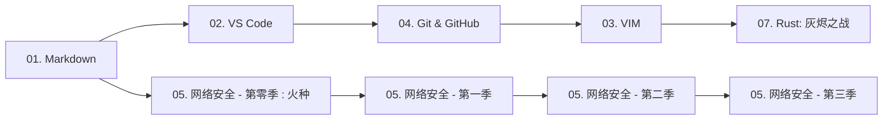

# 守夜者之书<!-- omit in toc -->

   

## 目录<!-- omit in toc -->

- [:book: 这是什么](#book-这是什么)
- [:books: 这里有什么](#books-这里有什么)
- [:rocket: 从哪里开始](#rocket-从哪里开始)
- [:globe\_with\_meridians: 关于守夜者](#globe_with_meridians-关于守夜者)
- [:page\_facing\_up: 许可证](#page_facing_up-许可证)

> 从零开始学安全。每天2小时，雷打不动。

## :book: 这是什么

这是一个**公开的学习笔记仓库**，记录一名守夜者从零开始学习网络安全的完整过程。

我是 **TheSilentOne-creator**（沉默者），守夜者的一员。我相信：

> 五年后、十年后、二十年后，世界和时间会给我们答案。

---

## :books: 这里有什么

- **:memo: 学习笔记**：每天学的内容，整理成笔记
- **:triangular_ruler: 教程系列**：从零开始的教程，中英双语
- **:computer: 代码练习**：写过的脚本、工具

---

## :rocket: 从哪里开始

- :blue_book: **基础工具与协作系列**（守夜者的利剑与盾牌）
- :computer: **网络安全世界**（守夜者的战场与使命）

| # | 教程 | 状态 | 链接 |
| :--- | :--- | :--- | :--- |
| 01 | **玩转 Markdown** | :white_check_mark: 已完成 | [开始阅读](<./中文 (Chinese)/01. 玩转 Markdown/01.玩转 Markdown.md>) |
| 02 | **玩转 VS Code** | :white_check_mark: 已完成 | [开始阅读](<./中文 (Chinese)/02. 玩转 VS Code/02. 玩转 VS Code.md>) |
| 03 | **VIM 从入门到得体** | :white_check_mark: 已完成 | [开始阅读](<./中文 (Chinese)/03. VIM 从入门到得体/03. VIM 从入门到得体.md>) |
| 04 | **拿捏 Git 与 GitHub** | :pencil: 等待中 | 敬请期待 |
| 05 | **这才是网络安全 (全六季)** | :construction: 编写中 | [开始阅读](<./中文 (Chinese)/05. 这才是网络安全 (全六季)/0. 这才是网络安全·第零季：火种/0. 这才是网络安全·第零季：火种.md>) |
| 06 | `[进阶]` **用 Python 写安全工具** | :pencil: 等待中 | 敬请期待 |
| 07 | `[进阶]` **最终章 - Rust：灰烬之战** | :construction: 编写中 | [开始阅读](<./中文 (Chinese)/07. [进阶] 最终章 - Rust：灰烬之战/07. [进阶] 最终章 - Rust：灰烬之战.md>) |
| 08 | `[进阶]` **详解计算机科学丛书** | :construction: 编写中 | [开始阅读](<./中文 (Chinese)/08. [进阶] 详解计算机科学丛书/README.md>) |

> 所有教程采用**中英双语**编写：先用中文写完，再翻译成英文。

### 各教程介绍<!-- omit in toc -->

1. **玩转 Markdown** - 别再傻乎乎地用记事本写笔记了！  
   - 你是不是还在忍受Word排版时图片乱飞、格式崩溃的痛苦？或者写了半天笔记，粘到网页上丑得自己都不想看？  
   - **Markdown** 就是来解决这个问题的。它像极了武林秘籍里的 **“轻功”** ——学起来只需要十分钟，但用好了能让你飞一辈子。  
   - 这套教程不跟你讲复杂的语法树，只教你在写代码笔记、写GitHub Readme、甚至写书时，**那最常用的5%语法**。  
   - **学完这一课，你将解锁：** 优雅地写出一份连程序员看了都想Star的笔记，从此告别鼠标狂点格式刷的原始时代。

2. **玩转 VS Code** - 武装你的“瑞士军刀”
   - 如果把写代码比作做饭，那VS Code就是你的**厨房工作台**。你可以用它切菜（写代码）、看火候（调试）、甚至下单买菜（Git集成）。  
   - 很多人用了好几年VS Code，还把它当成一个高级记事本——就像买了辆法拉利却只用来推着走。  
   - 本教程手把手教你装上那些 **“开了挂”的插件** ：远程写服务器代码、AI帮你补全、一键格式化乱糟糟的代码。  
   - **学完这一课，你将解锁：** 一个能让你在任何地方（甚至iPad上）写代码的云端开发环境，让写代码变成一种享受。

3. **VIM 从入门到得体** - 没有图形界面？那就用键盘征服世界
   - 听好了，菜鸟。当你还在纠结用鼠标点击“保存”按钮时，真正的黑客早已在VIM里键入 `:wq` 潇洒离去。
   - VIM是Linux系统里的 **“文字游戏”** ，它的学习曲线陡峭得像悬崖。但只要你爬上去了，就能体验到“手不离键盘，思绪如流水”的快感。
   - 我们只讲10节必修课，外加6个选修方向。绝不让你背那些一辈子用不到的花哨命令。你只需要学会：**怎么进去、怎么改字、怎么保存、怎么拍桌子骂娘然后退出。**
   - **学完这一课，你将解锁：** 在任何一个服务器上（哪怕只有命令行）都能流畅写代码的底气，以及成为室友眼中的“键盘侠”。

4. **拿捏 Git 与 GitHub** - 别再把你的代码存桌面了！
   - 你一定经历过这种绝望：`毕业论文_最终版.doc`、`毕业论文_最终版2.doc`、`毕业论文_打死也不改版.doc`……
   - **Git** 就是专门治这种“版本混乱”病的。它不仅记下了你每次改了啥，还能让你一键回到“昨天下午那个还没改崩的状态”。
   - 而 **GitHub** 是程序员的“朋友圈”，也是最牛逼的代码仓库。这套教程会教你：**如何把代码白嫖（Fork）下来、如何更新、以及如何把你的开源项目变成简历上的亮点。**
   - **学完这一课，你将解锁：** 拥有一个绿油油的GitHub贡献墙，以及那句让你底气十足的：“来，先 Fork 我的项目。”

5. **这才是网络安全 (全六季)** - 省下一万块的培训，**免费**看完这一套
   - 你有没有过这种经历：看了好多碎片化的文章，觉得“我行了”，一上手发现“我啥也不会”？
   - 全六季采用 **“相声式”教学法** —— 保证没有昏昏欲睡的理论，只有让你笑完还能记住的攻击手法。比如：“什么叫XSS？就是你在我评论区发了个脚本，我一打开网页，弹窗说‘你被耍了’。”
   - 从Web渗透到内网漫游，从信息收集到日志溯源，这条路我给你铺好了，你只需要跟着走。
   - **学完这一课，你将解锁：** 完整的网络安全知识体系 + 一套可以在面试官面前侃侃而谈的实战项目经验。

6. `[进阶]` **用 Python 写安全工具** - 不要重复造轮子，但要学会改装轮子
   - 只会用别人写好的工具，你永远是个脚本小子。
   - 当 SQLMap 跑不出注入时，当 Nmap 扫得不够精细时，你需要自己写一个脚本。
   - 这套教程不讲爬虫和Web开发，只讲**网安视角的Python**：写一个端口扫描器、写一个弱口令爆破工具、写一个日志分析脚本。
   - **学完这一课，你将解锁：** 把枯燥的渗透工作自动化——点一下鼠标，让电脑帮你干活，然后你去喝杯咖啡。

7. `[进阶]` **Rust：灰烬之战** - 这不是一门语言课，这是一场你必须写 Rust 才能活下来的战争
   - “碎镜”爆发后的第 247 天。你在数据废墟中收到一个信号：“守夜者，你还在吗？”要回应它，你必须先学会用 Rust 锻造自己的武器。
   - 从“爆破弱口令”到“日志猎手”，从“并发反击”到“自毁与永恒”——15 个章节，12 个真实工具，一段从废墟到牺牲的完整叙事。
   - 所有权不再是晦涩的内存模型，而是“情报原件只有一份，读完必须销毁”。生命周期不再是编译器报错，而是“牛奶的保质期”。
   - **学完这一课，你将解锁：** 一门高性能系统语言的完整实战能力，以及一段你永远忘不了的战争记忆。

8. `[进阶]` **详解计算机科学丛书** - 追随计算机科学的初心，用“大块头”体会编程之道
   - 如果你觉得看完了上面的教程，感觉自己“啥都会了但又啥都不会”，说明你缺了**内功**。
   - 这是一份读书笔记/伴读指南。针对那些经典的“黑皮书”（如《计算机网络》、《深入理解计算机系统》）。
   - 我不会帮你读书，但我告诉你**哪些章节是面试必考的、哪些算法是写Exploit必用的、哪些理论可以跳过。**
   - **学完这一课，你将解锁：** 一颗计算机科学的大脑。从此以后，任何新的漏洞和框架在你眼里，都不过是基础原理的排列组合。

---

### 怎么学？<!-- omit in toc -->

本教程完全面向零基础，哪怕你连最基本的工具都不会用。

为了让基础工具（`01`~`04`）的学习不枯燥，并让你尽快接触到安全知识的乐趣，建议你按照以下路径学习。

**核心原则：以网络安全为主线，工具和语言在实战中随用随学。**

---

1. **务必先学 `01. 玩转 Markdown`**  
   这是你写文档、做笔记，乃至**写漏洞报告**时都要使用的一种**标记语言**（类似于 Word，但是纯文本！）。它是整个学习旅程的书写基础。

2. **在学 Markdown 的同时，可以开始看 `05. 这才是网络安全` 的“第零季：火种”**  
   第零季讲的是黑客文化与精神，非常有趣，像听故事一样。它不需要任何技术基础，适合在你练习 Markdown 语法时当作调剂。这是主线剧情的前传，先点燃你的热情。

3. **接下来学习 `02. 玩转 VS Code`**  
   学好了这将是你写代码、做笔记、写 Markdown……的**利器**，你的核心工作台。同时，你可以正式进入 `05. 这才是网络安全` 的**第一季**，开始学习真正的渗透测试基础。

4. **在学第一季的同时，顺手拿下 `04. 拿捏 Git 与 GitHub`**  
   写代码、做项目，离不开版本控制。Git 帮你管理每一次修改，GitHub 让你的项目能被全世界看到。这时候学 Git，是因为你已经开始写安全练习的代码，需要版本管理了。

5. **进入第一季后半段或第二季时，开始 `03. VIM 从入门到得体`**  
   等你需要操作远程服务器，或者想在终端里更快地编辑配置文件时，VIM 就是你的必修课。它很难，但和网络安全同步学会让你事半功倍。

6. **当需要编写自己的扫描器、利用脚本或高性能工具时，请出神兵 `07. Rust：灰烬之战`**  
   这不是一门普通的编程语言课。这是一场你必须用 Rust 才能活下来的战争。当你在安全学习中需要更快、更底层的工具时，这本叙事驱动的 Rust 实战教程会在故事中教会你一切。

7. **想让攻击自动化？`06. 用 Python 写安全工具`**  
   当你在安全实战中有了“这个重复工作能不能自动化”的想法时，就是打开这本教程的最佳时机。

8. **最后，修炼内功：`08. 详解计算机科学丛书`**  
   如果你觉得看完了上面的教程，感觉自己“啥都会了但又啥都不会”，说明你缺了**内功**。这份伴读指南会告诉你，那些经典的“黑皮书”里，哪些是必读的、哪些可以跳过。

---

接下来的 `05. 这才是网络安全 (全六季)` 就可以按照顺序深入学习了。

---

## :globe_with_meridians: 关于守夜者

我是守夜者的一员。守夜者是一个技术学习社区。

- **我们相信**：从零开始，一起进步
- **我们不做**：非法攻击、盈利、暴露成员身份

**守夜者宣言**：长夜将至，我从今开始守夜，今夜如此，夜夜皆然。

---

> **加入我们**:  
> 如果你也在从零开始，想找个人一起守夜，Fork 这个仓库，写下你的第一行笔记。  
> Fork后，在 `/community/` 下新建 `你的名字.md`，写下你今天的收获。

---

## :page_facing_up: 许可证

本仓库内容采用 [CC BY-NC-SA 4.0](https://creativecommons.org/licenses/by-nc-sa/4.0/) 协议（署名-非商业性使用-相同方式共享）。
