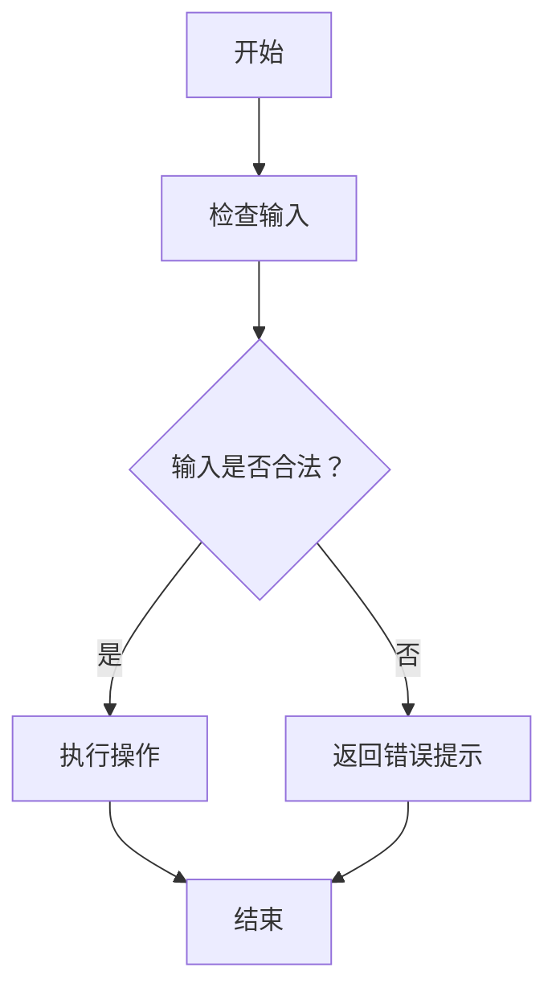
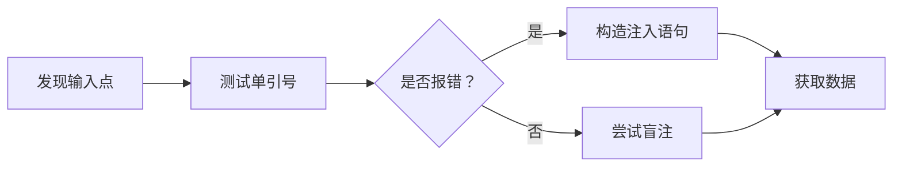
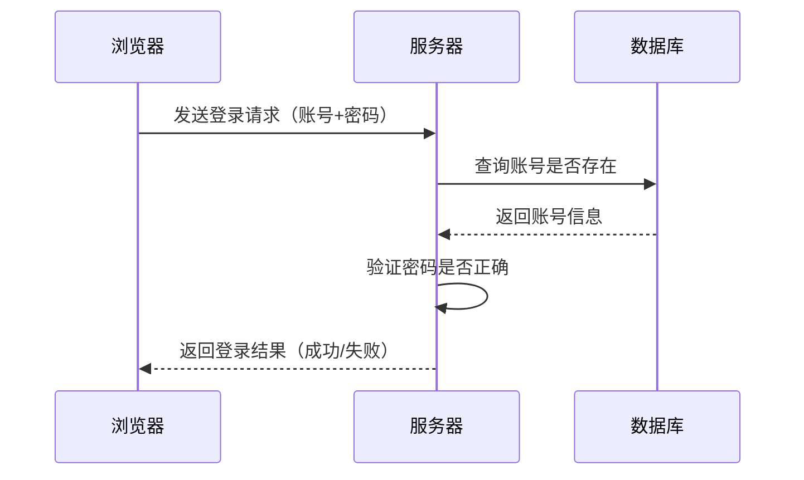
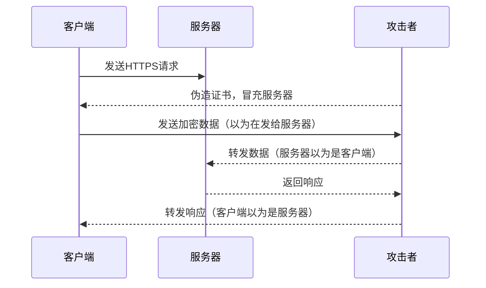
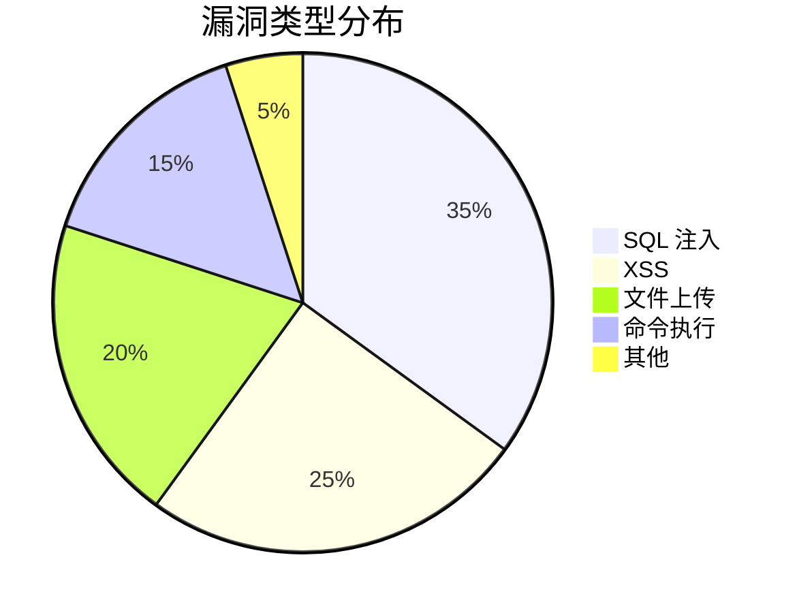
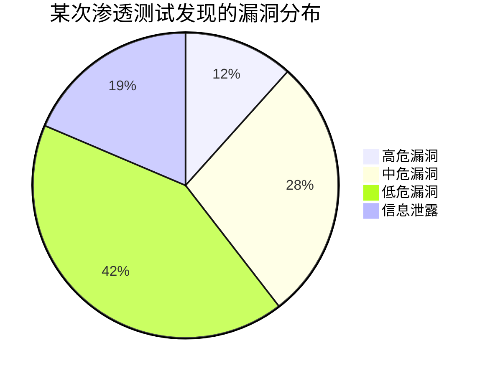

# 01. 玩转 Markdown

## 目录

- [01. 玩转 Markdown](#01-玩转-markdown)
  - [目录](#目录)
  - [前言](#前言)
  - [第一章 - 先别急着写字，磨刀不误砍柴工](#第一章---先别急着写字磨刀不误砍柴工)
    - [1.1 把 VSCode 请进家门](#11-把-vscode-请进家门)
    - [1.2 给 VSCode 上点“科技与狠活”（装插件）](#12-给-vscode-上点科技与狠活装插件)
  - [第二章 - Markdown 介绍与发展](#第二章---markdown-介绍与发展)
    - [2.1 Markdown 是个什么玩意儿？](#21-markdown-是个什么玩意儿)
    - [2.2 接下来的闯关路线图](#22-接下来的闯关路线图)
  - [第三章 - 排版基本功](#第三章---排版基本功)
    - [3.1 快速入门](#31-快速入门)
    - [3.2 标题](#32-标题)
      - [3.2.1 底线标题法](#321-底线标题法)
      - [3.2.2 井号标题法](#322-井号标题法)
    - [3.3 粗体和斜体](#33-粗体和斜体)
    - [3.4 段落与换行](#34-段落与换行)
    - [3.5 分割线](#35-分割线)
    - [3.6 删除线](#36-删除线)
  - [第四章 - 高级内容组织](#第四章---高级内容组织)
    - [4.1 行内代码与围栏代码块](#41-行内代码与围栏代码块)
      - [4.1.1 行内代码：只“框”住几个词](#411-行内代码只框住几个词)
      - [4.1.2 代码块：展示多行代码的“橱窗”](#412-代码块展示多行代码的橱窗)
      - [4.1.3 语法高亮：让代码穿上“彩虹色”的外衣](#413-语法高亮让代码穿上彩虹色的外衣)
    - [4.2 引用与转义](#42-引用与转义)
      - [4.2.1 引用：把别人的话装进“对话框”](#421-引用把别人的话装进对话框)
      - [4.2.2 转义：让特殊符号“变回普通文字”](#422-转义让特殊符号变回普通文字)
    - [4.3 表情符号](#43-表情符号)
      - [4.3.1 语法：两个冒号夹一个名字](#431-语法两个冒号夹一个名字)
      - [4.3.2 怎么输入？两种真实方式](#432-怎么输入两种真实方式)
      - [4.3.3 常用表情速查](#433-常用表情速查)
      - [4.3.4 什么时候用表情？什么时候别用？](#434-什么时候用表情什么时候别用)
    - [4.4 列表完全指南](#44-列表完全指南)
      - [4.4.1 无序列表：三种符号，一种效果](#441-无序列表三种符号一种效果)
      - [4.4.2 有序列表：数字随便写，渲染帮你数](#442-有序列表数字随便写渲染帮你数)
      - [4.4.3 嵌套列表：子列表缩进两个空格](#443-嵌套列表子列表缩进两个空格)
      - [4.4.4 列表里塞代码块（新手翻车最高发路段）](#444-列表里塞代码块新手翻车最高发路段)
      - [4.4.5 列表里塞引用](#445-列表里塞引用)
      - [4.4.6 任务列表：给你的待办清单打钩](#446-任务列表给你的待办清单打钩)
    - [4.5 链接与图片](#45-链接与图片)
      - [4.5.1 链接：给文字装上任意门](#451-链接给文字装上任意门)
      - [4.5.2 图片：链接的亲弟弟，多一个感叹号](#452-图片链接的亲弟弟多一个感叹号)
    - [4.6 表格](#46-表格)
      - [4.6.1 基础语法：竖线 + 减号](#461-基础语法竖线--减号)
      - [4.6.2 对齐方式：冒号决定一切](#462-对齐方式冒号决定一切)
      - [4.6.3 表格可以写得很难看，但渲染出来很漂亮](#463-表格可以写得很难看但渲染出来很漂亮)
      - [4.6.4 Markdown Table 插件：一键格式化表格](#464-markdown-table-插件一键格式化表格)
      - [4.6.5 表格里塞其他 Markdown 元素](#465-表格里塞其他-markdown-元素)
      - [4.6.6 表格避坑指南](#466-表格避坑指南)
      - [4.6.7 表格什么时候用？什么时候别用？](#467-表格什么时候用什么时候别用)
    - [4.7 锚点与脚注](#47-锚点与脚注)
      - [4.7.1 锚点：文档内部的“传送门”](#471-锚点文档内部的传送门)
      - [4.7.2 脚注：正文的“小声补充”](#472-脚注正文的小声补充)
    - [4.8 排版技巧](#48-排版技巧)
      - [4.8.1 推荐的排版样式](#481-推荐的排版样式)
      - [4.8.2 排版样式对比](#482-排版样式对比)
      - [4.8.3 空行：让文档“呼吸”](#483-空行让文档呼吸)
      - [4.8.4 换行与80字符规则](#484-换行与80字符规则)
      - [4.8.5 缩进与对齐](#485-缩进与对齐)
      - [4.8.6 空格：Markdown 的隐形骨架](#486-空格markdown-的隐形骨架)
      - [4.8.7 全角和半角](#487-全角和半角)
      - [4.8.8 正确的英文大小写](#488-正确的英文大小写)
    - [4.9 HTML 救场](#49-html-救场)
      - [4.9.1 改文字颜色](#491-改文字颜色)
      - [4.9.2 调整图片尺寸](#492-调整图片尺寸)
      - [4.9.3 内容居中](#493-内容居中)
      - [4.9.4 折叠面板](#494-折叠面板)
      - [4.9.5 键盘按键样式](#495-键盘按键样式)
      - [4.9.6 上标和下标](#496-上标和下标)
      - [4.9.7 什么时候不该用 HTML？](#497-什么时候不该用-html)
    - [4.10 序列图、流程图与 Mermaid](#410-序列图流程图与-mermaid)
      - [4.10.1 为什么学 Mermaid？](#4101-为什么学-mermaid)
      - [4.10.2 什么是 Mermaid？](#4102-什么是-mermaid)
      - [4.10.3 流程图：把步骤变成图](#4103-流程图把步骤变成图)
      - [4.10.4 序列图：把交互变成图](#4104-序列图把交互变成图)
      - [4.10.5 饼图：把数据占比变成图](#4105-饼图把数据占比变成图)
      - [4.10.6 Mermaid 的局限与替代方案](#4106-mermaid-的局限与替代方案)
      - [4.10.7 Mermaid 在安全文档中的使用场景总结](#4107-mermaid-在安全文档中的使用场景总结)
    - [4.11 数学公式](#411-数学公式)
      - [4.11.1 行内公式与块级公式](#4111-行内公式与块级公式)
      - [4.11.2 上下标：数学公式的“第一课”](#4112-上下标数学公式的第一课)
      - [4.11.3 分式与根号](#4113-分式与根号)
      - [4.11.4 求和、求积、积分](#4114-求和求积积分)
      - [4.11.5 矩阵](#4115-矩阵)
      - [4.11.6 条件表达式（cases）](#4116-条件表达式cases)
      - [4.11.7 常用希腊字母与符号速查](#4117-常用希腊字母与符号速查)
      - [4.11.8 公式编号与引用（进阶）](#4118-公式编号与引用进阶)
      - [4.11.9 GitHub 上的特殊处理](#4119-github-上的特殊处理)
  - [第五章 - 手把手写第一个 README](#第五章---手把手写第一个-readme)
    - [5.1 什么是 README？为什么它很重要？](#51-什么是-readme为什么它很重要)
    - [5.2 README 的骨架：先搭结构](#52-readme-的骨架先搭结构)
    - [5.3 第一步：写项目名称和介绍](#53-第一步写项目名称和介绍)
    - [5.4 第二步：列出功能特点](#54-第二步列出功能特点)
    - [5.5 第三步：写“快速开始”指南](#55-第三步写快速开始指南)
    - [5.6 第四步：展示用法示例](#56-第四步展示用法示例)
    - [5.7 第五步：添加徽章（Badge）](#57-第五步添加徽章badge)
    - [5.8 第六步：添加贡献指南和许可证](#58-第六步添加贡献指南和许可证)
    - [5.9 你的 README 成品](#59-你的-readme-成品)
  - [第六章 - VSCode 六神装详解](#第六章---vscode-六神装详解)
    - [6.1 Markdown All in One：你的“快捷键管家”](#61-markdown-all-in-one你的快捷键管家)
    - [6.2 Markdown Preview Enhanced：你的“写轮眼”](#62-markdown-preview-enhanced你的写轮眼)
    - [6.3 Paste Image：你的“截图闪传”](#63-paste-image你的截图闪传)
    - [6.4 Markdown Table：你的“表格美容师”](#64-markdown-table你的表格美容师)
    - [6.5 Markdown Lint：你的“语法教官”](#65-markdown-lint你的语法教官)
    - [6.6 Markdown Emoji：你的“表情翻译官”](#66-markdown-emoji你的表情翻译官)
    - [6.7 写作效率技巧（番外）](#67-写作效率技巧番外)
  - [番外：为什么 AI 工具都选 Markdown？](#番外为什么-ai-工具都选-markdown)

---

## 前言

Hello world !

各位同学好，欢迎翻开这本《守夜者之书》第一页。

在开始之前，先给你介绍一个人——**Kate**。

Kate 和你一样，是个从零开始学技术的普通人。她不是什么天才，也不是什么黑客。她会犯错，会踩坑，会在看到一串报错时抓狂地喊“这到底什么意思啊？！”——然后她会和你一起，一个一个地把坑填平。

**你在教程里看到的所有错误示范，都是 Kate 写的。** 她负责翻车，你负责学习，我负责把原理讲清楚。

比如，Kate 第一次保存 Markdown 文件的时候，只写了文件名“我的笔记”，忘了加 `.md` 后缀。结果 VS Code 不给她语法高亮，预览按钮是灰的。她盯着屏幕看了五分钟，问我：“为什么我的 VS Code 跟你的不一样？”——这个坑，我们第一章会一起填。

好了，认识完 Kate，我们来说正事。

先问你一个扎心的问题：你用 Word 写文档的时候，有没有过这种经历？

调个标题字号？你得先瞄准那个小小的下拉菜单——就是屏幕顶上那一排小图标里，写着“正文”或“标题1”的那个长条。点开它，再在一堆选项里找到你要的字号。稍微手滑选错了，整段文字就**集体叛变**成二号标题。

插个图片？嘿！图片一拖进去，文字瞬间像受惊的哈士奇，满屏乱窜。你拽一下图片，文字往左跑；你拖一下文字，图片往右跳。折腾了十分钟，最后图片还是压在文字上面，谁也别想看全。

好不容易满头大汗排好版，微信发给老板或老师，对方用手机上一个叫 WPS 的软件打开——**轰！** 排版瞬间崩成毕加索的《格尔尼卡》。（那是一幅很有名的画，画里的东西扭曲、抽象，你看一眼就知道“这东西本来不应该长这样的”。）你的文档也一样——标题跑到了第二页，图片变成了红叉，段落之间多了一堆莫名其妙的空白。

Kate 经历过所有这些。她曾经在期末考试前一晚，花了两个小时调整论文格式，最后交上去的还是被老师说“排版乱七八糟”。

**这，就是二进制格式的“福报”。**  

Word 文档（就是那些文件名以 `.docx` 结尾的文件）像一个加密的保险箱。要理解为什么，你需要先知道电脑存文件有两种方式：

- **文本文件**：文件里存的都是你可以直接读的文字。你用记事本打开一个文本文件，看到的就是文件里的真实内容。就像一张白纸上用铅笔写的字——你一眼就能看懂。
- **二进制文件**：文件里存的是电脑才能直接读懂的 0 和 1。你用记事本打开一个二进制文件，看到的是一堆乱码——就像一张纸上打的孔，人看不懂，只有特定的机器才能读。

Word 文档就是二进制文件。你写了一篇论文，保存成 `.docx`，Word 在里面塞了一堆你看不到的东西：字体信息、排版数据、图片缓存、修改历史……这些东西被压缩成一堆 0 和 1，只有 Word 自己才能完全读懂。

然后你把这个文件发给另一个人。他用的 Word 版本和你的不一样，或者他用的是 WPS（另一个能打开 Word 文档的软件）。他打开之后，WPS 试图解读 Word 塞进去的那堆 0 和 1，但解读方式不完全一样——于是格式就崩了。

Git——一个帮你记录文件修改历史的工具，像一个无限次的“Ctrl+Z”，你每一次修改、每一次保存，它都帮你记下来了——往 Word 文档里一看，也只能看到那堆 0 和 1 的乱码。你改了哪句话？删了哪张图？Git 完全不知道。这就意味着你永远没法回到“昨天下午那个版本”。

而 **Markdown**，就是来解救你和 Kate 的白衣骑士。

它告诉你：**放下鼠标，把双手放在键盘上，用几个简单的符号就能排版。**

Markdown 是 2004 年由一位叫约翰·格鲁伯的程序员发明的一种**轻量级标记语言**。“标记语言”听起来很高端，其实很简单：就是你在写文字的时候，顺手敲几个符号，告诉电脑“这里要加粗”“这里是标题”。等你写完，电脑自动帮你排版，不用你再拿鼠标点来点去。

**最重要的是：Markdown 文件就是纯文本文件。** 你用记事本打开它，看到的就是你敲的那些字和符号，没有乱码，没有加密。Git 能清楚地看到你改了哪一行、删了哪个词。任何人用任何软件打开你的 Markdown 文件，看到的都是一样的内容。

Kate 学会 Markdown 之后，再也没有为了格式熬过夜。她现在写笔记用 Markdown，写教程用 Markdown，给老师交的作业也尽可能用 Markdown。她说：“我终于不用和鼠标较劲了。”

---

**本套 Markdown 教程各章速览。**

| 章 | 内容 | 定位 |
| :--- | :--- | :--- |
| 第一章 | 磨刀（VSCode 安装+插件+认识 Kate） | 工具准备 |
| 第二章 | Markdown 介绍与发展 | 世界观 |
| 第三章 | 排版基本功 | 文字格式 |
| 第四章 | 高级内容组织 | 结构排版 |
| 第五章 | 手把手写第一个 README | 综合实战 |
| 第六章 | VSCode 六神装详解 | 插件深度使用 |

本教程的规矩只有一条：

**请把手放在键盘上，跟着敲！**

Kate 会在每一章陪你一起练。她敲错了，你来分析哪里错了。你敲对了，Kate 会替你高兴。肌肉记忆不是看出来的，是敲出来的——是 Kate 敲崩了无数次之后，终于敲对的那一次。

禁止开着教程当电视剧看。Kate 在敲，你也得敲。

好了，翻页吧。第一章，我们先把写 Markdown 的工具请进家门。

---

## 第一章 - 先别急着写字，磨刀不误砍柴工

俗话说得好：**工欲善其事，必先利其器**。意思是：想把活干好，先得把工具磨快。

写 Markdown 用什么写？你的电脑上自带了一个叫“记事本”的程序（Windows 系统）或者“文本编辑”（Mac 系统），打开就能写字。Kate 一开始也是这么干的——她打开记事本，敲了几行 Markdown 语法，保存，然后把文件拖到浏览器里看效果。

三天后她就放弃了。因为记事本没有语法高亮（就是不同内容显示不同颜色，帮你一眼分清标题和正文）、没有实时预览（写完得切到浏览器才能看到排版效果）、也没有快捷键。**用记事本写 Markdown，相当于用指甲刀砍树——意志力的无谓消耗。**

所以我们需要一个专门的编辑器。编辑器就是用来写字的软件，就像 Word 是用来写文档的，编辑器是用来写代码和 Markdown 的。

市面上能写 Markdown 的编辑器很多，Kate 帮你试过了几个主流的：

| 编辑器 | 江湖绰号 | 看家本领 | 财力消耗 | 忠告 |
| :---- | :---- | :---- | :---- | :---- |
| **Typora** | 隐居的美人 | 所见即所得，美得像初恋。你在左边敲 Markdown 语法，它当场就帮你渲染成漂亮的排版，不用点预览按钮。 | 💰 **已嫁入豪门**（收费） | 白嫖党慎入，情怀党随意。Kate 试用期过了就含泪卸载了。 |
| **VSCode** | **变形金刚** | 装个插件就能从玩具车变歼星舰。免费，跨平台（Windows、Mac、Linux 都能装），插件商店里有几万个免费插件。 | 🆓 **白嫖党的耶路撒冷** | **本教程钦定御驾。Kate 正在用。** |
| **记事本** | 指甲刀 | 能剪指甲，也能剪钢丝——如果你命硬的话。 | 🆓 系统自带的尊严 | **用这写 MD 等于自虐，请放过自己。** |

市面上编辑器很多，但论**扩展性**（能装多少插件来增加功能）和**白嫖指数**（能不能免费用），还得是这位号称 **“宇宙第一编辑器”** 的——

**Visual Studio Code (简称 VSCode)。**

别看它名字里带个“Code”，听起来像是程序员才用的东西。装起插件来，它就能原地变身成**顶级 Markdown 写作神器**。这就好比给你家那辆破旧的面包车（五菱宏光）装上了喷气式发动机——外表还是那个样，内脏全是顶级配置。

---

### 1.1 把 VSCode 请进家门

首先，打开你的浏览器。浏览器就是你用来上网的那个软件——Chrome、Edge、Firefox、Safari 都是浏览器。

在浏览器顶部的地址栏（就是显示网址的那个长条）里输入这个地址：

**`https://code.visualstudio.com/Download`**

然后按回车。你会看到一个蓝色的下载按钮。网站会自动识别你用的是 Windows 还是 Mac，给你推荐对应的版本。点那个按钮，下载安装包。

> *Kate 看着下载进度条，问：“安装包是什么？我需要准备什么吗？”*
> *“不用。你就把它想象成一个快递包裹。下载就是快递在运输，等会儿双击它就是拆箱。装完之后，箱子就可以扔了。”*

**⚠️ 警报！Windows 用户请立正站好！**

如果你是 Windows 系统，安装界面弹出来的时候，睁大你的钛合金眼，**务必**把这两个勾勾打上：

- ☑ **添加到右键菜单**。装完之后，你在任何一个文件夹上点鼠标右键，弹出的菜单里会多一个选项：“通过 Code 打开”。**不打勾** = 你每次打开一个文件夹都要先启动 VS Code，再从 VS Code 里一层一层地翻文件夹——翻到地老天荒。
- ☑ **添加到 PATH**。装完之后，你可以在一个叫“命令行”或“终端”的黑窗口里，输入 `code` 然后回车，VS Code 就打开了。**不打勾** = 以后你输入 `code` 想快速打开 VS Code 时，电脑会无情地回复你 `'code' 不是内部或外部命令`，让你当场社死。

*Kate 看到“添加到 PATH”这个选项时，犹豫了一下。她问：“什么是命令行？什么是终端？我是不是不该勾这个？”*  

*“不，你更应该勾。你现在不知道它是什么没关系，你只需要知道：它的作用是让你在任何一个文件夹里，输入 `code .` 就能直接打开 VS Code。详细原理我们在《02. 玩转 VS Code》里讲。现在，先勾上。”*

其他步骤无脑点“下一步”，直到安装完成。

如果你用的不是 Windows，而是 Mac 或 Linux，详细的安装步骤参见我们的姊妹教程 `02. 玩转 VS Code` 的第一章。这里先不展开，不然 Windows 用户要睡着了。

谁要是卡在这步装不上，建议回退去用记事本——开玩笑的。卡住了就在仓库的 Issues 里提问，Kate 会来帮你。

安装完成后，双击桌面上的 VS Code 图标（或者在开始菜单里找到它），启动它。你会看到这样的界面：


这个界面是 VS Code 的欢迎页。中间的 "Get Started" 是一些入门引导，你可以关掉它，也可以留着随便点点看看。咱们不在乎这些——咱们在乎的是左边那一排图标。

---

### 1.2 给 VSCode 上点“科技与狠活”（装插件）

打开 VS Code，满屏英文？Kate 第一次打开的时候也是懵的：“这啥？我是不是下错了？”别慌，咱先给它披上中文的皮。

1. 点左边那一排图标里，由**四个小方块**组成的那个图标。它是 VS Code 的“扩展商店”——就像手机上的应用商店，你可以在里面找各种功能包（叫“插件”或“扩展”）来安装，装完 VS Code 就多了那个功能。
2. 在搜索框里输入 `Chinese`。你会看到一个图标像小地球的插件，名字叫 "Chinese (Simplified) (简体中文) Language Pack for Visual Studio Code"。点它，然后点右边的蓝色 "Install" 按钮。装完之后，VS Code 会提示你重启。重启之后，满屏的中文就亲切了。


> *Kate 重启了 VS Code，看到菜单栏变成了中文，长舒一口气：“终于不再是‘猜谜游戏’了。”*

接下来是**灵魂注入**环节。下面这几个插件，请**无脑**装上。它们是让你在 Markdown 世界里横着走的**六神装**——就像游戏里的六件顶级装备，凑齐了就能开启无双模式：

- **Markdown All in One** (ID: yzhang.markdown-all-in-one)
  - *外号：三相之力。* 来自《英雄联盟》里那件能给角色全方位加成的神装。这个插件也一样——当你敲 `Enter` 换行时，它会自动帮你续上列表格式；当你需要目录时，一键就能生成；选中文字按 `Ctrl+B`，自动帮你加好 `**`。没它你就得**手动挡**开到吐血，什么都要自己手敲。

- **Markdown Preview Enhanced** (ID: shd101wyy.markdown-preview-enhanced)
  - *外号：写轮眼。* 《火影忍者》里的瞳术，能看穿一切虚妄。你在左边写 Markdown 源码，右边立刻显示排版后的效果——所见即所得。不止如此，写代码、画流程图、导出 PDF 甚至 PPT 幻灯片，它全包了。别人还在用 Word 慢慢转 PDF，你已经一键生成发布会级别的演示文稿了。这是**必杀技**。

- **Paste Image** (ID: mushan.vscode-paste-image)
  - *外号：疾行之靴 + 闪现。* 两件装备的合体，一个负责极速移动，一个负责瞬间传送。用法：你在电脑上截图（Windows 上按 `Win+Shift+S`，Mac 上按 `Shift+Command+4`），回到 VS Code 按 `Ctrl+V`，图片就自动保存并插入到文档里了。文件名自动生成，路径自动填写。**啪的一下，很快啊！** 你还在找菜单里的“插入图片”按钮？对不起，Kate 图都已经插完开始喝咖啡了。

- **Markdown Table** (ID: TakumiI.markdowntable)
  - *外号：表哥/表姐制造机。* 表格画出来歪歪扭扭？它一键帮你对齐。专治强迫症，让你从此告别用空格键一点一点敲出表格的原始人生活。按一下 `Tab`，世界清净了。

- **Markdown Lint** (ID: DavidAnson.vscode-markdownlint)
  - *外号：你的语文老师·灵魂形态。* 你瞎写空格、滥用标题，它立马在你写错的地方下面画一道**红色波浪线**。就像语文老师批作文，在错别字下面画圈一样。别嫌烦，这叫**优雅的鞭策**，帮你养成好习惯。

  > *Kate 一开始被这个波浪线烦得不行，后来她发现没有波浪线的文档反而让她不放心。她说：“没有波浪线的文档，我不信任它。有波浪线至少说明有人在帮我检查。”*

- **Markdown Emoji** (ID: bierner.markdown-emoji)
  - *外号：表情包斗士。* 写作不带点 :smile: :dog: :+1: ，好意思说自己是 21 世纪网民？这个插件让 `:smile:` 在编辑器里直接显示成 😄，不用开预览就能看到效果。Kate 的每篇笔记里都至少有一个表情符号，她最喜欢用 🔥 表示“重点来了”。

**装完这些，你的 VSCode 已经不是编辑器了，它是高达。**（高达是一台日本动画片里的巨型机器人，非常厉害，几乎无所不能。）

Kate 装完这些插件之后，沉默了三秒钟，然后说了一句话：

> “我以前的笔记都是白写了。”

好啦，工具磨好了。下一章，我们来聊聊 Markdown 到底是什么，它从哪来，以及为什么 Kate 说“学了 Markdown 之后，我再也不想打开 Word 了”。

守夜人，翻页！🔪

---

## 第二章 - Markdown 介绍与发展

> **守夜者之誓：**  
> **鼠标是我的枷锁，键盘是我的利剑。**  
> **从今夜开始，我将不碰格式刷、不调行间距、不看那该死的预览乱跳。**  
> **我将用符号与文字铸就秩序，我是黑暗排版中的火焰，我是二进制乱码的破壁人。**  
> **我将此生献给纯文本的荣光，今夜如此，夜夜皆然。**

Kate 跟着你念完了这段誓词。她念到“鼠标是我的枷锁”时，低头看了一眼自己握鼠标的右手，然后默默把手挪到了键盘上。

念完之后，她问了一个问题：

> “那个……‘二进制乱码的破壁人’是什么意思？”

你还记得我们在前言里讲过的那两种文件格式吗？文本文件像白纸铅笔字，人一眼就能读懂。二进制文件像纸上打的孔，人看不懂，只有特定的机器才能读。Word 文档就是二进制文件——Git 往里一看，只能看到一堆 0 和 1 的乱码，根本不知道你改了哪句话。

而 Markdown 是纯文本。你写的每一个字、每一个符号，都是可以直接读的。Git 能清楚地看到你改了哪一行、删了哪个词。

**这意味着你不需要任何特殊的软件就能打开它、读懂它、修改它——而那个用 Word 的人，他的文档在 Git 眼里还是一堆没人能看懂的 0 和 1。**

当你用 Markdown 写文档的时候，你就是那个**打破二进制乱码壁垒的人**——你就是“破壁人”。

Kate 点了点头，在自己的笔记本上写了一行字：“破壁人 = 用 Markdown 的人。”

（好，中二病发完了，我们说正事……）

---

在日常工作和互联网写作中，Markdown 几乎随处可见，并且扮演着越来越重要的角色。

不管你是不是程序员，只要关乎写作，都离不开 Markdown。

你平常刷的知乎、简书、CSDN，程序员每天都在用的 GitHub，写博客用的 WordPress，记笔记用的印象笔记和有道云笔记——这些平台都支持 Markdown。你在这些地方写的每一篇文章，都可以用 Markdown 来排版。Markdown 已经悄悄变成了互联网上最流行的“写作语言”。

> *Kate 发现这个事实之后，沉默了三秒钟，然后说：“所以那些平台——知乎、GitHub——他们不是‘支持’Markdown，他们是‘依赖’Markdown？因为纯文本比二进制好处理得多？”*
>
> *“对。纯文本不挑软件、不挑系统、不挑版本。一个平台要处理几千万用户写的文章，用纯文本比用二进制划算一万倍。”*
>
> *“……我以前以为 Markdown 只是‘一个更快的 Word’。原来它是整个互联网的‘通用文字格式’。”*

本章我们就一起来搞清楚 Markdown 到底是什么，以及如何学习 Markdown。

---

### 2.1 Markdown 是个什么玩意儿？

Kate 举手了：“我能不能先问一句——这玩意儿用中文怎么念？”

好问题。Markdown 读作“马克当”（英文音标是 `ˈmɑːrkdaʊn`），重音在第一个音节。把它拆开看：mark = 标记，down = 写下来。合在一起就是把标记写下来。不过中国程序员们更习惯直接叫它“MD”——方便，省事，而且听起来像某种神秘代号。

> *Kate 在自己的笔记本上写了一行：“Markdown = 把标记写下来。”*

**一句话人话：** Markdown 就是用键盘写文章时的**排版快捷键。**

你想啊，在 Word 里加粗——你得先选中文字，然后把鼠标挪到屏幕顶部的工具栏，找到那个粗体 **B** 图标，点下去。手离开键盘三次，耗时三秒，灵魂损耗若干。

在 Markdown 里？手指不挪窝。在要加粗的文字两边各敲两个星号——`**加粗**`——完事。

Kate 试了一下。她在一个空白的 Markdown 文件里敲了 `**这是一个粗体测试**`，然后点开预览。看到预览里那行字变粗了，她说：“就这？就这？”

对，就这。

---

#### 2.1.1 它的爹是谁？（起源）<!-- omit in toc -->

2004 年，一个叫约翰·格鲁伯的程序员老哥，正对着屏幕里的这串东西发愁：`<p><strong><em>`。

如果你看不懂这串东西是什么——没关系，Kate 也看不懂。你只需要知道：这是 **HTML**，一种用来写网页的语言。

**什么是 HTML？**

HTML 的全名叫“超文本标记语言”。这名字听起来很吓人，但它的工作原理其实很简单：你在文字外面套一层“标签”（就是那些尖括号 `<>` 包着的东西），告诉浏览器（你用来上网的那个软件——Chrome、Edge、Safari 都是浏览器）这段文字应该长什么样。

你可以把 HTML 标签想象成给文字穿上不同的外套：

- `<p>` 和 `</p>` 是一件风衣——穿上了，这段文字就是独立的一段（p = paragraph，段落）
- `<strong>` 和 `</strong>` 是一件加厚的棉袄——穿上就变粗了
- `<em>` 和 `</em>` 是一件倾斜的披风——穿上就变斜了（em = emphasis，强调）

所以如果你想用 HTML 写一句“你好，我是粗体”，你得写成：

```html
<p>你好，我是<strong>粗体</strong></p>
```

光是加粗两个字，你就得伺候六个尖括号。约翰·格鲁伯觉得，他不是在写文章，他是在**给文字做开颅手术**。

*Kate 听到这里，说：“所以尖括号就是在文字外面套衣服——穿一件还不够，要穿好几层。跟冬天出门似的。”*  

**为什么 Markdown 能兼容 HTML？**

因为 **Markdown 的底层就是用 HTML 实现的**。

这句话是什么意思？当你用 Markdown 写完一篇文档，点击“预览”或“渲染”的时候，Markdown 解析器（一个负责把 Markdown 符号变成漂亮排版的程序）在背后做了一件事：把你写的 `# 标题` 悄悄转换成了 HTML 的 `<h1>标题</h1>`，把你写的 `**粗体**` 转换成了 `<strong>粗体</strong>`。

那为什么不直接用 HTML，而要学 Markdown 呢？

因为 HTML 太繁琐了——加粗要写六个尖括号，标题要写 `<h1>` 和 `</h1>`。Markdown 把最常用的格式简化成了几个符号：`#` 代替 `<h1>`，`**` 代替 `<strong>`。所以，Markdown 和 HTML 不是“两种不同的语言”——**Markdown 是 HTML 的简化写法**。你用几个简单的符号代替了那些尖括号，然后解析器帮你把符号翻译成 HTML。

> *Kate 说：“所以 Markdown 是 HTML 的‘省事版’。我用星号写粗体，它帮我翻译成尖括号。”*

**这个设计最棒的地方在于：你可以直接在 Markdown 里写 HTML 代码。**

如果 Markdown 的语法做不到某件事——比如改文字颜色、调整图片大小、居中对齐——你可以直接写 HTML 标签来搞定。Markdown 解析器看到 HTML 标签，会直接把它原样保留，不会去碰它。

Kate 听到这里，眼睛亮了：“所以我可以在 Markdown 里写 HTML？”

对。这意味着 Markdown 能做的一切，你都可以用 Markdown 的简洁语法来写。Markdown 做不到的事——比如把一段文字变成红色——你可以直接写 HTML 来救场。

我们会在第四章的“HTML 救场”那一节专门教你怎么用 HTML 标签突破 Markdown 的限制。现在你只需要记住一句话：**Markdown 是 HTML 的简装版，HTML 是 Markdown 的安全网。** 简装版不够用的时候，安全网接住你。

他一拍桌子，怒吼一声：**“我就想加个粗体，为什么要伺候这么多尖括号？！”**

于是，为了全人类的懒，Markdown 诞生了。

这玩意儿牛就牛在：**你看着源码读，甚至觉得比渲染后的排版还好读。** “源码”就是你敲的那些原始字符——`#`、`**`、`-` 这些东西。“渲染”就是电脑把这些符号变成漂亮排版的过程。

比如你看到 `# 标题`，你脑子里已经知道“这是一个大标题”了，不需要等电脑渲染出来。你看到 `**加粗**`，你已经知道“这两个词要变粗”了。

这就是 Markdown 最大的优点：**源码长得跟最终效果差不多**。哪怕你不渲染它，直接看原始文本，也能看懂。而不是像 Word 文档那样，用记事本打开只有一堆乱码。

Kate 说：“所以我写 Markdown 的时候，其实就是在看‘还没渲染的成品’？”

对。这就是“所见即所思”——你脑子里想的是什么格式，源码就长什么样。

---

#### 2.1.2 谁说了算？（演进）<!-- omit in toc -->

Markdown 诞生之后，迅速火遍了程序员圈子。但它有一个致命的问题。

**最初的 Markdown 只定义了最基础的功能：** 标题、段落、粗体、斜体、列表、链接、图片。这些叫 **“基础语法”**。

你猜怎么着——基础语法连表格都画不了。你想画一个三行两列的表格？对不起，没有这个功能。你想写一个脚注标注参考文献？对不起，也没有。你想把一段文字划掉表示“我说错了”？对不起，还是没有。

这就好比武林。最初祖师爷创了一套拳法（基础语法）。这套拳法轻巧、实用、能打人——但打不死人。你不能画表格，不能写公式，不能标注任务清单。于是，各家弟子开始自己发明**独门暗器**（扩展语法）。

**问题来了：每家发明的暗器都不一样。**

你在编辑器 A 里画了一个漂亮的表格，到了编辑器 B 里，表格就碎成了一堆乱码。比如下面这个表格——在 Typora 里完美显示，到了 VS Code 里缩进全乱了：

```markdown
| 姓名 | 武器 | 编号 |
| :--- | :--- | :--- |
| Kate | Markdown | 007 |
| 沉默者 | Rust | 001 |
```

你在编辑器 B 里写了脚注，到了编辑器 C 里，脚注变成了普通文字。Kate 经历过这个——她用一个叫 Typora 的编辑器写的表格，导到 VS Code 里就全歪了。她当时说了句：“这什么破玩意儿？”

为啥会这样？**标准不统一。** 每家编辑器都按自己的规则来解析 Markdown，互不兼容。这就像一个武林里，嵩山派说“用星号画表格”，华山派说“用加号画表格”，衡山派说“你们都不用我的方法，你们都是错的”。武林大乱。

于是，有人站出来说：**“别打了！都听我的！”**

这个人不是一个人，是一群人。他们成立了一个组织，制定了一套所有编辑器都应该遵守的 Markdown 解析规则。这套规则叫 **CommonMark**。

CommonMark 是一个“统一标准”——它严格规定了 Markdown 的每个符号应该被怎么解析。你在任何一个支持 CommonMark 的编辑器里写 Markdown，渲染出来的结果都是一样的。空行怎么处理、缩进怎么算、列表怎么嵌套——CommonMark 把一切都说清楚了。

Kate 听到这里，问了一个问题：“那我们现在学的是 CommonMark 吗？”

答案：是，但不全是。

因为 CommonMark 也很保守。它只包含了基础语法——标题、段落、粗体、斜体、列表、链接、图片。表格？没有。任务列表？没有。删除线？没有。脚注？没有。CommonMark 的做法是：我只保证最基本的东西在所有平台都能用，剩下的是你们的事。

> *Kate 说：“那我用 CommonMark 写笔记，连表格都画不了？我第四章学的表格、删除线、任务列表——这些全都不在 CommonMark 里？”*
>
> *“对。你在 4.6 节画的那些表格，它们能正常显示，不是因为 Markdown 本身支持表格——是因为你在用 GFM。”*
>
> *“……原来我一直在用 GFM，我自己都不知道。”*

这时候，一个大佬入场了。

**GitHub**——全球最大的代码托管平台，也是全球最大的~~同性交友网站~~程序员社区。GitHub 上的每个项目都有一个叫 README 的文件，用来介绍这个项目是干什么的。这些 README 文件，绝大多数都是用 Markdown 写的。

GitHub 觉得 CommonMark 不够用。用户在 README 里需要画表格来展示数据，需要任务列表来管理待办事项，需要删除线来标注过时的信息，需要表情符号来让文档不那么冷冰冰。所以 GitHub 在 CommonMark 的基础上，加上了这些功能。这套增强版的 Markdown，叫 **GitHub Flavored Markdown**，简称 **GFM**。

Flavored 这个词很有趣。它的原意是“加了调味料的”——就像原味薯片和烧烤味薯片。CommonMark 是原味薯片，GFM 是烧烤味薯片。底层是同一种东西，但 GFM 多了一些“调味料”：表格、任务列表、删除线、表情符号、自动链接、脚注……

**那其他平台呢？**  

大部分你听说过的平台——知乎、简书、CSDN、WordPress、印象笔记、有道云笔记——它们支持的都是 GFM 或者 GFM 的变体。因为 GitHub 的用户量太大了，GFM 已经变成了事实上的标准。你在 GitHub 上能用什么，你在这些平台上大概率也能用。

**结论：咱们学的就是 GFM。**  

跟着大佬走，有肉吃。你在 GitHub 上能用的功能，我们全教。你在 GitHub 上不能用的功能（比如某些编辑器私有的扩展），我们不教——因为教了你换一个地方可能就用不了了。

Kate 在自己的笔记本上写了一行字：“GFM = CommonMark + 表格 + 任务列表 + 表情 + 删除线 + 自动链接”。然后她抬头问：“那我们在哪里能用到 GFM？”

答案：你现在就在用。VS Code 的 Markdown 预览支持 GFM，GitHub 的 README 渲染支持 GFM，你平常写笔记的平台大概率也支持 GFM。

好了，历史课上完了。我们知道 Markdown 从哪来、到哪去、为什么有不同的版本、我们应该学哪一个。

下一节，我们来看看接下来的学习路线图——也就是你要经历的几道关卡。

---

### 2.2 接下来的闯关路线图

既然来到了《守夜者之书》，就别想着躺着看完了。

Kate 已经在摩拳擦掌了。她翻开下一页，看到了一张路线图。

接下来，我们不会像其他教程那样给你念字典——不会把每一个 Markdown 语法按字母顺序念一遍，那样你会睡着。

我们将直接进入 **“地狱级实战”：**

1. **第一关（下一章）：排版起手式** —— 先让你的字**变粗、变大、变清晰**，三分钟写出比 Word 还干净的文章。Kate 在 Word 里花了两小时排的论文，你用 Markdown 三分钟就能搞出来。

2. **第二关：列表与代码块** —— 教你如何写清单、嵌代码，让你的笔记清晰得像图书馆目录。Kate 第一次看到列表的缩进规则时摔了键盘，但等她搞懂之后，她说：“这个规则，值得为它摔一次键盘。”

3. **第三关：链接、图片与表格** —— 用键盘画出一张完美对齐的表格，效率吊打 Excel 鼠标流。这一关有个外号，叫“表哥表姐速成班”——学完之后，你就是那个被同事请教“这表格怎么画的”的人。

4. **第四关：引用、转义与排版技巧** —— 优雅地引用别人的话，在 Markdown 里显示那些“被占用的符号”，以及让你的文档从“能看”升级到“好看”的排版细节。

5. **第五关：HTML 救场与 Mermaid 图表** —— 当 Markdown 做不到的时候，HTML 标签来帮忙。用代码画流程图、序列图、饼图，让你的笔记从文字变成可视化。

6. **第六关：数学公式** —— 用 LaTeX 在 Markdown 里写出漂亮的数学表达式，让你的安全笔记从“能看”升级到“严谨”。

**别愣着了，翻页吧！下一章，我们动真格的！**

> *Kate 说：“等等。六关。我要打六个 BOSS。第四章一个章里就有三个 BOSS。”*
>
> *“对。第四章最长、最难、也最有用。你第三章学的是‘能写’，第四章学的是‘能写任何东西’。”*

Kate 已经把她的键盘摆正了。你呢？

---

## 第三章 - 排版基本功

第二章讲完了 Markdown 从哪来、到哪去。现在，我们该动手了。

> **闯关倒计时：第一章（磨刀）✅ · 第二章（拜神）✅ · 第三章（动手）🔴 进行中**

从这一章开始，我们不再只是围观这把“键盘圣剑”，而是要**亲手握住剑柄，挥出第一道剑气**。

Kate 已经把键盘摆正了。她说：“我准备好了。但我有点紧张。”

别紧张。第一剑，我们挥得轻一点。

你准备好了吗？

---

### 3.1 快速入门

首先，打开我们在第一章恭恭敬敬请进家门的 **VS Code**。

还记得怎么打开它吗？

- 双击桌面上的 VS Code 图标。
- 或者在开始菜单里找到它。
- 如果你在第一章勾了“添加到右键菜单”，你也可以在任何一个文件夹上点右键，选择“通过 Code 打开”。

---

**第一步：新建文件**  

在 VS Code 里，按下 **`Ctrl + N`**。

> 按住键盘左下角的 `Ctrl` 键不松手，然后点一下 `N` 键，再松开两个键。

你会看到 VS Code 中间出现一个空白的编辑区域，标签栏上写着 **“Untitled-1”**——Untitled 就是“没有名字”的意思，1 表示这是你打开的第一个未命名文件。

> **Mac 用户**：按下 `Cmd + N`。`Cmd` 键在空格键旁边，上面画着一个 ⌘ 符号。

---

*Kate 按了 `Ctrl + N`，屏幕上弹出一片白。她盯着这片白看了三秒钟，然后说：*

> “感觉像一个无限大的白板。我可以在上面写任何东西。”

*对。这就是你的第一块画布。*

---

**第二步：保存文件**  

按下 **`Ctrl + S`**（Mac 上是 `Cmd + S`）。这个快捷键的意思是“保存当前文件”。

VS Code 会弹出一个窗口，让你选择两件事：

1. **存在哪里**：选一个你能找到的文件夹。比如桌面，或者专门建一个叫“守夜者笔记”的文件夹。
2. **叫什么名字**：输入文件名。

---

**⚠️ 敲黑板！Kate 在这里翻过车！**

文件名后面**必须**跟上 `.md` 或者 `.markdown`。

> Kate 第一次保存的时候，只写了文件名“我的第一篇笔记”，没有写后缀。她兴冲冲地点了保存，然后发现——VS Code 没有给她语法高亮（就是不同内容显示不同颜色），右上角的预览按钮也是灰的，点了没反应。  
>
> 她问我：“为什么我的 VS Code 跟你的不一样？”  
>
> 我说：“因为你没有写 `.md`。”  

---

**为什么这个后缀这么重要？**

你的电脑上可能有几百种不同类型的文件：

| 后缀 | 文件类型 | 用什么打开 |
| :--- | :--- | :--- |
| `.docx` | Word 文档 | Word 或 WPS |
| `.jpg` / `.png` | 图片 | 图片查看器 |
| `.mp3` | 音乐 | 音乐播放器 |
| `.txt` | 纯文本 | 记事本 |
| `.md` | **Markdown** | VS Code 或其他 Markdown 编辑器 |

电脑通过文件名的**后缀**（就是 `.` 后面的那几个字母）来判断每个文件是什么类型，该用什么软件打开它，该给它什么特殊待遇。

不写后缀？那 VS Code 和你的电脑就会对着这个文件**大眼瞪小眼**：

> “你谁啊？Markdown？TXT？还是来自外星的乱码？”

它们猜不透，就会**集体摆烂**：

- ❌ 语法高亮？不给。你敲的 `# 标题` 不会变成蓝色。
- ❌ 实时预览？想得美。右上角的放大镜图标是灰的。

记住：**`.md` 是你和电脑之间的接头暗号。** 对上暗号，大门才开。

---

*Kate 在她的文件名后面加上了 `.md`，然后——*

- *标签栏上的图标变了*
- *语法高亮出现了（`#` 变成了蓝色）*
- *预览按钮亮了*

*她说：“原来电脑不是不搭理我，是我没说对暗号。”*  

---

> 更多的 VS Code 操作技巧，我们将在《守夜者之书》的下一个系列——`02. 玩转 VS Code`——里详细讲解。催更请至仓库的 `Issues` 区。

---

**第三步：打开预览**  

保存好之后，看 VS Code 的右上角工具栏。那里有一排小图标。

找到一个像**放大镜**的图标，旁边带一个小文档的图案。点它。

*Kate 找了半天，说：“左边还有一个放大镜，右边也有一个。哪个是预览？”*  

*“右边那个带小文档图案的。左边那个带小裂口的是搜索——别点错了。”*  


**啪的一下！** 右边弹出一个白花花的区域。

---

这个白屏幕就是我们的 **Markdown 高级渲染**。

> **渲染**：我们上一章讲过——就是电脑把你敲的 Markdown 符号（`#`、`**`、`-` 这些）翻译成漂亮的排版，显示在右边。

为什么说“高级”？因为我们装了 `Markdown Preview Enhanced` 这个插件。它比 VS Code 自带的预览强得多——这就是传说中的 **“写轮眼”**（来自《火影忍者》的瞳术，能让使用者看穿一切）。

- 左边：你写的是“天书”（Markdown 源码）
- 右边：“写轮眼”帮你**原地显形**，立刻看到排版后的效果

我们强烈建议你：**左边敲字，右边看效果。** 体验感直接拉满！

---

*Kate 把编辑区和预览区并排摆好。她在左边敲了一个 `# 我的第一篇笔记`，右边立刻出现了一个大标题。*

*她看着左右两个屏幕，说了一句：*

> “这也太爽了吧。”

---

现在，你左边是空的 Markdown 文件，右边是空的预览。

接下来，我们开始往里面填东西。

下一节，我们从**标题**开始——也就是怎么让你的文字变大、变醒目、变成读者第一眼就看到的“门面”。

守夜人，继续敲！🔥

---

### 3.2 标题

在 Markdown 的世界里，标题有两种实现方式。

虽然最终效果差不多，但知名度却是**一个天上，一个地下**。我们先来参观一下那个“地下”的。

---

#### 3.2.1 底线标题法

这种方法极其小众，难用到很多大牛都不承认它的存在（也可能真不知道）。

本着 **“来都来了”** 的精神，我们认识一下就行：

```markdown
一号标题
===

二号标题
---
```

亲手一个字一个字敲进去，**严禁复制粘贴**！手指不累，记忆不深。


你需要知道的几点：

1. `=` 底线表示**一级标题**。
2. `-` 底线表示**二级标题**。
3. 底线符号的数量**至少两个**。
4. 这种语法**只**支持这两级标题——三、四、五、六级标题？对不起，它**罢工**了。

---

*Kate 敲完这六个等号，又敲了六个减号，然后盯着预览看了五秒钟。*

*她说：“所以我要写三级标题的话，得画三条线？四条线？那写六级标题的时候，我半个屏幕都是线。”*  

*对。这就是底线标题法被江湖抛弃的根本原因：写起来麻烦，限制还多，根本不够用。这玩意儿就像用砖头砌灶台——能用，但谁家有燃气灶还用砖头？*

---

好了，**废柴**介绍完毕，接下来有请我们的**主角**闪亮登场——

#### 3.2.2 井号标题法

语法干净得像刚拖过的地板：

```markdown
# 一级标题

## 二级标题

### 三级标题

#### 四级标题

##### 五级标题

###### 六级标题

```


规矩如下，请刻进肌肉记忆：

1. 在行首插入 `#` 即可召唤标题。
2. `#` 的数量 = 标题的等级。一个 `#` 是一级标题，两个 `##` 是二级标题，以此类推。
3. `#` 后面**必须**加一个空格。不加？波浪线和渲染失败二选一。
4. 标题下面建议加一个空行——美观，且方便阅读。想象一本书的标题紧贴着正文，那叫一个**窒息**。
5. Markdown 中最多只支持**前六级标题**。想写七级？抱歉，那是**小说目录**，Markdown 不伺候。

**结论：请无脑使用井号标题法，把底线标题法忘了吧。它不值得你留恋。**

---

*Kate 把六级标题全敲了一遍。她看着预览里从大到小的六行字，说：*

> “一级标题是房子，六级标题是蚂蚁。这也太好记了。”

*然后她问了一个问题：“为什么 `#` 后面要加空格？不加会怎样？”*

---

**好问题。我们来做个实验。**

#### 3.2.3 标题实验<!-- omit in toc -->

这是加了空格的版本：

```markdown
# 这是一个标题
```

渲染出来：一个大标题。

这是**没加空格**的版本：

```markdown
#这是一个标题
```

渲染出来：一堆普通文字。`#` 没有被识别成标题标记，它只是一个井号。

> 记住：**`#` 后面不加空格，Markdown 解析器就当你是真的想写一个井号。** 空格是“激活”标题的钥匙。没钥匙，门不开。

*Kate 把那个空格加上去，预览立刻变出了大标题。她说：“一个空格，决定了一个字的命运。这不叫语法，这叫蝴蝶效应。”*  

---

**养成好习惯的细节**  

建议标题前后都空一行（标题在文档开头除外）。`#` 与标题文本之间也要有 **1 个空格**，否则阅读源码时就像看人**蒙面说话**——费劲。

---

**✅ 正确示范：**

```markdown
一点文字
   
# 一级标题
   
一点文字
   
## 二级标题
   
一点文字
```

标题前后各空一行，`#` 后面有空格。干净，清爽。

---

**❌ 错误示范（Kate 的翻车现场）：**

```markdown
一点文字
 ## 二级标题
一点文字
```

注意看——`#` **前面多了一个空格**。

*Kate 盯着这段源码看了十秒钟，然后说：“我啥也没看出来。这不挺正常的吗？”*  

这就是问题所在。`##` 前面那个多余的空格，在源码里不容易被发现，但它会让你的标题缩进和整篇文档的节奏不一致。这就好比站队时你故意往旁边横跨一步——虽然不影响大局，但**强迫症看了会死**。

---

**最后，别做“空格侠”。**

标题要写在行首，结尾也不要有多余的空格。那就像**句号前面愣是塞了个空气**——看着难受。

**✅ 正确示范：**

```markdown
# 一级标题
```

**❌ 错误示范（标题前后各加了一个空格，渲染了可能看不出来，但源码里藏着一根刺）：**

```markdown
 # 一级标题 
```

*Kate 说：“那我怎么知道我的文档里有没有多余的空格？”*  

装了我们第一章提到的 `Markdown Lint` 插件之后，它会帮你检查。多余的空格下面会出现**黄色波浪线**——Lint 老师的“啧——”，提醒你这里有刺，赶紧拔掉。

---

**🎉 恭喜！你已经掌握了 Markdown 世界的第一道大门——标题。**  

下一节，我们该让文字**变粗、变斜**了。准备好了吗？守夜人。🔥

---

### 3.3 粗体和斜体

Kate 在 Word 里加粗一段字的流程是这样的：

> 选中文字 → 右手离开键盘去摸鼠标 → 鼠标指针挪到屏幕左上角 → 瞄准工具栏里那个小小的 **B** 图标 → 点下去 → 手回到键盘上。

手离开键盘三次，耗时三秒，灵魂损耗若干。那如果用键盘呢？Ctrl+B。

但手还是离开了主键盘区——你需要先选中文字，再按快捷键。Markdown 把这个“选中”也省了，直接在写字的瞬间就告诉电脑“这里要加粗”。

她问我：“Markdown 里加粗也要这样吗？”

在 Markdown 里？手指不挪窝，敲两个星号，完事。

---

**粗体**有两种召唤方式：

```markdown
**我是粗体，星号护体**
__我也是粗体，下划线护体__
```

*斜体*也有两种：

```markdown
*我是斜体，一颗星*
_我也是斜体，一根下划线_
```

*Kate 把四行全敲了一遍，然后点开预览。她指着预览说：“这不都一样吗？那我随便用哪个都行？”*  

实现效果如下：


⚠️ 但是！看到那条黄色波浪线没有？

别慌，你的眼睛没花，语法也没写错。

那波浪线是 Markdown Lint 教官发出的 **“啧——”**。

---

*Kate 看到了波浪线，指着屏幕问我：“这什么东西？我写错了？”*  

*我说：“你没写错。下划线的粗体也能渲染。但 Lint 教官觉得这不是正统写法。”*  

*Kate 说：“那正统写法是啥？”*  

*“星号。”*  

---

它在告诉你：

> “下划线这套剑法能杀人，但不是正统。在守夜人的军营里，我们统一用星号。”

规矩总结：

| 效果     | 推荐写法（正统） | 不推荐（野路子，会挨骂） |
| :------- | :--------------- | :----------------------- |
| **粗体** | `**用星号**`     | `__用下划线__`           |
| *斜体*   | `*用星号*`       | `_用下划线_`             |

**结论：请无脑用星号 `*`，让波浪线远离你的屏幕。** 你的强迫症会感谢你的。

*Kate 把她所有的下划线粗体全改成了星号，波浪线消失了。她说：“好，我以后只用星号。”*  

---

**🧐 Markdown Lint 为什么偏袒星号？**

*Kate 举手了：“等一下。星号和下划线渲染出来一样，为什么 Lint 非要我用星号？”*  

这就得请出 **Markdown Lint 的第 49 条家规（Rule MD049）** 和 **第 50 条家规（Rule MD050）** 了。

这两条规定翻译成人话就是：

> **“要加粗？请统一用星号 `**`，别用下划线 `__`。”**
> **“要斜体？请统一用星号 `*`，别用下划线 `_`。”**

---

**理由一：避免歧义——下划线太忙了。**

下划线 `_` 在编程世界里是个大忙人。如果你以后学 Python——一种编程语言，很多网络安全工具都是用 Python 写的，你在《05 这才是网络安全》里会学到它——你会经常看到这些东西：

- 变量名：`my_variable_name`（用下划线连接多个单词）
- 文件名：`final_draft_v2.md`
- Python 里的特殊方法：`__init__`（前后各两个下划线）

就算你不学 Python，下划线的歧义问题也跟你有关。想象一下，你在一篇 Markdown 笔记里写了一个文件名 `final_draft_v2.md`——编辑器看到那一堆下划线，就像交警看到一个路口同时亮红灯和绿灯——它得停下来猜：“你到底是让我加粗，还是你真的想打下划线？”

用星号？不存在这个问题。星号就是星号，干净，纯粹。编辑器不用猜。

*Kate 说：“所以我写 `__init__` 的时候，编辑器会以为我想把 init 加粗？”*

*“有可能。`__init__` 是 Python 里一个特殊函数的名字——前后各两个下划线是它的固定写法，不是加粗标记。但编辑器看到四个下划线挤在一起，它会犯迷糊：这到底是‘加粗的 init’还是‘一个叫 init 的特殊函数’？用星号就没有这个问题——星号永远不会出现在变量名里。”*

---

**理由二：统一江湖规矩——别让队友眼睛累。**

想象你加入一个守夜者小队，三个人一起写同一份文档：

- **你**：用 `**星号**` 加粗，干净利落。
- **队友 A**：用 `__下划线__` 加粗，野路子。
- **队友 B**：两种混着用，心情好就切一种。

代码审查的时候（就是队友互相检查对方写的文档），这份文档看起来就像**方言大杂烩**——四川话混东北话再掺点粤语。能看懂，但累死。

统一用星号，就是统一讲普通话。省心，省眼，省命。

---

**🎭 用守夜人的话来说**  

想象 Markdown Lint 是你的**剑术教官**：

你左手舞了个剑花（`**`），漂亮，标准！教官点头。

你右手也舞了个剑花（`__`），也能杀人。但在正统剑谱里……

> “你这是野路子剑法。战场上能用，但我不能给你颁发‘标准守夜人’勋章。”

教官给你的波浪线，就是那声 **“啧——”**，加上一个恨铁不成钢的眼神。

*Kate 说：“懂了。星号是官方认证的守夜人剑法。下划线是民兵。”*  

---

**💡 守夜人铁律：单独一行的加粗**  

*Kate 有一天写了一段笔记，里面有一行单独加粗的文字。她保存之后，发现 Lint 又给她画了波浪线。*

*她说：“我用的就是星号啊！为什么还有波浪线？！”*  

**单独一行的加粗**，Markdown Lint 可能会给你画波浪线。因为它看起来像一个“假标题”——如果你这行字是一个标题，你应该用 `#`，而不是用加粗。Lint 觉得你在用加粗“冒充”标题。

> 为什么 Lint 连这个都要管？因为标题和加粗在 HTML 里是不同的标签——`<h1>` 和 `<strong>`。屏幕阅读器（盲人用来“听”网页的工具）会根据标题来跳转内容。如果你用加粗假装标题，盲人用户就跳不过去。Lint 不只是洁癖，它在帮你做无障碍设计。

别去研究“什么情况会触发，什么情况不会”——那是和风车战斗。你不可能赢。

**一句话解决方案：**

- 如果它是个标题 → 用 `#`，别用加粗。
- 如果它不是标题 → 让它跟着正文走，别让它一个人站岗。

---

**有没有办法把波浪线弄消失呢？**

*Kate 不死心。她对着那行单独加粗的文字研究了半天，发现了一个野路子。*

有的包有的兄弟！

你可以尝试在单独一行加粗的后面——注意，是星号**外面**，不是星号里面——打上两个空格：

```markdown
**我是一行孤独的加粗**  
```

星号外面那两个空格，就是让波浪线消失的“开关”。

虽然并不影响最终的预览效果（加粗还是加粗，不会多出什么东西），但至于为什么这么干就没有波浪线了——其实是因为加了两个空格，Markdown Lint 就会认为这是一段话（而不是一个“假标题”）。一段话可以只有一行。一行加粗的文字加上两个空格，就是“一段只有一句话的话”，而不是“一个冒充标题的加粗”。

我们会在下一章中详细讲解这两个空格的含义。

---

*Kate 发现了这个野路子之后，得意了大概五分钟。然后她说：“算了。为了消一条波浪线，敲两个空格。这不划算。”*  

**but 你的时间是拿来写作的，不是拿来哄 Lint 的。** 教官“啧”就“啧”吧，你写得爽就行。

*Kate 最后说了一句：“Lint 教官的波浪线，就像我妈说我房间乱。我知道她说得对，但我现在不想收拾。”*  

*“但你总有一天会收拾的。”*  

*“……对。等我要用这份文档见人的时候。”*  

---

下一节，我们要学**段落与换行**——也就是怎么让你的文字分段分得清清爽爽，而不是粘成一坨。

守夜人，继续敲！🔥

---

### 3.4 段落与换行

在 Markdown 里，“换行”这件事，比你想的复杂**那么一丁点**。

*Kate 写了一段笔记，在 VS Code 里看起来是这样的：*

```markdown
今天学了 Markdown。
好难。
但是很有趣。
```

*她明明敲了三次回车，三行字分得清清楚楚。然后她点开预览——*  

*三行字粘成了一句：“今天学了 Markdown。好难。但是很有趣。”*  

*她说：“这什么东西？我明明换行了啊！”*  

你有没有过这种经历？

在编辑器里明明敲了回车另起一行，渲染出来却**粘在一起**，像两块融化的巧克力——你以为分了，其实没分。

这不是 Bug，这是 Markdown 的 **个性**。

---

**🎭 守夜人的理解方式:**  

想象 Markdown 是一个**排版机器人**。

你负责说，它负责排。

机器人没有感情，但规矩很死、执行很公平：

| 你想干嘛 | 你这么敲 | 机器人脑子里想的是 |
| :--- | :--- | :--- |
| 另起一段 | 敲**两次**回车（中间留个空行） | “收到，开新段。上一段结束，下一段请。” |
| 段内换行 | 上一行末尾敲**两个空格**，再回车 | “收到，换行但还是一家人。紧凑排版是吧？懂。” |
| 啥也不干 | 直接敲一次回车 | “啊？你刚才说话了吗？这行还没完呢，继续继续——” |

看明白了没？

机器人只听两种指令：**空行**（分段）和**两个空格+回车**（段内换行）。

**单次回车**在它耳朵里，就是个清喉咙的声音，不算数。

*Kate 看完这张表，说：“所以我刚才那三行字，机器人只听到了三声清喉咙？它根本没觉得我在换行？”*  

*“对。”*  

*“……这机器人，比我的猫还难沟通。”*  

---

**📜 规矩条文版（给喜欢抠字眼的人）:**  

1. 行与行之间**没有空行** → 视为**同一段落**。
2. 行与行之间**有空行** → 视为**不同段落**。
3. **空行** = 这一行什么都没有，或者只有空格和制表符（反正你肉眼看不见就算数）。
4. 想在**段内换行**？→ 上一行末尾插 **两个以上空格**，然后回车。

---

**🔍 上代码，看真相**  

*Kate 把她刚才那三行字改成了三个不同的版本，想看看有什么区别：*

```markdown
## 没有空行
第一段
第二段

## 有空行
第一段

第二段

## 段内换行
第一段(结尾有两个看不见的空格)  
第二段

```

在你的 VS Code 预览里，这三个例子渲染出来长得**完全不一样**。

但源码里的差别，小到你会以为自己在玩“找不同”：

- 第一个例子中间**没有空行**。
- 第二个例子中间**插了一个空行**。
- 第三个例子第一行末尾**偷偷藏了两个空格**。

> 如果你怀疑“第一段”后面是不是真的有两个空格——把光标移到“第一段”那行的末尾，按一下右箭头键。如果你的光标没有立刻跳到下一行开头，而是“顿了一下”，说明那里藏着空格。空格是看不见的，但光标不会骗人。

*Kate 盯着这三个例子看了半天，然后说：“前两个我能看出来——一个中间没空行，一个有空行。第三个……第三行有啥区别？我没看到空格啊。”*  

---

**🙋 读者心态崩了：“这不都一样吗？！”**  

如果你看着源码觉得“这不都差不多”，先别怀疑自己的视力。

那是因为 VS Code 的源码视图太“干净”了——它默认不显示行尾空格、不显示空行的标记，空格和空行在你眼皮底下**隐身**。

**请立刻做这个实验，三分钟，别跳过：**

1. 把上面「段内换行」那两行代码**亲手敲一遍**（复制粘贴的走开，肌肉记忆是敲出来的）。
2. 在「第一段」后面**狠狠敲两个空格**，然后回车。
3. 点右上角的**预览放大镜**，左眼看源码，右眼看预览。

看见没？**魔法出现了。**

- 没有空行的 → 粘成一坨，像没切开的年糕。
- 有空行的 → 段落分明，清清爽爽，像整理过的书架。
- 段内换行的 → 换了行，但行间距不增，像写诗的换行——紧凑，优雅，没废话。

*Kate 亲手敲完两个空格，看着预览里的效果，沉默了两秒。*

*然后她说：“两个空格。就两个空格。我以后写 Markdown 的时候，空格键可能要被我敲烂。”*  

---

**💡 换行最佳实践（守夜人内部手册，不外传）**  

Markdown 给了你换行的权力，但没教你怎么用得优雅。

以下是三条老兵**拿命换来的经验**：

1. **一行超过 80 个字符？果断换行。**
  别让读者的眼珠子从左跑到右像跑马拉松。80 个字符差不多就是一条老式终端的宽度，这个数字是从打字机时代传下来的老兵智慧——用上它，你的文档在手机、平板、电脑上都不会崩成一根细面条。

2. **一句话结束（。！？）之后，换行。**
  把“一句话一行”刻进你的肌肉记忆里。
  现在你觉得无所谓，但三个月后你回来改稿子，你会跪着感谢现在的自己——因为改一行不会连累隔壁行，依赖关系清零，幸福指数拉满。

3. **贴了巨长的 URL？换行。**
  别让一个链接把整段文字撑成宽屏电影画幅。
  （这个我们会在后面的「链接」一节细讲，保证你不会再被 URL 搞崩排版）

*Kate 把这三条经验抄在了她的笔记本上。在“80 个字符”旁边，她画了一个小眼睛，旁边写着“别让眼睛跑马拉松”。*  

---

**🎉 段落换行，通关！**

你现在已经掌握了 Markdown 世界里最不起眼、但最容易被坑的基本功。

*Kate 说：“所以总结一下——想分段，敲两次回车。想换行但不分段，敲两个空格再回车。只敲一次回车，机器人当你在清喉咙。”*  

*“完美总结。”*  

*“谢谢。我用三行粘成一坨的笔记换来的。”*  

*“你猜，Markdown 里画一条横线需要几个符号？”*  

*Kate 想了想：“……五个减号？三个星号？一个下划线？”*  

*“下一节我们学分割线。答案比你猜的简单。”*  

下一节，我们要学**分割线**——也就是给文章画一道华丽的分割线，告诉读者：从这里开始，故事翻篇了。

守夜人，继续敲！🔥

---

下一节，我们要学**分割线**——也就是给文章画一道华丽的分割线，告诉读者：从这里开始，故事翻篇了。

守夜人，继续敲！🔥

---

### 3.5 分割线

3.4 节我们学会了分段和换行。但有时候，光分段还不够——你还需要告诉读者：“前面的事讲完了，我要开始讲新的话题了。”

*还记得 3.4 节结尾 Kate 问的那句“什么横线？”吗？她指的是这个——*  

你有没有过这种经历？

写了一篇文章，上半段在讲“如何安装 VSCode”，下半段突然跳到“Markdown 的起源”。两段之间没有明显的界限，读者看着看着就懵了：

> “嗯？刚才不是在教安装吗？怎么突然开始讲历史了？”

这时候，你就需要一条 **分割线**。

它像一道“视觉护栏”——告诉读者：**前面的内容已经讲完了，接下来是新的话题。**

*Kate 说：“哦，就是一根横线。我在别人的 README 里见过。”*  

*“对。但你知道这根横线有三种画法吗？”*  

*“……一根横线还要三种画法？”*  

---

**一. 语法：三种写法，效果一样**  

Markdown 里，分割线可以用三种符号表示：

```markdown
---

***

___
```

三个减号、三个星号、三个下划线，效果**完全一样**：


渲染出来都是一条横线，把上下两段内容隔开。

*Kate 把三种全敲了一遍，盯着预览说：“这不就是同一根线吗？”她果断选了减号。“那我用减号。”*  

*“选得好。原因如下——”*  

> **守夜人建议：用 `---`（三个减号）。**  
>
> - `***` 容易跟无序列表搞混（`*` 也是列表标记）。
> - `___` 容易跟粗体/斜体搞混（下划线在 Markdown 里本来就不推荐用）。
> - `---` 最干净，最不容易被误解。

*Kate 说：“所以不是我选减号，是减号是唯一不惹麻烦的选项。”*  

*“对。”*  

---

**二. 最重要的规则：上下都要空行**  

这是新手翻车率最高的地方，没有之一。

*Kate 很自信地敲了一段代码，然后点开预览——横线没出来，她的文字变成了一个二级标题。*  

*她说：“……这又是什么情况？”*  

*“你没空行。”*  

---

**✅ 正确写法：**  

```markdown
这是上一段的内容

---

这是下一段的内容

```

分割线**前面空一行，后面空一行。**

**❌ 错误写法（Kate 的翻车现场）：**  

```markdown
这是上一段的内容
---
这是下一段的内容

```


没有空行的情况下，`---` 可能被 Markdown 解析器“认错”：

| 你写了 | 解析器以为 |
| :--- | :--- |
| 这是标题`\n`--- | 二级标题（底线标题法） |
| 文字`\n`---`\n`文字 | 看心情，可能变分割线，可能报错 |

> `\n` 表示换行。

*Kate 盯着表格看了几秒，然后说：“所以我刚才就是犯了第一种错——我的‘这是上一段的内容’被当成了标题，`---` 被当成了底线？”*  

*“对。还记得 3.2 节那个被我们扔进垃圾桶的‘底线标题法’吗？它阴魂不散，正埋伏在分割线前面等着你呢。你创造了一个你不想要的二级标题。”*  

*“……这底线标题法，阴魂不散啊。”*  

**你不需要记这些复杂的规则。**  

你只需要记住一条铁律：

> **分割线上下各留一个空行，它永远不会背叛你。**

*Kate 把这条铁律抄在了笔记本上。她用了最大号的字。*  

---

**三. 实战：什么时候该用分割线？**  

| 场景 | 要不要用 | 举例 |
| :--- | :--- | :--- |
| 章节与章节之间 | ✅ 推荐 | 第三章结尾 → 第四章开头 |
| 正文与附注之间 | ✅ 推荐 | 教程正文 → “守夜者小贴士” |
| 两条不相关的信息之间 | ✅ 推荐 | “今天的天气” → “明天的股市预测” |
| 同一个话题内的细分 | ❌ 别用 | 标题就够了，别每段之间都来一条线 |

> **守夜人铁律：**  
> 分割线是“话题转换器”，不是“装修材料”。  
> 用多了，文档看起来像被五马分尸。克制一点。

*Kate 说：“懂了。分割线是‘翻页’，不是‘画线’。翻太多页，书就散架了。”*  

---

**四. 避坑指南**  

| 现象 | 原因 | 解决方案 |
| :--- | :--- | :--- |
| `---` 变成了一行文字“—”（没分割线） | 忘了空行，解析器当成普通文本处理了 | 上下各加一个空行 |
| `---` 变成了一级标题 | 忘了空行，解析器当成了底线标题 | 上下各加一个空行 |
| 页面被一条线拦腰斩断 | 用得太多了 | 删掉几根，保留真正需要的地方 |

*Kate 扫了一眼避坑指南，说：“三行的解决方案全是‘上下各加一个空行’。我可以理解成——分割线的一切问题，都是忘了空行的问题吗？”*  

*“可以。”*  

*“那分割线这一节，其实只学了一件事：空行。”*  

*“……你总结得比我好。”*  

---

**下一节，我们要学“删除线”——也就是给文字画一道优雅的横杠。**  

写错了不想删？说过的话想收回？`~~` 两个波浪线，一秒搞定。 🔥

---

### 3.6 删除线

3.5 节我们学会了一根横线——分割线，用来把两个话题隔开。这一节，我们来画另一种横线——画在文字身上的。

有时候，你写了一句话，过了三秒又后悔了。

比如：

> “我精通 C++。”

你想了想，觉得这话有点狂，但又不想删掉——因为它代表了**曾经的自信**。

这时候，你就需要 **删除线**。

它让文字不被删掉，但被划掉。读者能看到它，但知道它“不作数”。

*Kate 看到这个例子，说：“我也有类似的——‘我熟练掌握 Python。’”*  

*“你学了多久？”*  

*“……两天。”*  

*“那可以划掉了。”*  

*Kate 敲了 `~~我熟练掌握 Python~~`，看着预览里被划掉的字，沉默了一秒，然后说：“两个月后再看这句话，我应该会笑。”*  

*“不，两个月后你会把它删掉，改成‘我确实熟练掌握了 Python’。”*  

*“……那到时候再说。”*  

---

**语法：两个波浪线，左右各一**  

```markdown
~~我精通 C++~~
```

效果：


语法就是 `~~` 包住你想划掉的文字，左右各两个波浪线。

*Kate 又敲了一遍，说：“有一种‘我承认我说过，但我现在不认了’的感觉。”*  

*“精准。”*  

---

**什么时候用删除线？**  

| 场景 | 示例 |
| :--- | :--- |
| 自我纠正 | `“这个问题很简单 ~~其实我也不会~~”` |
| 更新信息 | `“会议在 ~~周三~~ 周四下午两点”` ——或者比如你之前写“GitHub 上的仓库有 50 个 Star”，一周后变成了 200 个。你不想删掉之前那句话，因为它记录了你的成长，但你需要告诉读者“这是旧数据”。划掉它，旁边写上新数字。 |
| 自嘲/吐槽 | `“我的代码 ~~完美运行~~ 崩了”` |
| GitHub 任务列表搭配 | `- [x] ~~已废弃的方案~~` |

> **守夜人建议：** 删除线是**调味料**，不是**主食**。一篇文章划掉太多内容，读者会怀疑你到底有没有定稿。克制一点，只在关键时刻用。

*Kate 说：“懂了。删除线就像在句子上画一条优雅的横杠。画太多，别人会觉得你满嘴跑火车。”*  

---

**🎉 第三章，通关！**

你现在已经掌握了 Markdown **排版基本功**的全部六项技能。

*Kate 翻到她笔记本的第一页，上面有她第一天写的六个目标。她一个一个地勾掉：*

- [x] 快速入门（创建文件 + 预览）
- [x] 标题（井号法 + 底线法）
- [x] 粗体与斜体（星号 vs 下划线）
- [x] 段落与换行（空行分段 + 双空格换行）
- [x] 分割线（`---` + 空行规则）
- [x] 删除线（`~~` 划掉一切）

*她看着六个勾，说：“我从‘Markdown 是什么’到‘我会排版了’，用了三章。”*  

*“感觉怎么样？”*  

*“感觉我可以去给 Word 写一份分手信。用 Markdown 写。”*  

*“开头怎么写？”*  

*Kate 想了想，敲了一行字：`~~Dear Word, it's not you, it's me. Actually it's you. 因为你排版太难用了。~~`*  

*“手还在吗？”*  

*Kate 举起双手，活动了一下手指。“还在。没敲断。”*  

*“那就好。第四章还要用。”*  

这些技能足够你写出一篇格式清晰、重点突出的文章了。

下一章，我们要进入**高级内容组织**——列表、链接、图片、代码块、表格……让你的文档从“能看”升级到“好看”。

*Kate 把笔记本翻到新的一页，在第一行写了四个字：*  

*“第四章：好看。”*  

守夜人，翻页！🔥

---

## 第四章 - 高级内容组织

*还记得第三章结尾 Kate 在笔记本上写的那四个字吗——“第四章：好看。”*  

*她翻开新的一页，准备开始学“高级内容组织”。然后她看到了第一节的标题：行内代码与围栏代码块。*  

*“代码？我以为 Markdown 是写字的，怎么还要写代码？”*  

*“你不是说你学过两天 Python 吗？”*  

*“……那是为了写删除线的笑话。其实我连 print 是什么意思都不太确定。”*  

*“没事。这里的‘代码’不要求你会编程。你只需要知道怎么在文档里展示代码——给别人看，或者给自己看。”*  

*“哦，就是贴代码。懂了。”*  

---

### 4.1 行内代码与围栏代码块

你是不是经常遇到这种情况：

在文章里想写一个 `print("Hello, world!")`，结果 “print” 被解析器当成了普通文字，括号也变成了奇奇怪怪的符号。更离谱的是，写 Markdown 笔记时想给别人(或未来的自己)展示 `**粗体**` 的用法，结果自己的教程里直接变成了 **粗体**——这就像你教别人怎么变魔术，结果自己在台上先穿帮了。

这就是本节要解决的所有问题。

*Kate 说：“我写 Python 笔记的时候就遇到过——我写了个 `print('hello')` 在 Markdown 里，print 这个词直接消失了。”*  

*“因为它被当成 Markdown 语法了。你需要一个‘保护罩’。”*  

---

#### 4.1.1 行内代码：只“框”住几个词

在段落里单独提某个变量名、函数、文件路径、或者一个短短的代码片段的时候，就需要用到 **行内代码**。

语法极其简单：**用一对反引号（`` ` ``）把目标内容包起来。**

```markdown
在 Python 里，打印东西要用 `print()` 函数。
你的 VSCode 配置文件在 `settings.json` 里。
别记错了，`**粗体**` 用的是星号，不是下划线。
```

效果：


注意第三行：我们成功地向读者展示了 `**粗体**` 的源码，它没有被渲染成 **粗体**。这就是行内代码的“保护罩”功能——里面写什么，就显示什么，Markdown 解析器不碰它。

*Kate 敲了 `**粗体**`，又敲了 `` `**粗体**` ``，看着预览里一个变粗一个没变粗，说：“所以反引号就是‘免疫’——被它包起来的东西，Markdown 就当没看见。”*  

*“精准。反引号是 Markdown 的‘隐身斗篷’。”*  

**如果代码里本身就带反引号怎么办？**

比如你想展示 `` `code` ``（一个被反引号包着的单词）。外层用双反引号包起来：

```markdown
`` `code` ``
```

规则：最外层用两个反引号，里面正常写一个反引号。同理，如果里面有两个反引号，最外层就用三个——以此类推。

*Kate 盯着 ```` `code` ```` 看了五秒钟，说：“这是俄罗斯套娃。反引号套反引号。”*  

*“对。每多一层嵌套，外面多加一个反引号。”*  

> 几个反引号连续出现时，基本遵循“外层比内层多一个”的规律。*Kate 念叨了一遍：“外层比内层多一个。记住了。”*

---

#### 4.1.2 代码块：展示多行代码的“橱窗”

行内代码只能放一两行。如果你要展示一段完整的代码，比如：

```python
def hello():
    for i in range(3):
        print(f"Hello, world! {i}")
```

用反引号一行行包？你会疯。读者也会疯。

*Kate 想象了一下那个画面——每一行前后各加一个反引号，缩进全乱，颜色全没。“……这比 Word 排版还累。”*  

这时候需要 **代码块**。

---

**2.1 基础写法：缩进**  

把代码整体往右缩进 **四个空格**（或者一个制表符 Tab）：

```markdown
这是一段文字前面的说明。

    def hello():
        print("Hello, world!")

这是一段文字后面的说明。
```

效果：代码块会被单独渲染，保持原有的缩进格式。

但这个方法有致命缺陷：**一次只能缩进一级，多级缩进根本分不清是代码还是列表。** 而且每次都要敲空格，手会酸。现在几乎没人用这种方法写代码块了，了解一下就行。

*Kate 试了一下缩进法，敲了八个空格之后，说：“这方法该被淘汰。我的手已经酸了。”*  

---

**2.2 主流写法：围栏代码块**  

用 **三个反引号** ` ``` ` 把代码“围”起来。围栏上下各一行，代码夹中间：

````markdown
```
def hello():
    print("Hello, world!")
```
````

这就是围栏代码块。比缩进法好十倍的原因：

- 不需要手动缩进
- 代码格式原样保留（空格、空行、缩进都在）
- 一眼就能看出哪里开始、哪里结束

*Kate 把刚才那个酸手的缩进版本改成了围栏版本，敲了三个反引号，中间粘贴代码，再三个反引号。“就这？就这么简单？”*  

*“就这么简单。”*  

*“那为什么还要教我缩进法？”*  

*“为了让你知道现在的工具有多好用。”*  

而且围栏代码块还可以 **嵌套**：如果你要在代码块里展示一段带有三个反引号的代码？最外层用四个反引号即可：

`````markdown
````
```
这是代码块里展示的三个反引号
```
````
`````


咦？为啥这里会有**黄色波浪线** 呢？哪里出错了？

*Kate 指着波浪线：“Lint 教官又来了。这次又是哪里不对？”*  

---

#### 4.1.3 语法高亮：让代码穿上“彩虹色”的外衣

你注意到没有，上面的代码块里，`def`、`print`、`"Hello, world!"` 显示成了不同的颜色？

这就是 **语法高亮**。在三个反引号后面加上语言名称，Markdown 解析器就知道“这段代码是 Python”，自动帮你染色：

````markdown
```python
def hello():
    print("Hello, world!")
```
````

*Kate 在 ` ``` ` 后面加了 `python`，预览里的代码立刻从黑白变成了彩色。她盯着彩色代码看了几秒，突然说：*  

*“等一下。Word 里贴代码是什么样的？”*  

*好问题。你回忆一下——在 Word 里贴一段代码，它是纯黑的，就像把一幅彩色画印成了黑白复印件。所有的字、所有的符号、所有的缩进，全是一个颜色。你想把它变得好看一点？你得手动选中关键字，手动改成蓝色；手动选中字符串，手动改成绿色。贴十行代码，调半小时颜色。然后你改了一个变量名——颜色又乱了，你得从头再调一遍。而在 Markdown 里，你只需要在 ` ``` ` 后面加一个单词——`python`、`javascript`、`bash`——全部自动上色。*  

*“而且 Word 还会‘好心’帮你把直引号变成弯引号——`"hello"` 变成了 `“hello”`。弯引号在代码里是非法字符，复制回去直接报错。”*  

*Kate 听完这段话，沉默了两秒。然后她说：“所以我以前在 Word 里贴代码的每一个深夜，都是在浪费时间。”*  

常用的语言标注：

| 语言 | 标识符 | 语言 | 标识符 |
| :--- | :--- | :--- | :--- |
| JavaScript | `js`, `javascript` | Python | `python`, `py` |
| TypeScript | `ts`, `typescript` | Java | `java` |
| JSX | `jsx`, `react` | C++ | `cpp`, `c++` |
| TSX | `tsx` | C# | `csharp`, `cs` |
| HTML | `html` | PHP | `php` |
| CSS | `css` | Go | `go` |
| SCSS | `scss` | Ruby | `ruby` |
| JSON | `json` | Rust | `rust` |
| YAML | `yaml`, `yml` | SQL | `sql` |
| Bash/Shell | `bash`, `shell`, `sh` | Swift | `swift` |
| Markdown | `md`, `markdown` | Kotlin | `kotlin` |

> **守夜人心法：** 哪怕你只是写一段伪代码，也加上语言标注。没有高亮的代码块就像没有调味料的白水煮面——能吃，但读者不想吃。

---

**回到前面黄色波浪线的问题**  

现在你应该明白了：那段被 Lint 教练画波浪线的代码块，是因为**你没有标注语言**。Markdown Lint 的第 40 条家规（Rule MD040）规定：

> “围栏代码块必须标注语言。不标注？波浪线伺候。”

*Kate 回到那个被画波浪线的代码块，在 ` ``` ` 后面加了 `markdown`。波浪线消失了。她说：“Lint 教官，你是对的。但下次能不能不要啧我，直接告诉我加什么？”*  

加上 `markdown` 或 `bash`，波浪线立刻消失。

---

**🎉 行内代码与代码块，通关！**

你现在已经可以：

- 用反引号框住行内代码
- 用围栏代码块展示多行代码
- 标注语言让代码高亮
- 处理反引号嵌套

*Kate 在她的笔记本上写了三行字：*  

- *反引号 = 隐身斗篷*  
- *三个反引号 = 橱窗*  
- *加语言名 = 上色*  

*然后她在下面加了一行，用力写到笔尖都快断了：*  

- ***Word 贴代码 = 浪费时间***  

下一节，我们学 **引用与转义**——也就是怎么优雅地引用别人的话，以及在 Markdown 里显示那些“被占用的符号”。

守夜人，继续敲！🔪

---

### 4.2 引用与转义

*Kate 正在写一篇学习笔记，想引用一句守夜者宣言。她敲了一行 `> 长夜将至，我从今开始守夜`，点开预览——一根竖线后面跟着缩进的文字，漂亮。*  

*然后她一口气敲了三段引用，每一段前面都加了 `>`。她点开预览——三段粘成了一段。*  

*“怎么又粘住了？！我以为引用是特殊的，Markdown 会给它特殊待遇！”*  

*“引用不特殊。它也需要空行规则——和段落换行一样。”*  

*“……我恨空行规则。我爱空行规则。”*  

有时候，你不是在写自己的话，而是在引用别人的。

有时候，你写了一个 `#`，本意是“井号”，Markdown 却把它当成了“一级标题”。

这一节，我们解决这两个问题。

---

#### 4.2.1 引用：把别人的话装进“对话框”

**1.1 基础引用**  

在行首加一个 `>`，后面跟一个空格，然后写内容：

```markdown
> 长夜将至，我从今开始守夜，今夜如此，夜夜皆然。
```

效果：


渲染出来就像微信聊天里的引用气泡——一条竖线 + 缩进的文字，告诉读者：“这是引用的内容，不是我说的。”

*Kate 敲了一遍，看着预览里的竖线，说：“所以引用就是‘画一道墙，把别人的话圈在里面’。”*  

*“对。墙里面是别人说的，墙外面是你说的。”*  

---

**1.2 多段落引用**  

如果一个引用有好几段，每一段前面都要加 `>`。空行那行也要加一个 `>`，不然引用就断了：

```markdown
> 第一段引用的内容。  
>
> 第二段引用的内容。  
```

效果：


注意空行前面的 `>` 不能省。省了的话，两个引用就分家了——上面一个，下面一个，中间隔了道缝。

*Kate 看到她刚才粘住的那三段，每一段之间的空行都是光秃秃的——没有 `>`。她在每段空行前面补上了 `>`，预览立刻变成了三块分开的引用。*  

*她说：“……所以引用的空行，也要加 `>`。空行也不放假。”*  

除了 `>`，引用段落末尾的**两个空格**也很关键。默认情况下，如果每一行后面都加了 `>` 和两个空格，段落之间是清晰分开的；如果只加了 `>` 但没加两个空格，段落会粘在一起——就像 Kate 刚才经历的那样。如果你不确定该不该加，加就对了。养成习惯：每个引用段落的末尾，敲两个空格。

*Kate 问：“为什么又跟空格有关？”*  

如果你不加，在 VS Code 里看不出来什么。一旦你把笔记传到 GitHub 上后——

*Kate 把她之前写的一段多行引用 Push 到了 GitHub，然后打开仓库的 README 预览——所有引用粘成了一坨。*  

*她盯着屏幕看了五秒钟，说：“……我本地看明明好好的。怎么一上传就粘住了？”*  

*“因为 GitHub 的 Markdown 解析器比 VS Code 的预览更严格。不加那两个空格，GitHub 就当你在写同一段引用。”*  

*“……所以 VS Code 骗了我。”*  

*遇到这种情况，补救方案很简单：回到源文件，在每段引用的末尾加两个空格，保存，重新 Push。GitHub 上的引用就会恢复成一段一段的了。*

---

**1.3 嵌套引用**  

引用里还可以套引用，像俄罗斯套娃：

```markdown
> 外层引用。  
>
>> 内层引用，前面加两个 `>` 。  
>
> 回到外层引用。  
```

效果：


*Kate 看到“俄罗斯套娃”四个字，说：“又来？4.1 是反引号套娃，4.2 是引用套娃。Markdown 的设计师是不是很喜欢套娃？”*  

每多一层嵌套，前面多加一个 `>`。

---

**1.4 引用里塞代码、列表、标题**  

引用块不只是装文字，里面可以塞任何 Markdown 元素：

```markdown
> ### 守夜人铁律
>
> - 键盘不烂，学习不断。  
> - 鼠标不放，进度不慌。  
>
> 在终端里输入：  
>
> ```bash
> git commit -m "Keep the watch"  
> ```
```

效果：


引用块里塞代码块有一个坑：代码块的缩进规则和列表里一样——围栏代码块的 ` ``` ` 前面需要多缩进一些空格，和引用内容对齐。不过大多数编辑器（包括 VS Code）会自动帮你处理好，不用手数。

*Kate 说：“所以引用就是一个集装箱。里面可以装字、装列表、装代码块——什么都能装，只要前面有 `>`。”*  

---

**1.5 引用什么时候用？**  

| 场景 | 示例 |
| :--- | :--- |
| 引用经典语录 | `> 长夜将至，我从今开始守夜` |
| 标注参考资料 | `> 以上数据来自 2026 年网络安全报告` |
| 提示/警告/注意 | `> **⚠️ 注意：** 这个操作不可逆！` |
| 幽默吐槽 | `> 我精通 C++ —— 我三年前说的` |

*Kate 指着最后一行，说：“这个好。用引用来吐槽自己说过的话，比直接划掉更高级。”*  

> **守夜人铁律：** 引用是“别人的话”，不是“自己的话”。别用引用来写正文——读者会困惑你到底是在引用还是在自言自语。

---

#### 4.2.2 转义：让特殊符号“变回普通文字”

**2.1 问题：当文字遇到 Markdown 关键字**  

你在写 Markdown 笔记时，经常需要展示 `#`、`*`、`-`、`>` 这些符号本身——而不是让它们被解析成标题、粗体、列表、引用。

*Kate 正在写一段笔记：“在 Markdown 里，`#` 表示标题。”她在 VS Code 里敲了下面这行：*

```markdown
# 表示标题
```

*然后她点开预览——`#` 消失了。“表示标题”三个字变成了一级标题，又大又粗。*  

*她说：“我要的是‘井号’这个符号本身，不是一级标题！Markdown 把井号吃了！”*  

---

**2.2 解决方案：反斜杠 `\`**  

在任何一个 Markdown 特殊符号前面加一个反斜杠 `\`，这个符号就“变回普通文字”：

```markdown
\# 表示标题  
\* 表示斜体  
\- 表示列表  
\> 表示引用  
\` 表示行内代码  
```

效果：


*Kate 在 `#` 前面加了一个 `\`，预览里的 `# 表示标题` 终于完整出现了——没有变标题，就只是一个井号后面跟着文字。她说：“反斜杠就是‘解除 Markdown 武装’。被它碰过的符号，Markdown 就当没看见。”*  

---

**2.3 哪些符号需要转义？**  

| 符号 | 在 Markdown 里的含义 | 转义后显示 |
| :--- | :--- | :--- |
| `\` | 转义符本身 | `\\` → \\ |
| `` ` `` | 行内代码 | `` \` `` → \` |
| `*` | 斜体 / 无序列表 | `\*` → \* |
| `_` | 斜体 / 粗体 | `\_` → \_ |
| `#` | 标题 | `\#` → # |
| `-` | 无序列表 / 分割线 | `\-` → \- |
| `>` | 引用 | `\>` → \> |
| `[ ]` | 链接 | `\[` → \[ |
| `( )` | 链接地址 | `\(` → \( |

*Kate 扫了一眼这个表格，说：“所以 Markdown 里，这些符号都是‘有主’的。你要用它们当普通符号，就得用反斜杠‘赎身’。”*  

---

**2.4 行内代码也能“保护”符号**  

除了反斜杠，行内代码也是一个“保护罩”。在反引号里，所有 Markdown 特殊符号都会原样显示：

```markdown
如果你想展示 `#` 的用法，直接把它放进反引号里。
```

效果：如果你想展示 `#` 的用法，直接把它放进反引号里。

*Kate 说：“所以我有两种办法——反斜杠是‘赎身’，反引号是‘隐身斗篷’。哪种更好？”*  

> **守夜人心法：** 展示单个符号 → 用反引号（反引号里干净，读起来舒服）。展示一行完整的 Markdown 语法 → 用代码块。反斜杠是“最后一招”，不到不得已不用它——满屏反斜杠读起来太丑。

*Kate 在笔记本上画了一个决策流程：*  

- *只展示一个符号 → 反引号*  
- *展示一整行语法 → 代码块*  
- *实在没办法 → 反斜杠*  

---

**🎉 引用与转义，通关！**  

你现在已经可以：

- 用 `>` 优雅地引用别人的话
- 嵌套引用、引用里塞代码块
- 用 `\` 让特殊符号“变回普通文字”
- 在反引号里安全地展示任何 Markdown 符号

*Kate 在她笔记本上的“空行规则”旁边，又加了一行字：*  

- *引用空行也要加 `>` —— 空行不放假。*  
- *反斜杠 = 赎身。反引号 = 隐身斗篷。*  

下一节，我们要学 **表情符号** ——给文档加一点 :smile: :dog: :+1: 的魔法。 🔥

---

### 4.3 表情符号

*Kate 正在写一篇学习笔记，标题是“Markdown 的引用和转义：笔记”。她写完之后，盯着屏幕看了一会儿，说：“这篇笔记……看起来好严肃。像法律文件。”*  

*“你可以加点表情。”*  

*“Markdown 还能发表情？”*  

在 Markdown 里，你可以用几个简单的字符，敲出表情符号。

比如 `:smile:` 变成 😄，`:dog:` 变成 🐶，`:+1:` 变成 👍。

*Kate 在笔记末尾敲了 `:smile:`，预览里立刻出现了一个 😄。她说：“就这？就几个冒号？”*  

这节很短——因为语法实在没什么可讲的。真正的重头戏是**怎么找到那些表情的代码**。

---

#### 4.3.1 语法：两个冒号夹一个名字

```markdown
:表情代码:
```

- 左边一个冒号 `:`
- 右边一个冒号 `:`
- 中间是表情的**英文名字**

```markdown
:smile: :dog: :+1: :joy: :heart: :fire:
```

效果：


*Kate 一行全敲了一遍，看着预览里一排表情，说：“所以表情的代码就是英文名？笑就是 smile，狗就是 dog？”*  

*“对。设计这个规则的人希望你不用查文档就能猜出大部分表情的代码。”*  

---

#### 4.3.2 怎么输入？两种真实方式

**方式一：手敲代码**  

记住几个常用的表情代码，直接敲。我们前面已经在用的 `:smile:` `:joy:` `:+1:` 就是手敲的。

**方式二：系统自带的表情键盘**  

- **Windows**：`Win + .`（句号键）
- **macOS**：`Fn + E` 或 `Control + Command + 空格`

这会弹出系统自带的表情选择器，点一下就能插入 😄。但注意——这是插入**真表情**，不是 `:smile:` 代码。在 VS Code 编辑器和 GitHub 上都能正常显示。

*Kate 按了 `Win+.`，屏幕上弹出了一个表情面板。她翻了大概三十个表情之后，说：“这里面有猫、有狗、有食物、有交通工具……但我要找的‘警告符号’在哪？”*  

*macOS 用户可以按 `Ctrl+Command+空格`，打开系统自带的字符面板，在搜索框里输入表情的名字（比如 warning），直接就能找到 ⚠️。*

*Kate 试了一下，说：“这个比 emojipedia 快。”*  

*“对。而且系统表情键盘插进来的是真表情，不是代码——但效果一样。”*  

**方式三：上网查**  

去 [emojipedia.org](https://emojipedia.org) 搜一个表情，复制它的 `:shortcode:` 回来用。

> **守夜人心法：** 不用背。记住几个最常用的（`:smile:` `:+1:` `:fire:` `:warning:`），剩下的用 `Win+.` 或上网查。写教程又不是考单词。

*Kate 在 emojipedia 里搜了 “warning”，找到了 `:warning:` 的代码。她说：“所以记不住的就上网搜。这跟写代码查文档是一个道理。”*  

---

#### 4.3.3 常用表情速查

| 表情 | 代码 | 什么时候用 |
| :--- | :--- | :--- |
| 😄 | `:smile:` | 表示友好、开心 |
| 😂 | `:joy:` | 笑到流泪 |
| ❤️ | `:heart:` | 感谢、喜欢 |
| 👍 | `:+1:` | 赞同、支持 |
| 🔥 | `:fire:` | 热门、重要 |
| ⚠️ | `:warning:` | 警告、注意 |
| ✅ | `:white_check_mark:` | 已完成、正确 |
| ❌ | `:x:` | 错误、取消 |
| 🚧 | `:construction:` | 施工中、待完成 |
| 📝 | `:memo:` | 笔记、记录 |
| 💡 | `:bulb:` | 小提示、灵感 |
| 🎉 | `:tada:` | 庆祝、恭喜 |

*Kate 看着 `:tada:` 这个代码，说：“tada？这跟‘庆祝’有什么关系？”*  

*“是 ‘ta-da！’——就是魔术师变完魔术之后张开双手的那个音效。”*  

*“……所以这个表情的代码，是一个拟声词。”*  

**So `Markdown Emoji` 插件到底干了啥？**  

我们在 01 里装的六神装之一——`Markdown Emoji`，它的作用是**在 VS Code 编辑器中把 `:smile:` 显示成 😄**，让你不用开预览就能看到效果。

但它**不提供补全、不提供选择器**。它只是让你的源码里多了一点“所见即所得”的感觉。

*Kate 说：“所以这个插件就是帮我在源码里直接看到表情？不用点预览？”*  

*“对。装了之后，你写 `:smile:`，编辑器里就直接显示 😄，不用等到预览。”*  

*“那我之前没装的时候，`+1` 在编辑器里就是冒号、加号、数字 1、冒号——根本想不到它是 👍。”*  

---

#### 4.3.4 什么时候用表情？什么时候别用？

| 场景 | 建议 |
| :--- | :--- |
| GitHub README | ✅ 加几个，让页面有生气 |
| 教程正文 | ✅ 用 ⚠️ 💡 ✅ 这类功能性表情，帮助读者快速识别信息类型 |
| 技术文档、论文、报告 | ❌ 别用。会显得不专业 |
| 一页超过 10 个表情 | ❌ 太多了，像聊天记录，不像笔记 |

*Kate 问：“什么叫‘功能性表情’？”*  

*“就是用表情来当标签——⚠️ 表示‘注意这里有坑’，💡 表示‘这是一个小技巧’，✅ 表示‘这个步骤完成了’。读者扫一眼就能抓到重点，不用读完整段字。”*  

*“所以表情在教程里不是装饰，是指路牌。”*  

> **守夜人铁律：** 表情是**调味料**，不是**主食**。一页文档塞满 😂🔥👍，读者会以为自己在刷微博。

*Kate 回到她那篇“严肃得像法律文件”的笔记，在几个关键位置加了表情：每个小节标题前加了 📝，一个需要注意的地方加了 ⚠️，结尾加了一个 😄。*  

*她看着改完的笔记，说：“从法律文件变成了正常人类写的笔记。表情真好用。”*  

---

**🎉 表情符号，通关！**

你现在已经可以：

- 用 `:表情代码:` 敲出表情
- 用 `Win+.`（Windows）或 `Fn+E`（macOS）插入系统表情
- 查 emojipedia 找到任何表情的代码
- 在合适的场景用表情，在正式文档里克制

*Kate 在她的笔记本上画了一个小小的表情速查表——只写了四个：`:smile:` `:+1:` `:fire:` `:warning:`。在旁边写了一行字：“剩下的上网查。”*  

下一节，我们要学 **列表完全指南**——有序、无序、嵌套、任务列表，一节全搞定。

守夜人，继续敲！🔪

---

### 4.4 列表完全指南

列表是 Markdown 里最常用的排版工具之一。不管你是写笔记、写教程、写 README，还是列待办事项——列表都是你的好朋友。

*Kate 正在列一个“学完 Markdown 之后要做的事”的清单。她在 VS Code 里敲了四行字，每行前面加了一个 `-`。点开预览——四行字变成了四个小黑点。*  

*她说：“这就是列表？跟 Word 里那个项目符号差不多。”*  

*“对。但 Markdown 的列表比 Word 的灵活得多——你可以嵌套、可以塞代码块、可以混排有序和无序，甚至可以画一个可以打钩的待办清单。”*  

*“……在列表里塞代码块？这什么俄罗斯套娃操作？”*  

*“别急，我们一样一样来。先从最简单的无序列表开始。”*  

这一节，我们把有序列表、无序列表、嵌套列表、任务列表一次性全部讲完。你不需要翻来翻去，一节就够。

---

#### 4.4.1 无序列表：三种符号，一种效果

在行首加 `-`、`*` 或 `+`，后面跟一个空格，然后写内容：

```markdown
- 苹果
- 香蕉
- 橘子

* 苹果
* 香蕉
* 橘子

+ 苹果
+ 香蕉
+ 橘子
```

效果：


三种符号渲染出来一样，都是小黑点。

*Kate 把三种全敲了一遍，看着预览里一模一样的小黑点，说：“这不就是同一个效果吗？”*  

*“对，渲染出来都一样。但你最好只用一种——不然 Lint 教练会给你满屏的波浪线。”*  

| 符号 | 江湖评价 | 推荐指数 |
| :--- | :--- | :--- |
| `-` | 最通用，GitHub、Typora、VS Code 都默认认它 | ⭐⭐⭐⭐⭐ |
| `*` | 也很常见，视觉上更“轻”一点 | ⭐⭐⭐⭐ |
| `+` | 能用，但容易触发 Markdown Lint 波浪线 | ⭐⭐ |

> **守夜人建议：** 无脑用 `-`。把 `+` 留给数学公式，把 `*` 留给粗斜体。一个文档里混用三种符号，Lint 教练会给你满屏的波浪线。

*Kate 说：“懂了。三种符号都能用，但 `-` 是唯一不惹麻烦的。”*  

*“精准。”*  

---

#### 4.4.2 有序列表：数字随便写，渲染帮你数

在行首加 `数字 + 英文句号 + 空格`：

```markdown
1. 第一步
2. 第二步
3. 第三步
```

*Kate 敲了一遍，说：“这个跟 Word 里的编号列表一样。没什么特别的。”*  

*“那你试试把所有的数字都改成 `1.`。”*  

**但你全部写 `1.` 也行：**

```markdown
1. 第一步
1. 第二步
1. 第三步
```

效果完全一样。Markdown 只认你**第一个列表项的数字**，后面的数字随便写，它会自动递增。比如你已经在文档里写了 1 到 10 十个步骤，突然发现第 5 步和第 6 步之间漏了一个步骤。在 Markdown 里你只需要在两行之间插入一行 `1.`，后面所有编号自动更新。在 Word 里？你需要手动把第 6 到第 10 步的编号全部改一遍。

*Kate 把所有的 `2.` `3.` 全改成了 `1.`，预览里的编号依然是 1、2、3。她盯着预览看了三秒，说：“……那我以前在 Word 里手动改编号，都是在浪费时间。”*  

> **守夜人心法：** 写有序列表时全用 `1.`。以后在中间插入一个新步骤，不用手动改后面所有的编号——机器替你数，省心省命。


---

#### 4.4.3 嵌套列表：子列表缩进两个空格

有时候，你需要在一个列表项下面再分几个小点：

```markdown
- 水果
  - 苹果
  - 香蕉
- 蔬菜
  - 白菜
  - 萝卜
```

效果：


**规则：** 子列表前面比父列表**多缩进两个空格**。

- 无序列表 `-` 文字从第 3 列开始 → 子列表缩进 2 个空格
- 有序列表 `1.` 文字从第 4 列开始 → 子列表缩进 3 个空格

*Kate 试着敲了一下嵌套列表，然后问：“为什么子列表前面是两个空格？不是四个？不是六个？”*  

*“你试试缩进四个空格——水果下面那行的‘苹果’会飘到很右边，像跟‘水果’这个词离了婚一样。缩进一个空格？‘苹果’和‘水果’几乎贴在一起，看不出谁是父级谁是子级。两个空格刚好——你能一眼看出层级，又不会觉得子列表在离家出走。”*  

*“谁定的？”*  

*“CommonMark——我们在第二章讲过，它是 Markdown 的‘统一标准’。”*  

*“哦对。那个‘别打了都听我的’组织。”*  

> **守夜人铁律：** 用**空格**缩进，别用 Tab。Tab 在不同编辑器里的宽度不一样——你的 Tab 在 VS Code 里是 2 格，到了 GitHub 上可能变成 8 格，缩进直接崩盘。空格是 Markdown 世界的硬通货。
>
> 如果你嫌每次敲空格太慢，VS Code 有一个默认功能：按 Tab 键时，它会自动帮你转换成空格。你可以在底部状态栏看到当前的缩进方式——如果显示“Spaces”，说明按 Tab 键实际插入的就是空格，你可以放心按。如果显示“Tab Size”，点一下它，选择“Indent Using Spaces”切换过来。

**而且有序与无序可以混排：**

```markdown
1. 打开冰箱门
   - 检查冰箱里有没有大象
   - 如果有，先把它请出去
2. 把大象放进去
3. 关上冰箱门
```

效果：


*Kate 看着这个例子，说：“所以这是把冰箱塞进大象……不对。这是把大象塞进冰箱。但是检查的时候，是要先开冰箱门，还是先把大象请出去？”*  

*“……你可以先检查，如果发现大象还在里面，就请出去。然后再关门。”*  

*“所以这是一个有逻辑的列表。比我的购物清单有逻辑多了。”*  

---

#### 4.4.4 列表里塞代码块（新手翻车最高发路段）

*Kate 正在写一篇笔记，标题是“今天学的 Markdown 命令”。她在列表的第二项下面想放一段代码。她敲了下面这段：*  

**❌ Kate 的翻车现场：**

````markdown
1. 打开终端
2. 输入以下命令：

  ```bash
    echo "Hello, Night Keeper!"
  ```

3. 按下回车
````

*她点开预览——列表在第二步断成了两截。第三步的“3. 按下回车”变成了一个新列表的第一项。*  

*她说：“……为什么我的列表会断掉？我明明写了第三步！”*  

*“因为你的代码块没有缩进。Markdown 看到那个 ` ``` ` 前面没有空格，它就以为你的列表结束了。”*  

*“所以代码块也要缩进？跟嵌套列表一样？”*  

*“对。而且要多缩进两个空格。”*  

**✅ 正确写法：**

```markdown
1. 打开终端
2. 输入以下命令：

    ```bash
    echo "Hello, Night Keeper!"
    ```

3. 按下回车
```

- ` ``` ` 前面是**四个空格**（和列表项文字 `输入以下命令：` 对齐）
- 代码内容前面也是四个空格
- 结束的 ` ``` ` 前面也是四个空格
- 结束之后空一行，再写 `3. 按下回车`，让列表继续


*Kate 在她的代码块前面加了四个空格，预览里的列表恢复了——三步骤完整，代码块嵌在第二步里面。她说：“所以嵌套列表的公式我记住了——比父级多两个空格。代码块也一样。就是‘多两个空格’，不是‘多四个’，不是‘多一个’。两个。记住了。”*  

**一句话缩进公式：**  

| 场景 | 缩进公式 |
| :--- | :--- |
| 无序列表 `-` 后面的子内容 | 缩进 **2 个空格** |
| 有序列表 `1.` 后面的子内容 | 缩进 **3 个空格**（对齐到文字开头） |
| 列表里的代码块 | 代码块整体比列表项**多缩进 2 个空格** |
| 列表里的引用 `>` | 同上，`>` 前面多缩进 2 个空格 |

*Kate 把这个表格抄在了她的笔记本上。在“列表里的代码块”旁边，她画了四个小方格，标注“四个空格”——然后想了想，又在旁边加了一行字：“其实是比父级多两个。”*  

---

#### 4.4.5 列表里塞引用

同样的缩进规则也适用于引用：

```markdown
- 守夜者宣言：

  > 长夜将至，我从今开始守夜，今夜如此，夜夜皆然。

- 守夜者铁律：

  > 键盘不烂，学习不断。
```

效果：


引用符号 `>` 前面缩进了两个空格（和列表项文字对齐），这样引用就被“锁”在列表项里面了。不缩进的话，引用会挣脱列表，独立成段。

> 检查缩进有一个简单的办法：看你的 `>` 和上一行的文字是否对齐。如果 `>` 和列表项的文字（比如“守夜者宣言：”的“守”）在同一列，说明缩进正确；如果 `>` 顶格了，说明缩进不够——引用会挣脱列表，独立成段。

*Kate 说：“所以引用在列表里也要缩进。这个规则是通用的——列表里的任何子内容，都要缩进。对吧？”*  

*“对。空行规则在列表里也适用——空行也要缩进。”*  

*“……我恨空行规则。我爱空行规则。”*  

---

#### 4.4.6 任务列表：给你的待办清单打钩

这是 GitHub 上最受欢迎的扩展语法之一：

```markdown
- [ ] 学习 Markdown 基础语法
- [x] 安装 VS Code
- [ ] 写完第四章
- [ ] 买一包咖啡豆
```

> `- [ ]` 中间方括号里必须有一个空格，写成 `[]` 是不行的；`[x]` 必须是英文小写 x，大写 X 在某些平台上不生效。

效果：


| 写法 | 含义 |
| :--- | :--- |
| `- [ ]` | 未完成 |
| `- [x]` | 已完成 |

*Kate 把她刚才列的那个“学完 Markdown 之后要做的事”的清单改成了任务列表。她在“写一篇 Markdown 笔记”前面写了 `- [x]`，因为刚写完。*  

*她看着那个被打勾的 `[x]`，说：“这个打勾的感觉，比在纸上画一个勾还要爽。”*  

*“因为纸上的勾不会保存。这个勾，会一直留在你的 README 里。”*  

> **守夜人心法：** 在 GitHub 的 Issue、Pull Request、README 里，任务列表是**装 X 神器**。别人还在用纯文字写待办，你已经有了一个可以勾选的清单。

---

**🎉 列表完全指南，通关！**

你现在已经可以：

- 写有序列表和无序列表
- 嵌套列表，多级缩进不乱
- 在列表里塞代码块、塞引用
- 用任务列表管理待办事项

列表是 Markdown 里最常用的排版工具，也是新手翻车率最高的路段。缩进是你手中的剑，握稳了，列表任你玩。

*Kate 翻到她笔记本上记缩进公式的那一页，在旁边写了一行字：*  

*“缩进 = 列表的灵魂。没有缩进，列表就是一堆字。有了缩进，列表就是架构。”*  

*然后她往前翻了几页，看到了 3.6 节结尾写的那句“我可以去给 Word 写一份分手信”。她笑了一下，说：“第三章是给文字穿衣服，第四章是给文字搭骨架。衣服穿好了，骨架搭稳了，现在我的笔记可以出去见人了。”*  

下一节，我们要学 **链接与图片**——让你的文档一键跳进另一个世界。

守夜人，继续敲！🔪

---

### 4.5 链接与图片

4.4 节我们学会了列表——把内容组织成清晰的结构。但有时候，光有结构还不够——你需要让读者能从一个地方跳到另一个地方。

链接和图片是 Markdown 世界里最常用的两个“跳转魔法”——链接让读者一键跳进另一个世界，图片让文档从黑白变彩色。

它们俩的语法长得像亲兄弟，区别只有一个：**图片多一个 `!`**。

*Kate 说：“所以图片就是链接前面加个感叹号？链接是门，图片是……带感叹号的门？”*  

*“差不多。图片是‘被感叹号标记过的门’——Markdown 看到感叹号就知道你要放图，不是要跳转。”*  

| 类型 | 语法 | 效果 |
| :--- | :--- | :--- |
| 链接 | `[文字](地址)` | 可点击的文字 |
| 图片 | `` | 一张图 |

记住这个区别，剩下的规则几乎一样。

---

#### 4.5.1 链接：给文字装上任意门

**1.1 基础写法（内联式）**  

最常用的写法，没有之一：

```markdown
[守夜者之书仓库](https://github.com/TheSilentOne-creator/The-Night-Keeper-s-Book)
```

- 方括号 `[]` 里放**点击时会显示的文字**。
- 圆括号 `()` 里放**点击后跳转的地址**。

效果：点击“守夜者之书仓库”，直接跳转到 GitHub。

*Kate 把她的笔记里所有提到“守夜者之书”的地方都加上了链接。她说：“所以链接就是文字版的传送门——点一下，人就过去了。”*  

> **⚠️ 记住：`[]` 和 `()` 都是英文符号。中文括号 `【】` `（）` 不行，Markdown 不认。**

---

**1.2 进阶写法（引用式）**  

如果你写了一篇长文档，同一个链接要被引用好几次——比如你反复提到“守夜者之书”的 GitHub 地址。

内联式的问题：每次都要把完整 URL 写一遍，又长又容易写错。而且如果你以后要改这个链接——比如仓库搬了新地址——你需要在正文里逐行找到每一处引用，逐一修改。

*Kate 在她的笔记里写了五次“守夜者之书”，每次都复制粘贴了一遍那个巨长的 GitHub 地址。她问我：“有没有办法只写一次地址，然后在正文里直接引用它？”*  

*“有。这叫引用式链接。”*  

引用式的做法：

```markdown
# 正文里只写标签
你可以去 [守夜者之书][1] 看看。  
另外，[1] 里面还有英文版。

# 文档末尾统一放地址
[1]: https://github.com/TheSilentOne-creator/The-Night-Keeper-s-Book
```

**标签不一定是数字，也可以是文字：**  

```markdown
[守夜者之书][gh]

[gh]: https://github.com/TheSilentOne-creator/The-Night-Keeper-s-Book
```

还有一种更懒的写法——如果你在文末定义了 `[守夜者之书]`，正文里可以直接写 `[守夜者之书][]`，标签都省了。Markdown 会自动把文字相同的标签和定义配对。

*Kate 看着这两种写法，说：“数字标签、文字标签……这不就是给链接起了个外号吗？正文里只写外号，真地址放在文档末尾。”*  

*“精准。而且改地址的时候，只改末尾那一行就行——不用满篇找。假设你的文档里有二十处‘守夜者之书’，有一天你要把这些链接全部改成新域名。用内联式的话，你需要全文搜索、逐行修改二十处。用引用式的话，你只改文档末尾那一行就够了。”*  

> **什么时候用引用式？**  
>
> - 同一个链接在文档里出现 **3 次以上** → 引用式能省一半打字量，改起来也更方便
> - 写书、写长报告、写技术文档 → 引用式是标配

---

**1.3 给链接加“悬浮提示”**  

鼠标悬停在链接上时，会弹出一段文字：

```markdown
[守夜者之书](https://github.com/... "码农的耶路撒冷")
```

引号里的内容不会显示在页面上，只在鼠标悬停时出现。适合用来加注释或者玩梗。

*Kate 把鼠标悬停在链接上，看到弹出来的提示文字，说：“所以这是一个‘隐藏的备注’。不悬停看不到，悬停了就是彩蛋。”*  

---

**1.4 跳转到文档内的某个章节（锚点）**  

你可以让点击链接后，**不跳去别的网站，而是跳转到本文档的另一个位置**。

```markdown
[回到标题那一节](#311-标题)
```

`#`后面的内容是**目标标题的“身份证号”**（官方叫“锚点”）。

锚点的生成规则：

- 所有字母变成**小写**
- 空格变成 `-`
- 去掉标点符号（`,`、`.`、`。`、`？` 等）

比如 `# 3.1.1 标题` 这个标题，锚点就是 `#311-标题`。

*Kate 试着给她的笔记加了一个“回到顶部”的链接，然后点了一下——页面跳到了笔记的第一行。她说：“这是文字版的电梯。点一下，直接到顶楼。”*  

> **💡 懒人做法：**  
> 装了我们之前提到的 `Markdown All in One` 插件后，直接 `Ctrl+Shift+P` 输入 `Create Link to File`，选择目标标题，插件自动生成锚点，不用手敲。  
> 不过你也可以更懒一点：直接输入 `#`，`Markdown All in One` 会给你跳出一个下拉菜单，用上下键选择，按回车键确定。

---

**1.5 绝对路径 vs 相对路径**  

这是写文档时最容易踩的坑之一。

| 类型 | 示例 | 什么时候用 |
| :--- | :--- | :--- |
| **绝对路径** | `https://github.com/.../file.md` | 指向**外部网站** |
| **相对路径** | `./第三章/3.1.6-链接与图片.md` | 指向**同一仓库**内的文件 |

> **守夜人铁律：教程内部的所有引用，一律用相对路径。**

为什么？

- 绝对路径是指向“别人家的房子”。一旦那个网站挂了、搬家了、改域名了，你的链接就断了。
- 相对路径是指向“自己家的房子”。以后你的整个仓库被别人 Fork 到本地，所有链接依然有效。

**相对路径速成：**  

| 写法 | 含义 | 示例 |
| :--- | :--- | :--- |
| `./` | 当前目录 | `./图片/logo.png` → 当前文件夹下的“图片”文件夹 |
| `../` | 上一级目录 | `../README.md` → 退回上一层文件夹，找到 README |

*Kate 把她笔记里所有的绝对路径链接都改成了相对路径。她说：“所以相对路径就是‘从我的文件出发，往哪走能找到它’。绝对路径是‘地球上有个地方叫……’。”*  

> **新手最容易犯的错：**  
> 把图片放在 `Images/` 文件夹，文档在根目录，结果写了 `Images/photo.png`（漏了 `./`）。某些解析器能猜对，某些会报错。**养成习惯，写上 `./`，不差这两下键盘。**

---

**1.6 链接避坑指南**  

| 现象 | 原因 | 解决方案 |
| :--- | :--- | :--- |
| 点链接没反应 | `[]` 和 `()` 之间有空格 | 删掉空格：`[文字](地址)` |
| 跳转到了奇怪的页面 | 地址忘了写 `https://` | 写成 `[GitHub](https://github.com)` |
| 锚点跳不动 | 锚点生成错了（中文标点、大小写） | 用插件自动生成，别手敲 |

---

#### 4.5.2 图片：链接的亲弟弟，多一个感叹号

图片的语法是链接语法的“亲弟弟”——前面多一个 `!`：

```markdown

```

*Kate 试着在她的笔记里插入一张 VSCode 的截图。她写了 ``，然后点开预览——图片裂了，预览里什么都没有，只有一个占位符。*  

*她说：“图片怎么不显示？我的截图文件就在这个文件夹里啊！”*  

*“你的截图文件叫 `screenshot.png`，但你写的是 `screenshot.png`——大小写一样。问题不在这里。你用了相对路径吗？”*  

*“我写了 `screenshot.png`……没加 `./`。”*  

*“那就是这个问题。加上 `./` 试试。”*  

---

**2.1 图片的两种来源**  

**来源一：网页图片**  

```markdown

```

缺点：如果图片服务器挂了，你的图也跟着挂。文档的命运掌握在别人手里。

**来源二：本地图片（推荐）**  

```markdown

```

图片和文档放在同一个仓库里，你说了算。注意路径外面包了一层 `<>`——这是为了防止路径中的空格或特殊字符被截断。

*Kate 在她的路径前面加上了 `./`，外面包了 `<>`，预览里的裂图立刻变成了她的截图。她说：“就一个 `./` 加一对尖括号的区别。裂图和张图之间，就差这四个字符。”*  

> **💡 配合 Paste Image 插件食用更佳：**  
> `Win+Shift+S` 截图 → 回到 VSCode 按 `Ctrl+V` → 图片自动保存到指定文件夹，路径自动生成。全程不用碰鼠标。

---

**2.2 图片太大？改尺寸**  

Markdown 本身不支持设置图片宽高。但有两个办法：

**办法一：HTML 救场（通用，但有例外）**  

```html

```

**绝大部分平台**（包括 GitHub）会认 `width` 和 `height` 属性。

> **⚠️ 注意：**  
> 少数极简主义的解析器会忽略 HTML 标签。比如某些纯文本渲染器……算了，你大概率不会用到它们。

**办法二：GFM 扩展语法（不通用）**  

```markdown

```

`=300x200` 表示宽 300 像素、高 200 像素。

**但 GitHub 都不支持这种写法**，只在少数编辑器里生效。

**守夜人建议：** 用 HTML 的 `img` 标签，最稳妥。

---

**2.3 图片居中？也用 HTML**  

Markdown 图片默认左对齐。想居中？

```html
<div align="center">
  
</div>
```

你可以把任何 Markdown 元素放在 `<div align="center">` 和 `</div>` 之间，不只是图片——标题、段落、表格、代码块，什么都能居中。

> 关于 HTML 能“救”哪些 Markdown 做不到的事，我们第四章 4.9 节专门讲。

---

**2.4 图片加链接（点击图片跳转）**  

把图片的“整段语法”塞进链接的方括号里：

```markdown
[](https://github.com/TheSilentOne-creator)
```

效果：图片显示出来，点一下图片就跳转到 GitHub 仓库。

这是 GitHub README 里的装X利器——放一张项目截图，点一下就跳转到演示页面。

*Kate 说：“所以图片套链接，就是‘点击图片跳转’。外面一层是链接，里面一层是图片。俄罗斯套娃又来了。”*  

---

**2.5 图片路径管理规范（血的教训）**  

很多人的教程写到“插图片”就停了，**不教你怎么组织图片文件**。结果读者写了几章后，`Images` 文件夹里塞了几百张图，分不清哪张是哪章的。

**守夜者规范：**  

```text
Your-Repo/
├── 第一章/
│   ├── 01-教程.md
│   └── Images/
│       └── chapter-1/
│           ├── screenshot-1.png
│           └── screenshot-2.png
├── 第二章/
│   ├── 02-教程.md
│   └── Images/
│       └── chapter-2/
│           └── ...
```

**规则：**  

1. 每章有自己的 `Images` 文件夹
2. 图片按章节分文件夹（`chapter-1`、`chapter-2`）
3. 图片命名用英文 + 数字（`screenshot-1.png`），别用中文（某些 Git 客户端会乱码）
4. 引用路径：``

养成这个习惯，写 100 章都不会乱。

*Kate 看着她当前散落在桌面上的三十多张截图，说：“我应该在开始写笔记的第一天就看到这一节的。但至少我现在知道了。从下一张截图开始，我会把它放进正确的文件夹里。”*  

---

**2.6 图片避坑指南**  

| 现象 | 原因 | 解决方案 |
| :--- | :--- | :--- |
| 图片裂了（显示个小图标） | 路径写错了 | 检查 `./` 和 `../`，确认文件确实在 |
| 路径有空格 | `./my images/photo.png` | 用 `<>` 包起来：`<./my images/photo.png>` |
| GitHub 上图片不显示 | 文件名有中文或空格 | 改成英文 + 下划线 |
| 本地能看到，推送后裂了 | 路径大小写写错了 | Windows 不区分大小写，Linux/GitHub 区分。`Image ≠ image` |

> **最后一个坑最阴间：**  
> 你在 Windows 上写 `./Images/photo.png`，文件夹叫 `images`（小写 i），本地能显示（Windows 不区分大小写）。推送到 GitHub（Linux 服务器）后，**图片裂了**。因为 Linux 眼里 `Images ≠ images`。  
>
> **解决方案：** 从一开始就统一用小写，或者统一首字母大写。别混用。

*Kate 说：“大小写不一致也会裂图？这坑也太隐蔽了。要不是你说，我可能永远都不知道为什么 GitHub 上图片显示不出来。”*  

*“这就是为什么我们把这些坑都列出来。你不需要每个都踩一遍。”*  

---

**🎉 链接与图片，通关！**  

你现在已经可以：

- [x] 给文字装上链接（内联式 + 引用式）
- [x] 用锚点跳转到文档内部的某个章节
- [x] 区分绝对路径和相对路径
- [x] 在文档里插入图片（网页 + 本地）
- [x] 调整图片尺寸、居中
- [x] 用图片做链接（点击图跳转）
- [x] 按规范管理图片文件夹

*Kate 在她笔记本的“俄罗斯套娃列表”里又加了一行：*  

- *图片套链接 = 点击图片跳转 → 套娃又来了*  

下一节，我们要学 **表格**——用键盘画出一张完美对齐的表格，效率吊打 Excel 鼠标流。

守夜人，继续敲！🔪

---

### 4.6 表格

4.5 节我们学会了链接和图片——给文档装上“任意门”和“插图”。但有时候，光有文字和图片还不够——你需要把信息排列整齐，让读者一眼就能对比。

在 Word 里画表格，你得先点“插入” → “表格” → 用鼠标拖出一个 N×M 的格子。在 Excel 里，表格就是它的全部。

在 Markdown 里？你用键盘画表格。不是“画出来”，是**写出来**。

*Kate 听到“用键盘画表格”，愣了一下。她说：“表格不是用鼠标拖出来的吗？键盘怎么画？拿竖线当笔画？”*  

*“差不多。竖线是你的画笔，减号是你的画布。”*  

---

#### 4.6.1 基础语法：竖线 + 减号

一个最简单的表格长这样：

```markdown
| 姓名 | 武器 | 守夜者编号 |
| :--- | :--- | :--------- |
| Kate | Markdown | 007 |
| 沉默者 | Rust | 001 |
```

效果：


拆解一下：

- **第一行**：表头。用竖线 `|` 分隔每一列的名字。
- **第二行**：分隔线。`:---` 定义这一列的对齐方式，也用来把表头和表体隔开。竖线 `|` 分隔每一列。
- **第三行及以后**：表体。每行用竖线分隔单元格内容。

*Kate 盯着第二行的 `:---` 看了半天，说：“这行是干什么的？它渲染出来会变成什么？”*  

*“它不会变成任何东西——你看到的渲染结果里，这行是‘消失’的。但你如果不写它，表格就无法渲染。它就像一个标尺，告诉 Markdown ‘上面一行是表头，下面开始是数据’。你可以把它想象成更衣室里挂衣服和试衣间之间的那层帘子——把表头（衣服）和表体（人）隔开，但它本身不是内容的一部分。”*  

---

#### 4.6.2 对齐方式：冒号决定一切

第二行的冒号位置，决定了这一列文字的对齐方式：

| 写法 | 对齐方式 | 效果 |
| :--- | :--- | :--- |
| `:---` | 左对齐（冒号在左边） | 文字靠左 |
| `:---:` | 居中对齐（冒号两边都有） | 文字居中 |
| `---:` | 右对齐（冒号在右边） | 文字靠右 |
| `---` | 默认（没有冒号） | 和左对齐一样 |

*Kate 把三个对齐方式全试了一遍。她建了一个三列表格——左对齐、居中、右对齐各一列。她看着预览里整整齐齐的三列数据，说：“冒号就像表格里的重力——它往哪边偏，文字就往哪边倒。”*  

---

#### 4.6.3 表格可以写得很难看，但渲染出来很漂亮

Markdown 不要求你对齐源码里的竖线。下面这两种写法，渲染出来**完全一样**：

**写法一：精美对齐版**  

```markdown
| 姓名   | 武器      | 编号 |
| :----- | :-------- | :--- |
| Kate   | Markdown  | 007  |
| 沉默者 | Rust      | 001  |
```

**写法二：随意版**  

```markdown
| 姓名 | 武器 | 编号 |
| :--- | :--- | :--- |
| Kate | Markdown | 007 |
| 沉默者 | Rust | 001 |
```

*Kate 说：“所以我不需要手动把竖线对齐？Markdown 会自动帮我排版？”*  

*“对。你只需要保证每一行的竖线数量一样多，就行了。当然你也可以自己手动敲空格一格一格对齐——但你很快会发现，对齐两列还行，对齐五列就让人想死。”*  

*“那竖线对齐这件事……谁来做？”*  

*“VS Code 插件。”*  

---

#### 4.6.4 Markdown Table 插件：一键格式化表格

还记得我们在 01 第一章装的六神装之一——**Markdown Table** 吗？它的外号是“表哥/表姐制造机”。

它的核心功能就一个：**自动对齐表格的竖线。**

你随便敲一个乱七八糟的表格：

```markdown
| 姓名 | 武器 | 编号 |
| :--- | :--- | :--- |
| Kate | Markdown | 007 |
| 沉默者 | Rust | 001 |
```

然后在表格的**任意位置**按 `Tab` 键——插件会自动帮你把竖线对齐：

```markdown
| 姓名   | 武器      | 编号 |
| :----- | :-------- | :--- |
| Kate   | Markdown  | 007  |
| 沉默者 | Rust      | 001  |
```

*Kate 在表格里按了一下 Tab，原本歪歪扭扭的竖线瞬间全部对齐。她盯着屏幕看了三秒，说：“这插件是不是偷偷给我雇了一个排版助手？”*  


> **守夜人心法：** 画表格的时候，永远不要手动敲空格去对齐竖线。先随便写——写完按一下 Tab——Markdown Table 插件帮你全部搞定。**你的时间是用来写内容的，不是用来对齐竖线的。**

---

#### 4.6.5 表格里塞其他 Markdown 元素

表格单元格里可以放很多东西：

**加粗、斜体、行内代码：**

```markdown
| 功能 | 语法 | 备注 |
| :--- | :--- | :--- |
| **加粗** | `**文字**` | 用两个星号 |
| *斜体* | `*文字*` | 用一个星号 |
| `行内代码` | `` `代码` `` | 用反引号 |
```

效果：


**放链接和图片：**

```markdown
| 项目 | 链接 | 截图 |
| :--- | :--- | :--- |
| 守夜者之书 | [GitHub](https://github.com/...) |  |
```

*Kate 试着在表格里放了一个链接，又放了一张小图。她说：“表格里什么都能塞。这是一个‘格式集装箱’。”*  

---

#### 4.6.6 表格避坑指南

| 现象 | 原因 | 解决方案 |
| :--- | :--- | :--- |
| 表格不渲染，源码直接显示 | 第二行分隔线忘了写 | 加上 `\| :--- \|` |
| 某一列多了一个竖线 | 竖线数量不统一 | 每一行的竖线数量必须一样 |
| GitHub 上表格歪了 | 用了 Tab 缩进 | 表格里别用 Tab，用空格或插件自动对齐 |
| 单元格里有竖线 | Markdown 把竖线当成列分隔符 | 在竖线前面加 `\` 转义：`\|` |

---

#### 4.6.7 表格什么时候用？什么时候别用？

| 场景 | 建议 |
| :--- | :--- |
| 对比多个选项 | ✅ 表格天生的对比结构 |
| 展示参数列表 | ✅ 函数参数、配置项一目了然 |
| 写时间线 | ✅ 日期 + 事件 |
| 整页都是表格 | ❌ 别让文档看起来像 Excel 导出 |
| 嵌套表格 | ❌ Markdown 不支持表格嵌套表格 |

> **守夜人铁律：** 表格是“对比工具”，不是“排版工具”。如果你想用表格来布局整个页面（比如左边导航栏、右边正文）——停下来。你应该去学 HTML 和 CSS，不是 Markdown。

*Kate 说：“所以表格就是用来做对比的。如果我用表格来排页面布局，那就像一个只拿了扳手的人想去修飞机。”*  

---

**🎉 表格，通关！**

你现在已经可以：

- [x] 用竖线和减号画出表格
- [x] 用冒号控制对齐方式
- [x] 用 Markdown Table 插件一键格式化
- [x] 在表格里塞加粗、斜体、代码、链接、图片
- [x] 避开表格的所有常见坑

*Kate 在她笔记本的“格式集装箱”列表里又加了一行：*  

- *表格 = 对比工具，不是布局工具。别拿扳手修飞机。*  

下一节，我们要学 **锚点与脚注**——锚点让读者在文档内部跳转，脚注让你在不打断正文的情况下加注释。

守夜人，继续敲！🔪

---

### 4.7 锚点与脚注

4.6 节我们学会了表格——把信息排列整齐，让读者一眼对比。但有时候，光有排列还不够——你需要让读者在文档内部跳转，或者在不打断正文的情况下加一句小声的补充。

你有没有遇到过这种情况：读一篇文章读到一半，突然看到一句“详见第三章”，然后你得手动滚回去翻第三章在哪。

或者：你写了一篇长笔记，想在不打断正文的情况下加一句补充说明——比如“这个结论只适用于 Windows 系统”——但你不想让这句话占正文的位置。

锚点和脚注，就是解决这两个问题的。

*Kate 说：“锚点我见过——就是点一下跳转到另一个位置。脚注是什么？”*  

*“脚注就是文末的小注释。你写论文的时候见过——正文里右上角有个小数字，翻到页面底部就能看到对应的解释。”*  

*“哦！那个小数字。我在 Word 里见过，但从来不知道怎么弄出来。”*  

---

#### 4.7.1 锚点：文档内部的“传送门”

我们在 4.5.1 的 1.4 节已经讲过锚点的基本用法——在链接地址里写 `#标题的锚点ID`，就能跳转到文档内的某个标题。

这里补充两个新内容：**自定义锚点** 和 **跨文件的锚点**。

---

**自定义锚点：给任意位置加“门牌号”**  

有时候，你想跳转到的不是一个标题，而是段落中间的某一句话。大多数情况下你不需要手动放锚——你的标题（`#`、`##`）会自动生成锚点，可以直接用 `[文字](#标题锚点)` 跳过去。但如果目标位置不是标题，就需要手动在那里放一个“锚”。

Markdown 支持用 HTML 来定义锚点：

```html
<a id="my-anchor"></a>
```

这行代码在页面上**不可见**，但它给这个位置贴了一个“门牌号”。你可以用 `[跳转文字](#my-anchor)` 跳过来。

*Kate 在她的笔记里加了一个 `<a id="important-note"></a>`，然后在笔记开头写了一个 `[跳到重要备注](#important-note)`。她点了一下——页面直接跳到了那个标签的位置。*  

*她说：“所以我可以给任何一句话贴标签？不只是标题？”*  

*“对。`<a id>` 就是你贴在墙上的一张便利贴。读者看不到它，但链接能找到它。”*  

---

**跨文件锚点：从一个文件跳到另一个文件的指定位置**  

如果你有两个 Markdown 文件——比如 `01-教程.md` 和 `02-教程.md`——想从 01 里跳转到 02 的某个章节：

```markdown
[去看 02 的安装步骤](./02-教程.md#安装步骤)
```

路径规则和相对路径一样——用 `./` 开头，后面跟文件名，再加 `#锚点`。

*Kate 试着在她的两篇笔记之间加了一个跨文件链接。“这和普通链接有什么区别？”她问。*  

*“普通链接打开的是新页面——跨文件锚点打开的是指定位置。你点一下，页面直接跳转到另一个文件里的对应标题，不用手动翻找。”*  

---

**锚点速查**  

| 你要跳转到 | 写法 |
| :--- | :--- |
| 本文档的某个标题 | `[文字](#标题锚点)` |
| 本文档的自定义位置 | 先放 `<a id="xxx"></a>`，再 `[文字](#xxx)` |
| 另一个文件的某个标题 | `[文字](./另一个文件.md#标题锚点)` |

---

#### 4.7.2 脚注：正文的“小声补充”

脚注让你在不打断正文的情况下，给某句话加一个补充说明。读者看到右上角的小数字，就知道“这里有额外的解释”，翻到文末能看到完整内容。

**基础写法：**

```markdown
守夜者之书是一套开源教程[^1]。

[^1]: 开源意味着任何人都可以免费阅读、修改和分享。
```

效果：


- `[^1]` 是脚注的“标签”——正文里的 `[^1]` 和文末的 `[^1]:` 配对，数字相同的是一对。
- 渲染出来：正文里的 `[^1]` 变成一个可点击的小数字 `¹`，文末会自动生成脚注列表。

*Kate 在她的笔记里加了一个脚注，正文里出现了小数字 `¹`，文末出现了对应的解释。她说：“所以脚注就是正文里的‘小声说话’——不打断正文，但想了解的人可以自己翻下去看。”*  

---

**脚注可以用文字标签，不只是数字：**

```markdown
这个功能只在 Windows 上测试过[^win]。

[^win]: macOS 和 Linux 用户请自行验证。
```

效果和数字一样——正文里出现 `[win]` 的小标签，文末出现对应的解释。

*Kate 说：“用文字标签比数字好——数字多了记不住哪个是哪个，文字标签一眼就知道这个脚注在说什么。”*  

> **守夜人心法：** 脚注多的时候，用文字标签。数字标签适合只有一两个脚注的场景。

---

**脚注放哪里？**

脚注的定义（`[^1]: 解释文字`）通常放在**文章末尾**。Markdown 解析器会自动把所有脚注收集起来，在文档最后生成脚注列表。

你不需要手动排序——解析器会按照正文中脚注出现的顺序，自动编号。

---

**🎉 锚点与脚注，通关！**

你现在已经可以：

- [x] 用锚点在文档内部跳转（标题 + 自定义位置）
- [x] 跨文件跳转到另一个文档的指定位置
- [x] 用脚注给正文加补充说明（数字标签 + 文字标签）

*Kate 在她笔记本的“传送门列表”里又加了两行：*  

- *锚点 = 文档内部的传送门*
- *脚注 = 正文的小声补充（用文字标签，别用数字）*

下一节，我们要学 **排版技巧**——对齐、缩进、空行、换行、80 字符规则。这些看似不起眼的细节，决定了你的文档是“能看”还是“好看”。

守夜人，继续敲！🔪

---

### 4.8 排版技巧

4.7 节我们学会了锚点和脚注——让读者在文档内部跳转，或者在不打断正文的情况下加补充说明。但所有这些技巧，堆在一起还不够——你需要一套统一的排版习惯，让它们彼此协调。

你已经学完了 Markdown 的所有核心语法：标题、粗斜体、段落、列表、链接、图片、表格、代码块。你现在能写出一篇“格式正确”的文档了。

但“格式正确”和“好看”之间，还差着最后一道工序——**排版**。

排版不是语法。排版是**习惯**。它决定读者打开你的文档时，是眼前一亮还是眉头一皱。

这一节，我们把前面各章散落的排版规则全部收拢到这里，加上几个新的技巧，一次性讲透。

---

#### 4.8.1 推荐的排版样式

先给你看两张图。这是同一份笔记的两种排版方式：

**❌ 排版前（Kate 的第一版笔记）：**

```markdown
# 守夜者笔记
## 今天学了什么
1.标题
用#号，几个#就是几级标题。
2.列表
用-号，前面加两个空格就是子列表。
3.表格
表格用竖线和减号画，第二行是分隔线。
## 注意事项
- 空格很重要
- 空行也很重要
- 缩进更重要
```

**✅ 排版后（Kate 改进后的笔记）：**

```markdown
# 守夜者笔记

## 今天学了什么

1. **标题**：用 `#` 号，几个 `#` 就是几级标题。
2. **列表**：用 `-` 号，子列表前面加两个空格。
3. **表格**：用竖线 `|` 和减号 `-` 画，第二行是分隔线。

## 注意事项

- 空格很重要。
- 空行也很重要。
- 缩进更重要。
```

同样的内容，同样的 Markdown 语法。区别只在于**排版习惯**。

> *Kate 把她改完的版本和原版并排放在一起，盯着看了几秒，说：“第一版像草稿，第二版像成品。我用了一模一样的语法——只是多敲了几个空格和空行。”*

---

#### 4.8.2 排版样式对比

我们把两版的区别拆开来看看，Kate 到底改了什么地方：

| 位置 | 原版 | 改进版 | 改了什么 |
| :--- | :--- | :--- | :--- |
| 标题上下 | 标题紧贴内容 | 标题上下各空一行 | 空行让标题“呼吸” |
| 列表项内容 | `1.标题` | `1. **标题**：` | 关键词加粗 + 冒号分隔 |
| 行内代码 | `#号` | `` `#` `` | 符号用行内代码框起来 |
| 列表项之间 | 挤在一起 | 同级列表项保持紧凑 | 不分段的内容别乱加空行 |
| 标点符号 | `- 空格很重要` | `- 空格很重要。` | 句子末尾加句号，保持统一 |

六个改动，全是**细节**。没有一个改的是“语法”——语法都是对的。改的是**阅读体验**。

> *Kate 指着表格最后一行说：“加句号也算排版？”*
>
> *“算。一句话说完不打句号，就像走路到一半突然停下来。读者会等你——等那个句号。等不到，就难受。”*
>
> *“……我以前的笔记，大概让读者难受了几百次。”*

---

#### 4.8.3 空行：让文档“呼吸”

空行是 Markdown 排版里最便宜、也最有效的工具。它不花你任何额外的时间——就是多敲一次回车。

但它能解决的问题，多到你无法想象：

| 位置 | 不加空行的后果 | 加了空行的效果 |
| :--- | :--- | :--- |
| 标题和正文之间 | 标题像压在了正文头顶上 | 标题浮起来，读者一眼就知道“这里开始新内容了” |
| 段落和段落之间 | 两个段落粘成一坨 | 段落的边界清晰，读者的眼睛知道哪里该“换气” |
| 代码块和正文之间 | 代码块像从文字里突然冒出来的 | 代码块被隔开，像一个独立的“展示柜” |
| 列表和正文之间 | 列表像是被硬塞进正文里的 | 列表成为一个独立的“区块” |

**铁律：一个 Markdown 元素（标题、段落、代码块、列表、引用、表格）的开始和结束，都应该各留一个空行。** 唯一的例外是同级的列表项之间——它们不需要空行，因为它们属于同一个“列表块”。如果你写的是一个几百行的长文档，空行是你最好的朋友。没有空行的长文档就像一堵密不透风的墙——读起来让人喘不过气。

> *Kate 说：“所以空行就是 Markdown 的‘换气符号’。人和文档都需要呼吸。”*

---

#### 4.8.4 换行与80字符规则

我们在 3.4 节已经详细讲过了 Markdown 的换行规则：空行分段，两个空格 + 回车换行，单次回车被忽略。这里不再重复。

这里要讲的是一条和“换行”相关的排版习惯——**80 字符规则**。

写代码的人经常会听到一句话：“一行不要超过 80 个字符。”这不是某个权威定下的死规矩，而是一条从打字机时代传下来的经验法则。80 个字符大约是这个长度——一行文字从左到右刚好能让你一眼扫完，不用扭头，也不用让眼球做横向马拉松。

**为什么 80 个字符对 Markdown 尤其重要？**

- Markdown 的源码是**纯文本**。如果你的某一行太长（比如一个 200 字符的句子），在 VS Code 里它会超出屏幕宽度，你需要横向滚动才能看到后半段。横向滚动是阅读的杀手——一旦你需要左右拖进度条，你的注意力就断了。
- 如果你的源码行太长，Git 在对比版本差异时会把整行标成“已修改”，即使你只改了一个字。Git 是按“行”来比较的，不是按“字”。一行 200 字符的段落里哪怕只改了一个逗号，Git 也会把整行标黄——你根本看不出到底改了哪里。
- 短行更容易“审阅”。一行一个句子，改某一句时不需要在整段里翻找。

**不是死规矩，是经验值。** 写中文的时候不用严格到 80 个字符——中文一个字占两个英文字符的宽度，一行 40-50 个字差不多就到头了。关键是养成“一个句子一行”的习惯，而不是让一段话挤在一行里。

> *Kate 把她之前一段挤在一行里的长段落拆成了每句一行，然后用 `git diff` 看了一眼——改动清晰得像超市小票。她说：“我以前写长段落，改一个字，整段标黄。现在改一个字，就那一行变。这感觉像从显微镜换成了望远镜。”*

---

#### 4.8.5 缩进与对齐

Markdown 里，缩进只有两种合法用途：

1. **嵌套列表**：子列表比父列表多缩进两个空格
2. **列表里的代码块或引用**：比列表项多缩进两个空格

除此之外，**不要用缩进来做“视觉对齐”**。Markdown 不是 Word，它没有“首行缩进两个字符”的排版规则。如果你在段落开头敲两个空格，Markdown 解析器会把它当成“段内换行”或者“代码块”——不是你想要的。

**表格对齐：冒号说了算**  

表格的对齐方式完全由第二行分隔线的冒号控制：

| 写法 | 对齐方式 |
| :--- | :--- |
| `:---` | 左对齐 |
| `:---:` | 居中对齐 |
| `---:` | 右对齐 |
| `---` | 默认左对齐 |

表格内容本身不需要手动用空格对齐——交给 `Markdown Table` 插件，按一下 Tab，竖线自动归位。

---

#### 4.8.6 空格：Markdown 的隐形骨架

空格是 Markdown 排版里最不起眼、但出错率最高的东西。我们已经在前面的章节反复碰到了空格导致的坑：

- 标题 `#` 后面不加空格 → 标题失效
- 列表嵌套不缩进两个空格 → 子列表断裂
- 分割线上下没有空行 → 变成标题或普通文字
- 引用空行没有加 `>` → 引用断裂
- 代码块没有缩进 → 从列表里挣脱出来

这里不再重复那些具体规则——每一条都在对应的章节里有详细说明。这里只补充一个你可能会遇到的**和 VS Code 相关的空格问题**。

**Trailing Spaces**  

VS Code 默认会自动删除行尾的空格（这个行为叫 *trim trailing whitespace*）。但 Markdown 的**段内换行**需要行尾有两个空格——如果你开启了自动删除行尾空格的功能，你刚敲的两个空格就会被 VS Code“好心”删掉，然后你的换行就失效了。

这会导致一个很诡异的现象：你明明敲了两个空格，预览里也看到了换行效果，但保存之后换行就消失了。你回来看源码，那两个空格已经不在了。

如果你经常用段内换行（两个空格 + 回车），建议在 VS Code 的设置里搜 `trim trailing whitespace`，把它关掉。或者你直接把 Markdown 文件的自动删除行尾空格功能关掉——在设置里搜 `files.trimTrailingWhitespace`，然后把 Markdown 文件设为例外。

**空格是 Markdown 的“隐形骨架”。** 骨架歪了，再漂亮的文字也撑不起来。写完任何 Markdown 文档之后，打开 VS Code 的预览，从上往下扫一遍。看到哪里不对劲，就回去检查那里的空格。

---

#### 4.8.7 全角和半角

**全角**和**半角**这两个词，你不需要记住它们的定义。你只需要记住一件事：

**写 Markdown 的时候，所有的标点符号——逗号、句号、冒号、分号、括号——都用中文全角。但所有的 Markdown 语法符号——`#`、`-`、`*`、`>`、`[`、`(`——永远用英文半角。**

如果你在中文段落里混入了英文逗号 `,`，字间距会变得很奇怪——中文的字是方的，英文逗号是窄的，塞在一起像牙齿中间卡了东西。

如果你在 Markdown 语法符号里用了中文全角的 `＃`（全角井号）代替 `#`（半角井号），Markdown 不会把它识别成标题——它只是一个普通的全角符号，渲染出来什么都不会发生。

> *Kate 盯着键盘看了半天，问：“所以我怎么知道我敲的是全角还是半角？”*
>
> *“简单。切换到中文输入法时敲出来的标点通常是全角——逗号宽、句号是圈、括号占两个字符宽度。切换到英文输入法时敲出来的标点通常是半角——逗号窄、句号是点、括号只占一个字符宽度。”*
>
> *“……那我每次写 Markdown 语法符号之前，都得切回英文输入法？”*
>
> *“对。或者你装一个输入法中英文切换的提示插件，能看到当前状态。”*

---

#### 4.8.8 正确的英文大小写

写技术文档时，经常会混入英文单词——变量名、工具名、协议名、人名。大小写的规则不复杂，但写错了会让整个文档看起来不专业。

几条基本规则：

| 规则 | 正确 | 错误 |
| :--- | :--- | :--- |
| **专有名词首字母大写** | GitHub、Markdown、Python、VS Code | github、markdown、python、vs code |
| **缩写全大写** | HTML、CSS、API、URL | Html、Css、Api、Url |
| **变量名和方法名小写** | `my_variable`、`print()` | `My_Variable`、`Print()` |
| **文件名全小写** | `README.md`、`setup-guide.md` | `Readme.md`、`Setup-Guide.md` |
| **人名首字母大写** | John Gruber、Linus Torvalds | john gruber、linus torvalds |

> *Kate 说：“我之前一直写的是 `GitHub` 和 `github` 混着来。原来 `github` 在英文里看起来像拼写错误。”*
>
> *“对。大小写不只是语法问题，是尊不尊重那个名字的问题。你写 Linus Torvalds 的时候，如果写了 `linus torvalds`，等于在说‘你名字不重要，我懒得按 Shift 键’。”*
>
> *“……好的，我以后一定大写。”*

---

**🎉 排版技巧，通关！**

你现在已经可以：

- 用空行让标题和段落“呼吸”
- 用 80 字符规则和“一句一行”让源码更易读、Git 差异更清晰
- 用正确的缩进和对齐方式让文档结构一目了然
- 处理 VS Code 的 Trailing Spaces 设置，让段内换行不再被自动删除
- 区分全角和半角，知道什么时候该切输入法
- 用正确的大小写让英文看起来专业

排版不是语法，排版是**尊重读者的眼睛**。你多花两分钟调一下空格、改一下大小写、加一个句号——读者在阅读时就能少花五分钟去猜“这个词是关键词还是普通文字”。

*Kate 把她的笔记从头到尾改了一遍。改完之后，她看着屏幕说：“原来好看和能看之间，隔的不是技术，是耐心。”*  

下一节，我们要学 **HTML 救场**——当 Markdown 做不到的时候，HTML 标签来帮忙。

守夜人，继续敲！🔪

---

### 4.9 HTML 救场

Markdown 的设计哲学是“简洁优先”。它故意不支持改颜色、调大小、居中对齐、折叠面板——因为这些功能属于“排版”，不属于“写作”。

但有时候，你就是需要这些功能。比如：

- 你想把一段警告文字标成红色，让读者一眼看到。
- 你插了一张图片，太大了，撑破了整个页面。
- 你想让某个内容居中，而不是永远左对齐。
- 你想把一段冗长的代码日志折叠起来，让读者自己决定要不要展开。

这时候，你就需要 **HTML 救场**。

我们在 2.1.1 节里已经讲过一个重要的知识点：**Markdown 的底层是 HTML**。Markdown 解析器看到 HTML 标签，会直接把它原样保留，不做任何转换。这意味着——你可以在 Markdown 里直接写 HTML，来实现那些 Markdown 本身做不到的事情。

这一节，我们就来学几个最常用的“救场”技巧。

> *Kate 说：“所以 Markdown 是‘简装版 HTML’。简装版不够用的时候，我就掏出完整版。”*
>
> *“精准。Markdown 是你在平地上开的轿车。HTML 是你卡在泥坑里时叫来的越野车。”*

---

#### 4.9.1 改文字颜色

Markdown 没有改颜色的语法。想加一行红色警告？用 HTML 的 `<font>` 标签：

```html
<font color="red">⚠️ 警告：这个操作不可逆！</font>
```

效果：


`color` 属性支持标准的颜色名称（`red`、`blue`、`green`）和十六进制颜色码（`#ff0000`、`#0000ff`）。

**守夜人心法：** 颜色是“紧急工具”，不是“日常用品”。一整段全是红字等于没有红字——读者的眼睛会麻木。只在真正需要提醒的地方用，一段话里不超过一两处。

> *Kate 在她的笔记里把“注意”两个字标成了红色，然后看了三秒，说：“红字像警报。用多了会变成狼来了。”*

---

#### 4.9.2 调整图片尺寸

Markdown 的 `` 语法不能指定宽高。如果图片太大，它会撑破你的页面布局。

用 HTML 的 `` 标签，加上 `width` 属性：

```html

```

`width` 的单位是像素。你也可以用百分比（`width="50%"`），让图片随窗口大小自动缩放。

也可以同时指定宽高：

```html

```

**守夜人建议：** 通常只指定 `width` 就够了——高度会按比例自动缩放。同时指定宽高可能会把图片压扁或拉长。  

> *Kate 把她笔记里一张占了半屏的大图改成了 `width="400"`，图片立刻缩到了一个适中的大小。她说：“原来我的图片不是太大，是我没告诉它该多大。”*

---

#### 4.9.3 内容居中

Markdown 的标题、段落、图片默认都是左对齐。想居中？

用 HTML 的 `<div>` 标签，加上 `align` 属性：

```html
<div align="center">
  <h1>守夜者之书</h1>
  <p>长夜将至，我从今开始守夜</p>
</div>
```

`<div>` 是一个“容器”——你把想居中的内容全部放在它里面，它一次性帮你全部居中。

不过有一个坑：被 `<div>` 包裹的内容，里面必须用 HTML 标签，Markdown 语法在里面会失效。比如你写 `<div align="center">` 然后里面写 `# 标题`，那 `# 标题` 不会变成标题——它只会原样显示为 `# 标题` 这几个字。所以需要把 `# 标题` 换成 `<h1>标题</h1>`。

效果：


**守夜人心法：** `<div align="center">` 是“排版神器”。不只图片能居中——标题、段落、表格、代码块……任何你塞进 `<div>` 的内容都会居中。这是 Markdown 做不了的，但 HTML 一句话就搞定了。

> *Kate 用 `<div align="center">` 把她笔记的标题和 logo 图一起居中了。她看着屏幕说：“原来居中不是 Markdown 不想做，是它觉得这不属于‘写作’。但 HTML 不在乎——HTML 什么都做。”*

---

#### 4.9.4 折叠面板

有时候，你有一段很长的内容——比如一屏的错误日志、几百行的配置代码、或者一个不是所有人都需要看的附录。你不想让它占满整个页面，但你也不想删掉它。

这时候，你需要一个**折叠面板**。读者点一下标题，内容展开；再点一下，内容收起。

````html
<details>
  <summary>点我展开详细的错误日志</summary>
  
  ```
  [2025-01-01 12:00:00] ERROR: Connection timeout
  [2025-01-01 12:00:01] ERROR: Retry failed
  [2025-01-01 12:00:02] ERROR: Connection timeout
  ```
  
</details>
````

- `<details>` 是折叠面板的“外壳”。
- `<summary>` 是“标题”——读者看到什么字，就点什么字。
- `<summary>` 下面的内容默认是**折叠隐藏**的，读者点了才展开。

> **守夜人心法：** `<summary>` 和它下面的内容之间，不要空行。如果空了一行，折叠内容在部分渲染器里会显示异常。养成习惯：`<summary>` 的下一行紧贴着内容开始，不要多敲回车。

效果：


在 GitHub 的 Issue、Pull Request、README 里，折叠面板是“信息分层”的神器——重要的内容放外面，细节放折叠里，读者自己决定要不要展开。一份好的文档，应该像一个好导游——先给你看全景，再告诉你“如果你感兴趣，这里还有更多”。

> *Kate 把她笔记里一段 200 行的配置代码塞进了折叠面板。之前这段代码占了整个屏幕的三分之二，现在只占一行。她说：“这感觉像把衣柜里的东西全部塞进了收纳箱。房间瞬间大了三倍。”*

---

#### 4.9.5 键盘按键样式

你在教程里经常会提到某个键盘快捷键——比如 `Ctrl + S`。用行内代码框起来当然可以，但如果你想让它看起来更像一个“按键”，可以用 HTML 的 `<kbd>` 标签：

```html
按 <kbd>Ctrl</kbd> + <kbd>S</kbd> 保存文件。
```

效果：


`<kbd>` 会给文字加上一个键盘按键的外框样式，读者一看就知道“这是个要按下去的键”。在教程和文档里特别有用——它把“描述操作”变成了“展示操作”。

> *Kate 把她教程里所有的快捷键都从 `` `Ctrl+S` `` 改成了 `<kbd>Ctrl</kbd> + <kbd>S</kbd>`，说：“原来我的快捷键是‘被引用的文字’，现在是‘一个真正的按键’。这个键看起来能按。”*

---

#### 4.9.6 上标和下标

写数学公式、化学分子式、或者日期后缀的时候，你可能需要上标或下标：

- 上标（比如平方）：`x<sup>2</sup>` → x<sup>2</sup>
- 下标（比如化学式）：`H<sub>2</sub>O` → H<sub>2</sub>O
- 日期后缀：`3<sup>rd</sup> of May` → 3<sup>rd</sup> of May

Markdown 本身不支持上标和下标——又是 HTML 来救场。

---

#### 4.9.7 什么时候不该用 HTML？

HTML 能做的事情太多了——改颜色、调大小、加边框、换字体、嵌入视频……理论上，你可以用 HTML 把 Markdown 文档变成一张网页。

但**不要这么做**。

Markdown 的哲学是“内容优先，排版其次”。HTML 是“排版优先”。如果你用 HTML 把整篇文档改得面目全非，那你就失去了 Markdown 最大的优势——**源码可读性**。

一条铁律：**HTML 是“救急”的，不是“重装”的。** 如果一个功能 Markdown 能做到，就别用 HTML。如果一个功能 Markdown 做不到，先用 HTML 顶一下，然后考虑——你是不是该换一个写作工具，而不是把 Markdown 改造成 HTML。

> *Kate 说：“所以 HTML 是急救包，不是装修队。出血了用一下，别拿来重新盖房子。”*

---

**🎉 HTML 救场，通关！**

你现在已经可以：

- [x] 用 `<font color>` 改文字颜色
- [x] 用 `` 调整图片尺寸
- [x] 用 `<div align="center">` 让内容居中
- [x] 用 `<details><summary>` 创建折叠面板
- [x] 用 `<kbd>` 展示键盘按键
- [x] 用 `<sup>` 和 `<sub>` 添加上标下标
- [x] 在合适的时机用 HTML，在不需要的时候不用

*Kate 看着她的笔记本，上面又多了一行字：“HTML 是急救包。别拿来盖房子。”*  

下一节，我们要学 **序列图、流程图与 Mermaid**——用代码画图，比截图更优雅。

守夜人，继续敲！🔪

---

### 4.10 序列图、流程图与 Mermaid

你已经学会了用 `` 插入截图和照片。但有一种“图”，用截图是搞不定的。

比如，你想画一张流程图，展示“用户登录时，系统先检查账号是否存在，再检查密码是否正确，最后决定放行还是拒绝”。这张图你用纸笔能画，用 Visio 能画，用 PowerPoint 能画——但你的笔记是 Markdown 写的，这些工具的截图一旦需要修改，你得重新打开原软件、重新编辑、重新截图、重新插入。

有没有办法，**直接在 Markdown 里写几行代码，渲染出来就是一张图**？

有。它叫 **Mermaid**。

> *Kate 说：“等一下。写代码画图？代码是字，图是画——字怎么能变成画？”*
>
> *“你写 `# 标题`，预览里出现一个大标题——字变成了排版。Mermaid 做的事情类似：你写 `A --> B`，预览里出现一个带箭头的流程图——字变成了图。”*

---

#### 4.10.1 为什么学 Mermaid？

在回答“Mermaid 是什么”之前，先回答“为什么你需要它”。

你在学网络安全。你以后会写漏洞报告、渗透测试文档、安全架构说明。这些文档里经常需要画图：

| 场景 | 传统做法 | Mermaid 做法 |
| :--- | :--- | :--- |
| 画攻击流程图 | Visio / PowerPoint → 截图 → 插入 Markdown | 写 10 行 Mermaid 代码 → 自动渲染成图 |
| 改图 | 打开 Visio → 改 → 重新截图 → 重新插入 | 改 2 行代码 → 图自动更新 |
| Git 版本管理 | 二进制文件，改了什么 Git 完全不知道 | 纯文本，Git 精确到每一行的改动 |

**Mermaid 的本质**：用纯文本描述图的结构，让渲染引擎帮你把文字变成矢量图。你的图是“写”出来的，不是“画”出来的。

这意味着：

- 图可以放在 Git 里做版本管理——改了一个节点，Git 会精确告诉你“改了这一行”。
- 图和文档用的是同一种语言——Markdown + Mermaid，不需要切换工具。
- 图可以随时修改——改几行代码，预览自动刷新，不需要重新导出、截图、粘贴。

> *Kate 说：“所以我以后写渗透测试报告，攻击流程图直接用 Mermaid 写在 Markdown 里，不需要开 Visio？”*
>
> *“对。而且你的报告是纯文本——Git 能看懂你改了什么。Visio 的文件是二进制，Git 看不懂。”*

---

#### 4.10.2 什么是 Mermaid？

Mermaid 是一个用纯文本画图的语言。你写几行类似 Markdown 语法的代码，Mermaid 的渲染引擎帮你把它变成一张矢量图。

它支持以下几种最常见的图：

| 图类型 | 用途 | 安全文档中的典型场景 |
| :--- | :--- | :--- |
| **流程图（flowchart）** | 展示步骤和分支逻辑 | 攻击流程、漏洞利用链、防御决策树 |
| **序列图（sequence diagram）** | 展示多个角色之间的交互顺序 | 浏览器-服务器-数据库交互、OAuth 认证流程 |
| **甘特图（Gantt chart）** | 展示项目进度和时间线 | 渗透测试计划、漏洞修复排期 |
| **饼图（pie chart）** | 展示数据占比 | 漏洞类型分布、攻击来源统计 |

对于写安全笔记和教程来说，**流程图**和**序列图**是最常用的两种。我们这一节重点讲这两种。

---

#### 4.10.3 流程图：把步骤变成图

流程图由**节点**和**箭头**组成。节点是“要做的事”，箭头是“做完这一步之后去哪”。

**最基础的例子：**

源码：

````markdown

````

**逐行解释：**

- `flowchart TD`：告诉 Mermaid“我要画一个流程图，方向是**从上到下**”（TD = Top Down）。你也可以用 `LR`（从左到右）。
- `A[开始]`：定义一个节点，名字叫 A，显示的文字是“开始”。方括号是矩形节点。
- `-->`：画一个箭头。`A --> B` 的意思是“从 A 到 B”。
- `C{输入是否合法？}`：花括号是菱形节点，表示一个“判断”——从这里开始会分叉。
- `-->|是|`：箭头上加标签。`C -->|是| D` 的意思是“如果判断结果为‘是’，就从 C 走到 D”。
- `-->|否|`：同理，“如果判断结果为‘否’，就从 C 走到 E”。

效果：


**节点形状速查**：

| 形状 | 语法 | 用途 |
| :--- | :--- | :--- |
| 矩形（方角） | `A[文字]` | 普通步骤/操作 |
| 圆角矩形 | `A(文字)` | 开始/结束 |
| 菱形 | `A{文字}` | 判断/分支 |
| 圆形 | `A((文字))` | 连接点 |
| 平行四边形 | `A[/文字/]` | 输入/输出 |
| 梯形 | `A[/文字\]` | 手动操作 |

**方向速查**：

| 写法 | 方向 | 适用场景 |
| :--- | :--- | :--- |
| `flowchart TD` | 从上到下（Top Down） | 步骤流程、攻击链 |
| `flowchart LR` | 从左到右（Left to Right） | 数据流、水平对比 |

---

**安全场景实例：SQL 注入攻击流程图**  

效果：


源码：

````markdown

````

> *Kate 说：“所以 SQL 注入的测试流程，一张图就画完了。我以后做渗透测试笔记，每个漏洞类型都可以配一张流程图。”*

---

#### 4.10.4 序列图：把交互变成图

流程图展示的是“步骤”，序列图展示的是“对话”。当你需要描述多个角色之间的交互顺序时——比如浏览器和服务器之间的一来一回——序列图是最合适的。

**最基础的例子：**

源码：

````markdown

````

**逐行解释：**

- `sequenceDiagram`：告诉 Mermaid“我要画一个序列图”。
- `浏览器->>服务器:`：实线箭头。`->>` 表示“发送一个同步请求”。后面的文字是这条线上显示的标签。
- `数据库-->>服务器:`：虚线箭头。`-->>` 表示“返回一个响应”。
- `服务器->>服务器:`：自己指向自己，表示“内部操作”。

效果：


**箭头类型速查**：

| 箭头 | 含义 | 什么时候用 |
| :--- | :--- | :--- |
| `->>` | 实线，同步请求 | 发送数据，等回复 |
| `-->>` | 虚线，响应/返回 | 对方回话 |
| `-)` | 实线，异步消息 | 发送后不等回复 |
| `--` | 虚线，无箭头 | 表示关联，不表示方向 |

---

**安全场景实例：中间人攻击（MITM）序列图**  

效果：


源码：

````markdown

````

> *Kate 盯着这张图看了几秒，说：“原来中间人攻击就是‘你以为是A在跟你说话，其实是B在中间转发’。一张序列图就看明白了。”*

---

#### 4.10.5 饼图：把数据占比变成图

流程图展示的是“步骤”，序列图展示的是“对话”，饼图展示的是“占比”。当你需要直观地展示各部分在整体中的比例时——比如漏洞类型分布、攻击来源统计、安全预算分配——饼图是最合适的。

**最基础的例子：**

源码：

````markdown

````

**逐行解释：**

- `pie`：告诉 Mermaid“我要画一个饼图”。
- `title 漏洞类型分布`：给饼图加一个标题。
- `"SQL 注入" : 35`：一个扇形区域。双引号里是标签，冒号后面是数值。数值不需要加起来等于 100——Mermaid 会自动计算每个扇形占总数的百分比。

效果：


> *Kate 说：“所以我不需要自己算百分比？Mermaid 帮我算？”*
>
> *“对。你只给每个扇区的数值，Mermaid 自动算占比。你改一个数，整个饼图的比例自动更新。”*

---

**安全场景实例：渗透测试发现的漏洞分布**  

效果：


源码：

````markdown

````

> **守夜人心法：** 饼图最适合用在你需要向非技术人员展示数据时——比如给客户看“我们发现了多少高危漏洞，多少中危漏洞”。饼图不需要解释，看一眼就知道“高危那几块”占了多少。
>
> *Kate 说：“所以饼图不是写给自己看的，是写给老板和客户看的。”*
>
> *“精准。流程图和序列图是给你和分析师同事看的，饼图是给决策者看的。”*

---

#### 4.10.6 Mermaid 的局限与替代方案

Mermaid 不是万能的。它只支持它内置的几种图类型——流程图、序列图、甘特图、饼图、类图、状态图。如果你需要画更复杂的图（比如网络拓扑图、UI 原型图），Mermaid 做不到。

**Mermaid 支持的平台：**

| 平台 | 支持 Mermaid？ | 备注 |
| :--- | :--- | :--- |
| **VS Code + MPE 插件** | ✅ 完全支持 | 你正在用的环境 |
| **GitHub** | ✅ 原生支持 | 在 README、Issue、PR、Gist 里直接写 Mermaid，会自动渲染 |
| **Typora** | ✅ 原生支持 | 写 Mermaid 后右键切换显示模式 |
| **Notion** | ❌ 不支持 | 需要用插件或截图代替 |
| **Obsidian** | ✅ 通过插件支持 | 安装 Mermaid 社区插件即可 |

**当平台不支持 Mermaid 时：**

1. 在支持 Mermaid 的环境中渲染出图
2. 截图保存为 PNG
3. 用 `` 插入 Markdown

这样虽然失去了“纯文本”的优势，但至少图能正常显示。

> **守夜人心法：** 如果你的读者主要在 GitHub 上看你的文档，放心用 Mermaid——GitHub 的原生渲染效果和 VS Code + MPE 基本一致。如果你的读者用 Notion 或其他不支持 Mermaid 的平台，考虑截一张渲染后的图作为替代。

---

#### 4.10.7 Mermaid 在安全文档中的使用场景总结

| 场景 | 用什么图 | 示例 |
| :--- | :--- | :--- |
| **描述攻击流程** | 流程图 | 信息收集 → 漏洞扫描 → 漏洞利用 → 权限维持 |
| **描述网络协议交互** | 序列图 | 客户端请求 → 服务器响应 → 中间人截获 |
| **描述漏洞挖掘思路** | 流程图 | 输入点分析 → 注入测试 → 结果判断 → 漏洞确认 |
| **描述防御决策树** | 流程图 | 收到告警 → 判断误报 → 升级处理 → 应急响应 |
| **描述认证流程** | 序列图 | 用户 → 应用 → OAuth → 令牌返回 |

你以后写的每一篇漏洞报告、每一份渗透测试文档、每一章安全教程——都可以用 Mermaid 来画图，而不是用鼠标在 Visio 里拖箭头。

> *Kate 说：“所以 Mermaid 就是我的‘文字版 Visio’。我写几个箭头，图就出来了。而且我不用买 Visio 许可证。”*
>
> *“对。而且你的图是纯文本——可以放在 Git 里做版本管理。Visio 的文件是二进制，Git 看不懂。Mermaid 的源码是纯文本，改了一个节点，Git 会精确地告诉你‘改了这一行’。”*

---

**🎉 序列图、流程图与 Mermaid，通关！**

你现在已经可以：

- [x] 用 Mermaid 画流程图（节点 + 箭头 + 判断分支 + 多方向）
- [x] 用 Mermaid 画序列图（多个角色 + 同步请求 + 异步响应 + 自调用）
- [x] 选择合适的节点形状和箭头类型来表达你的意思
- [x] 在安全笔记中用流程图描述攻击链，用序列图描述协议交互
- [x] 知道哪些平台支持 Mermaid，哪些需要用截图代替

*Kate 在她的笔记本上画了一个小方框，里面写着 `A --> B`，旁边标注：“字变成图。”然后她又在旁边加了一行：“图是纯文本。Git 看得懂。”*

下一节，我们要学 **数学公式**——用 LaTeX 在 Markdown 里写出漂亮的数学表达式，让你的安全笔记从“能看”升级到“严谨”。

守夜人，继续敲！🔪

---

### 4.11 数学公式

Markdown 本身不支持数学公式。你在 4.9 节里学了用 HTML 救场——改颜色、调尺寸、居中、折叠。但数学公式这件事，HTML 也救不了。

你不可能用 `<font>` 写出一个积分符号，也不可能用 `<div>` 对齐一个矩阵。

这时候，需要另一个“救场工具”——**LaTeX 数学公式**。

LaTeX 是一套在学术圈用了四十年的数学排版语法。它不是 Markdown 的一部分，但你正在用的 VS Code + `Markdown Preview Enhanced` 插件支持在 Markdown 里直接写 LaTeX——你写 LaTeX 代码，MPE 帮你渲染成漂亮的数学公式。

> *Kate 说：“等一下。LaTeX？那是什么？听起来像一种布料。”*
>
> *“不是布料。是一种‘数学排版语言’。你写 `$E = mc^2$`，预览里就会显示爱因斯坦的质能方程——不是截图，是真正渲染出来的数学公式。”*
>
> *“……所以数学公式也可以用代码写？”*
>
> *“对。和 Mermaid 一样——字变成图。只不过 Mermaid 变出来的是流程图，LaTeX 变出来的是数学公式。”*

---

#### 4.11.1 行内公式与块级公式

LaTeX 数学公式有两种插入方式：

| 类型 | 语法 | 渲染效果 | 什么时候用 |
| :--- | :--- | :--- | :--- |
| **行内公式** | `$公式$` | 公式嵌在段落里，和文字混排 | 简单变量、短公式、文字中引用数学符号 |
| **块级公式** | `$$公式$$` | 公式独占一行，居中显示 | 重要的、复杂的、需要突出的公式 |

**行内公式的例子：**

```markdown
质能方程是 $E = mc^2$，它告诉我们质量和能量本质上是同一种东西。
```

效果：质能方程是 $E = mc^2$，它告诉我们质量和能量本质上是同一种东西。

**块级公式的例子：**

```markdown
$$
E = mc^2
$$
```

效果：

$$
E = mc^2
$$

块级公式会自动居中，上下各留一定的间距，适合展示重要的、需要强调的公式。

**行内 vs 块级的选择标准：** 如果公式长度超过半行，或者包含分式、积分、求和等复杂结构，用块级公式。简单变量、短公式用行内即可。判断标准只有一个——读者能不能在阅读正文时流畅地扫过这个公式。能，就用行内。不能，就用块级。

> *Kate 试着在她的笔记里写了一个 `$E = mc^2$`，预览里出现了那个著名的方程。她又写了一个块级版本的，看着两个版本说：“行内的像嵌在句子里的宝石，块级的像摆在展柜里的展品。同一个公式，不同的气场。”*

---

#### 4.11.2 上下标：数学公式的“第一课”

数学公式里最常见的操作，就是给一个符号加上标或下标。

```markdown
$x^2$       # x 的平方
$x_2$       # x 的下标 2
$x^{10}$    # x 的 10 次方（多个字符用花括号包起来）
$x_{10}$    # x 的下标 10（多个字符同样用花括号）
```

效果：

$x^2$　$x_2$　$x^{10}$　$x_{10}$

**花括号是“分组”工具。** LaTeX 里，花括号 `{}` 不显示在渲染结果里——它们的作用是把多个字符“打包”成一个整体。`x^10` 会渲染成 $x^10$（只有 1 是上标，0 是普通文字），而 `x^{10}` 会渲染成 $x^{10}$（整个 "10" 都是上标）。

新手最容易犯的错是：写了 `x^10`，以为整个 10 都会变成上标，结果只有 1 变成了上标。养成习惯——只要上标或下标超过一个字符，就用花括号包起来。`x^{2}` 和 `x^2` 效果完全一样，但前者永远不会出问题。

> *Kate 试着写了一个 `$2^{1024}$`——2 的 1024 次方。她看着预览里那个巨大的指数，说：“原来 RSA 加密里那些天文数字一样的密钥，我也可以用键盘写出来。”*

---

#### 4.11.3 分式与根号

```markdown
$$
\frac{分子}{分母}
$$

$$
\sqrt{被开方数}        # 平方根
\sqrt[n]{被开方数}      # n 次根号
$$
```

**示例：**

```markdown
$$
\frac{a}{b} + \frac{c}{d} = \frac{ad + bc}{bd}
$$

$$
\sqrt{2} \approx 1.414
$$

$$
\sqrt[3]{8} = 2
$$
```

效果：

$$
\frac{a}{b} + \frac{c}{d} = \frac{ad + bc}{bd}
$$

$$
\sqrt{2} \approx 1.414
$$

$$
\sqrt[3]{8} = 2
$$

**分式可以嵌套：**

```markdown
$$
\frac{\frac{1}{x} + \frac{1}{y}}{x + y}
$$
```

效果：

$$
\frac{\frac{1}{x} + \frac{1}{y}}{x + y}
$$

> *Kate 看着嵌套分式，说：“分数里面套分数。这就是 LaTeX 版的俄罗斯套娃。”*

---

#### 4.11.4 求和、求积、积分

这三个符号是数学公式里的“重型武器”——它们带有上下限，结构比分式和根号更复杂。

```markdown
$$
\sum_{i=1}^{n} i = 1 + 2 + \cdots + n = \frac{n(n+1)}{2}
$$

$$
\prod_{i=1}^{n} i = n!
$$

$$
\int_{0}^{\infty} e^{-x} dx = 1
$$
```

效果：

$$
\sum_{i=1}^{n} i = 1 + 2 + \cdots + n = \frac{n(n+1)}{2}
$$

$$
\prod_{i=1}^{n} i = n!
$$

$$
\int_{0}^{\infty} e^{-x} dx = 1
$$

**逐行解释：**

- `\sum_{i=1}^{n}`：求和符号，下标 `{i=1}` 表示从 i=1 开始，上标 `{n}` 表示到 n 结束。`_{下限}^{上限}` 的格式也适用于 `\prod`（求积）和 `\int`（积分）。
- `\prod`：求积符号，和求和用法完全一样，只是符号不同。
- `\int_{0}^{\infty}`：积分符号，下标是积分下限，上标是积分上限。`\infty` 是无穷大符号。
- `\cdots`：三个居中的省略号。还有 `\ldots`（三个居底的省略号）和 `\vdots`（三个竖着的省略号，用于矩阵）。

**积分符号变体：**

| 写法 | 效果 | 用途 |
| :--- | :--- | :--- |
| `\int` | $\int$ | 单重积分 |
| `\iint` | $\iint$ | 双重积分 |
| `\iiint` | $\iiint$ | 三重积分 |
| `\oint` | $\oint$ | 环路积分/闭合曲线积分 |

> *Kate 试着写了一个 `$\int_{0}^{\infty} e^{-x} dx$`，预览里出现了那个带着上下限的积分符号。她说：“我以前在数学课本上看到这个符号，从没想过有一天自己能用手把它敲出来。”*

---

#### 4.11.5 矩阵

当你写安全笔记涉及到变换矩阵、协方差矩阵、或者任何二维数据排列时，需要用到矩阵。

```markdown
$$
\begin{pmatrix}
a & b \\
c & d
\end{pmatrix}
$$
```

效果：

$$
\begin{pmatrix}
a & b \\
c & d
\end{pmatrix}
$$

**逐行解释：**

- `\begin{pmatrix}` 和 `\end{pmatrix}`：定义一个**圆括号矩阵**。`pmatrix` = parentheses matrix。
- `&`：分隔同一行的不同列。`a & b` 表示这一行有两列：a 和 b。
- `\\`：换行。`a & b \\ c & d` 表示第一行是 a 和 b，第二行是 c 和 d。

**常用矩阵类型速查：**

| 写法 | 效果 | 什么时候用 |
| :--- | :--- | :--- |
| `{pmatrix}` | 圆括号矩阵 | 通用矩阵表示 |
| `{bmatrix}` | 方括号矩阵 | 线性代数、向量表示 |
| `{vmatrix}` | 行列式竖线 | 行列式、绝对值 |
| `{matrix}` | 无括号矩阵 | 内部结构，需要外层再加括号 |

**3×3 矩阵示例：**

```markdown
$$
\begin{bmatrix}
1 & 0 & 0 \\
0 & 1 & 0 \\
0 & 0 & 1
\end{bmatrix}
$$
```

效果：

$$
\begin{bmatrix}
1 & 0 & 0 \\
0 & 1 & 0 \\
0 & 0 & 1
\end{bmatrix}
$$

> *Kate 看着这个 3×3 单位矩阵，说：“所以矩阵就是用 `&` 分隔列、用 `\\` 换行。和 Markdown 表格的逻辑一模一样——表格用竖线，矩阵用 `&`。”*

---

#### 4.11.6 条件表达式（cases）

当你在安全笔记里需要表达“根据不同条件走不同分支”的逻辑时——比如 CVSS 风险等级判定、WAF 规则匹配、入侵检测阈值——条件表达式比纯文字描述直观得多。

```markdown
$$
f(x) = \begin{cases}
x^2, & x \geq 0 \\
-x^2, & x < 0
\end{cases}
$$
```

效果：

$$
f(x) = \begin{cases}
x^2, & x \geq 0 \\
-x^2, & x < 0
\end{cases}
$$

**逐行解释：**

- `\begin{cases}` 和 `\end{cases}`：定义一个**条件表达式**。`cases` = 情况、情形。
- `x^2, & x \geq 0`：`&` 前面是“这种情况下的结果”，`&` 后面是“触发这种情况的条件”。
- `\\`：分隔不同的情况。这里有两个情况——`x ≥ 0` 时返回 `x²`，`x < 0` 时返回 `-x²`。

---

**安全场景实例：CVSS 风险等级判定**  

```markdown
$$
\text{风险等级} = \begin{cases}
\text{高危}, & \text{CVSS} \geq 7.5 \\
\text{中危}, & 4.0 \leq \text{CVSS} < 7.5 \\
\text{低危}, & \text{CVSS} < 4.0
\end{cases}
$$
```

效果：

$$
\text{风险等级} = \begin{cases}
\text{高危}, & \text{CVSS} \geq 7.5 \\
\text{中危}, & 4.0 \leq \text{CVSS} < 7.5 \\
\text{低危}, & \text{CVSS} < 4.0
\end{cases}
$$

`\text{}` 的作用是在数学公式中插入普通文字。没有它，LaTeX 会把“高危”当成变量名（显示为斜体的一串字母）。加上 `\text{}`，文字就会以正常字体显示。

> *Kate 看着那个自动渲染出来的漂亮分段函数，说：“CVSS 评分标准，一个 cases 就写完了。这就是我以后写漏洞报告的方式——不再用文字描述‘如果分数大于7.5就是高危’，直接一个条件表达式，一目了然。”*

---

#### 4.11.7 常用希腊字母与符号速查

你不用背，用到的时候回来翻这张表就行。

**希腊字母：**

| 写法 | 效果 | 写法 | 效果 | 写法 | 效果 |
| :--- | :--- | :--- | :--- | :--- | :--- |
| `\alpha` | $\alpha$ | `\beta` | $\beta$ | `\gamma` | $\gamma$ |
| `\delta` | $\delta$ | `\epsilon` | $\epsilon$ | `\theta` | $\theta$ |
| `\pi` | $\pi$ | `\sigma` | $\sigma$ | `\omega` | $\omega$ |
| `\lambda` | $\lambda$ | `\mu` | $\mu$ | `\phi` | $\phi$ |
| 大写：`\Gamma` | $\Gamma$ | `\Delta` | $\Delta$ | `\Omega` | $\Omega$ |

**关系符号与运算符号：**

| 写法 | 效果 | 含义 | 写法 | 效果 | 含义 |
| :--- | :--- | :--- | :--- | :--- | :--- |
| `\pm` | $\pm$ | 正负号 | `\times` | $\times$ | 乘号 |
| `\div` | $\div$ | 除号 | `\cdot` | $\cdot$ | 点乘 |
| `\leq` | $\leq$ | 小于等于 | `\geq` | $\geq$ | 大于等于 |
| `\approx` | $\approx$ | 约等于 | `\neq` | $\neq$ | 不等于 |
| `\equiv` | $\equiv$ | 恒等于 | `\propto` | $\propto$ | 正比于 |
| `\infty` | $\infty$ | 无穷 | `\partial` | $\partial$ | 偏导数 |
| `\forall` | $\forall$ | 任意 | `\exists` | $\exists$ | 存在 |
| `\in` | $\in$ | 属于 | `\notin` | $\notin$ | 不属于 |

**特殊标记：**

| 写法 | 效果 | 说明 |
| :--- | :--- | :--- |
| `\bar{x}` | $\bar{x}$ | 平均值 |
| `\hat{x}` | $\hat{x}$ | 估计值 |
| `\vec{x}` | $\vec{x}$ | 向量 |
| `\dot{x}` | $\dot{x}$ | 时间导数（单点） |
| `\ddot{x}` | $\ddot{x}$ | 时间二阶导数（双点） |
| `\text{文字}` | $\text{文字}$ | 在公式中插入普通文字 |

> *Kate 说：“所以 LaTeX 的命令都是英文缩写。`\frac` 是 fraction，`\sqrt` 是 square root，`\int` 是 integral，`\sum` 是 sum，`\prod` 是 product。你猜得出英文意思，就猜得出 LaTeX 命令。”*

---

#### 4.11.8 公式编号与引用（进阶）

如果你在写一份正式的安全研究报告，可能需要给公式编号，并在正文中引用它：

```markdown
$$
E = mc^2 \tag{1}
$$

根据公式 $(1)$，质量和能量本质上是同一种东西。
```

`\tag{1}` 会在公式右边加上编号 `(1)`。然后在正文里用 `$(1)$` 来引用它。

不过，GitHub 目前**不支持** `\tag` 语法——VS Code + MPE 支持，Typora 支持，但 GitHub 渲染不出来。如果你的文档主要是给 GitHub 读者看的，建议用“手动编号 + 纯文本引用”代替：

```markdown
**公式 1：质能方程**

$$
E = mc^2
$$

根据公式 1，质量和能量本质上是同一种东西。
```

这样在任何平台上都能正常显示。

---

#### 4.11.9 GitHub 上的特殊处理

LaTeX 数学公式在 VS Code + MPE 里可以完美渲染，但在 GitHub 上有两个限制：

1. **GitHub 的 Markdown 渲染器不原生支持 LaTeX。** 你在 VS Code 预览里看到的漂亮公式，Push 到 GitHub 上可能会显示为原始的 LaTeX 代码——比如 `$E = mc^2$` 不会变成公式，而是显示为一行带美元符号的文字。

2. **解决方法：** 如果你的文档主要是给 GitHub 读者看的，有两个选择：
   - **截图**：在 VS Code 预览里渲染好公式，截图保存，用 `` 插入文档。缺点：公式修改后需要重新截图。
   - **MathJax**：在你的仓库里添加一个 MathJax 配置文件，让 GitHub Pages 能渲染 LaTeX。这需要一些额外配置，适合用 GitHub Pages 搭建博客或文档站的情况。

> **守夜人建议：** 如果你写的安全笔记主要在 VS Code 里预览、导出 PDF、或者推送到自己的博客——放心用 LaTeX，效果一流。如果你的笔记主要在 GitHub 上发布且不方便配置 MathJax，重要公式建议截图作为备选方案，同时在旁边附上 LaTeX 源码，方便读者自行渲染。

---

**🎉 数学公式，通关！**

你现在已经可以：

- 用 `$公式$` 写行内公式，用 `$$公式$$` 写块级公式
- 用 `^` 和 `_` 添加上下标，用花括号 `{}` 分组
- 用 `\frac{}{}` 写分式，用 `\sqrt{}` 写根号
- 用 `\sum`、`\prod`、`\int` 写求和、求积、积分，并加上下限
- 用 `\begin{pmatrix}` 写矩阵，用 `&` 分隔列，用 `\\` 换行
- 用 `\begin{cases}` 写条件表达式，用在 CVSS 风险等级判定等安全场景
- 用 `\text{}` 在公式中插入普通文字
- 知道 GitHub 不原生支持 LaTeX，知道截图和 MathJax 两种替代方案

*Kate 在她的笔记本上画了一个积分符号 `∫`，旁边写着：“\int = integral。不是布料，是积分。”然后她在下面又加了一行：“cases = 分支逻辑 = 安全风险等级。”再下面是一行新写的：“\text = 在数学里说人话。”*

---

**🎉 第四章，全部通关！**

你现在已经学完了 Markdown **高级内容组织**的全部十一项技能：

- [x] 4.1 行内代码与围栏代码块
- [x] 4.2 引用与转义
- [x] 4.3 表情符号
- [x] 4.4 列表完全指南
- [x] 4.5 链接与图片
- [x] 4.6 表格
- [x] 4.7 锚点与脚注
- [x] 4.8 排版技巧
- [x] 4.9 HTML 救场
- [x] 4.10 序列图、流程图与 Mermaid
- [x] 4.11 数学公式

从标题到数学公式，从排版到 HTML 救场，从 Mermaid 流程图到 LaTeX 积分符号——你现在已经可以用 Markdown 写出**任何**你需要的文档。

下一章，我们要把你学过的**所有语法**串起来，手把手写一个完整的 GitHub README——不是练习，是真正的“作品”。

守夜人，翻页！🔥

---

## 第五章 - 手把手写第一个 README

第四章学完了。你现在手里有 Markdown 的全部武器——从标题到数学公式，从 HTML 救场到 Mermaid 图表。

但这些武器是**散的**。你还没有用它们打过一场完整的仗。

这一章，我们要做一件事：**从零开始，写一个 GitHub README。**

不是练习。是一个真正可以挂在你仓库首页、介绍你的项目、让别人一看就想 Star 的 README。

---

### 5.1 什么是 README？为什么它很重要？

README 是 GitHub 仓库的“门面”。当你打开任何一个 GitHub 仓库，页面下方直接显示的就是 `README.md` 的内容。它是别人了解你的项目的第一扇窗。

一个好的 README 能在 30 秒内回答三个问题：

1. **这是什么？** — 这个项目是干什么的？
2. **怎么用？** — 我要怎么安装、怎么运行、怎么开始？
3. **我为什么要关注？** — 这个项目解决了什么问题？有什么特别之处？

而这三个问题的答案，全都可以用你学过的 Markdown 语法来写。

> *Kate 说：“所以我之前写的那些学习笔记，其实就是 README 的零件——标题、列表、代码块、表格。只是我一直没把它们拼成一件完整的作品。”*
>
> *“对。这一章就是把零件拼成作品。”*

---

### 5.2 README 的骨架：先搭结构

在写具体内容之前，先确定你的 README 里要有哪些部分。一个标准的项目 README 通常包含以下模块：

```markdown
# 项目名称

一段简短的项目介绍（1-2 句话）

## 功能特点

- 特点 1（比如“支持中英双语、开源免费”）
- 特点 2
- 特点 3

## 快速开始

1. 第一步
2. 第二步
3. 第三步

## 用法示例

用代码块展示一个最简单的使用例子

## 贡献指南

告诉别人怎么参与这个项目

## 许可证

说明项目的开源协议
```

这不是死规矩，但这是一个经过无数开源项目验证的“黄金骨架”。你的 README 可以比这个更长或更短，但这六个模块是最基本的。

> *Kate 看着她笔记本上零散的 Markdown 练习，说：“原来我之前写的那些——列表、代码块、链接——每一个都是这具骨架的一块骨头。”*

---

### 5.3 第一步：写项目名称和介绍

打开 VS Code，新建一个文件，命名为 `README.md`。保存到你准备放这个项目的文件夹里。

第一行，写你的项目名称：

```markdown
# 守夜者笔记
```

项目名称用一级标题。这就是读者看到的第一行字。

接下来写一段简短的项目介绍。告诉读者这个项目是什么、能做什么、为什么值得关注：

```markdown
一套从零开始学网络安全的开源笔记，中英双语，用 Markdown 编写。每天 2 小时，雷打不动。
```

这段介绍就是你在 README 开头对读者说的第一句话。把它想象成电梯演讲——你只有 10 秒的时间告诉一个陌生人“这个项目是什么”。如果他听完了还不想关掉页面，你的 README 就成功了一半。

---

### 5.4 第二步：列出功能特点

用一个无序列表，列出这个项目的主要特点：

```markdown
## 功能特点

- 📝 **每日笔记**：每天学的内容，整理成结构化笔记
- 📐 **教程系列**：从零开始的网络安全教程，中英双语
- 💻 **代码练习**：学过的脚本、工具，全部开源
- 🌐 **社区驱动**：任何人都可以 Fork、贡献、一起学习
```

每个特点前面加一个表情符号，让列表更生动。每个特点分两行写——第一行用加粗概括关键词，第二行用普通文字解释。这就是你在 4.4 节学的“列表里塞内容”和 4.3 节学的“表情符号”的结合。

---

### 5.5 第三步：写“快速开始”指南

“快速开始”是 README 里最重要的部分——它告诉读者“我要怎么用这个东西”。用有序列表写步骤，用代码块展示命令：

````markdown
## 快速开始

1. **克隆仓库**

    ```bash
    git clone https://github.com/你的用户名/守夜者笔记.git
    ```

2. **进入目录**

    ```bash
    cd 守夜者笔记
    ```

3. **打开 VS Code**

    ```bash
    code .
    ```

4. **开始阅读**

    打开任意一个 `.md` 文件，左边看源码，右边看预览。

````

注意看：每一个代码块都比列表项多缩进了两个空格。这是你在 4.4.4 节踩过坑的地方——列表里的代码块必须多缩进两个空格，否则列表会断裂。现在你已经刻进肌肉记忆了，但检查一遍：每一个 ` ``` ` 前面都是四个空格（两个给列表缩进，两个给代码块本身）。

---

### 5.6 第四步：展示用法示例

光说“这个项目很好”没用。你需要给读者看一个**具体的例子**——一段代码、一张截图、一个实际运行的效果。

````markdown
## 用法示例

以下是一篇典型的守夜者笔记的结构：

```markdown
# 2025-01-01 学习笔记

## 今天学了什么

- SQL 注入的基本原理
- 用 `sqlmap` 扫描了一个本地靶场
- 学会了用 `--dbs` 参数列出数据库

## 关键命令

```bash
sqlmap -u "http://localhost/vuln.php?id=1" --dbs
```

## 遇到的问题

- 靶场环境需要先启动 Docker
- 字符型注入和数字型注入的 Payload 不一样

## 明天计划

- 学 UNION 注入
- 用 Python 写一个简单的注入检测脚本

````

这就是一份完整的笔记——用到了标题、列表、行内代码、代码块、引用。你的 README 里放一个这样的示例，读者立刻就知道“原来这个项目的笔记长这样”。

---

### 5.7 第五步：添加徽章（Badge）

徽章是 README 里那些彩色的小图标——比如“构建通过”、“许可证 MIT”、“Stars 数量”。它们是 README 的“装饰品”，能让你的项目看起来更专业。

但徽章不只是装饰。它们是**你的项目的身份证**——读者不用读任何文字，扫一眼徽章就能知道：这个项目有多少人关注、用什么许可证、最近有没有更新、代码量有多少、甚至接受什么类型的贡献。

**徽章的本质：一张动态生成的图片**  

徽章看起来像图标，但它的本质是**一个图片链接**。这个链接指向一个叫 [shields.io](https://shields.io) 的服务——它会根据你提供的参数，自动生成一张带文字的 SVG 图片。

比如 `https://img.shields.io/github/stars/你的用户名/守夜者笔记?style=social` 这个链接，拆开来看：

| 部分 | 含义 | 说明 |
| :--- | :--- | :--- |
| `https://img.shields.io/github/stars/` | shields.io 的 GitHub Stars 接口 | 固定前缀，告诉 shields.io“我要一个 Stars 数量徽章” |
| `你的用户名/守夜者笔记` | 你的仓库路径 | shields.io 会去 GitHub 查这个仓库的实时 Stars 数量 |
| `?style=social` | 徽章样式参数 | `social` 是带圆角和 GitHub 风格的样式，适合放在 README 里 |

shields.io 会自动从 GitHub 获取你的仓库数据，生成一张对应颜色的图片。你的 Stars 涨了，徽章上的数字也会自动更新——你不需要手动改任何东西。

---

**徽章的样式参数**  

大多数 shields.io 徽章都支持以下几种样式：

| 参数值 | 效果 | 适合场景 |
| :--- | :--- | :--- |
| `?style=plastic` | 立体质感 | 老派风格，不太常用 |
| `?style=flat` | 扁平无圆角 | 简洁风格 |
| `?style=flat-square` | 扁平正方 | 和其他扁平图标搭配 |
| `?style=for-the-badge` | 大号圆角 | 适合项目首页醒目标识 |
| `?style=social` | 圆角、GitHub 风格 | 只适用于 Stars、Forks 等社交计数类徽章 |

---

**徽章的分类使用**  

徽章不是越多越好。你不需要把 shields.io 上所有可用的徽章全部堆在 README 里——挑选几个最能说明项目状态的就够了。以下是按类别整理的常用徽章，你可以根据自己的项目类型选择使用。

---

**第一类：项目动态信息**  

这类徽章显示的是**会随时间自动更新的数据**——GitHub 自动统计，你不需要手动更新。

```markdown


```

| 徽章 | 显示什么 | URL 结构 | 适合放在哪 |
| :--- | :--- | :--- | :--- |
| **Stars** | 收藏数 | `/github/stars/用户名/仓库名` | 项目名称下方，证明关注度 |
| **Forks** | 分支数 | `/github/forks/用户名/仓库名` | Stars 旁边，证明被使用量 |
| **Last Commit** | 最近一次提交距今多久 | `/github/last-commit/用户名/仓库名` | Stars 旁边，证明项目活跃 |
| **Lines of Code** | 代码总行数 | `/tokei/lines/github/用户名/仓库名` | 技术项目常用，展示代码规模 |

> **注意**：`Lines of code` 徽章使用的是 `tokei` 服务，而不是 shields.io 原生的 GitHub 接口。`tokei` 是一个专门统计代码行数的开源工具，shields.io 调用它来生成徽章。`tokei` 会自动排除空行和注释，只统计实际代码行数。

---

**第二类：项目元信息**  

这类徽章显示的是**项目的固定属性**——许可证类型、编写语言、项目进度。它们不会自动更新，需要你手动设定。

```markdown


```

| 徽章 | 显示什么 | URL 结构 | 适合放在哪 |
| :--- | :--- | :--- | :--- |
| **License** | 许可证类型（自动从仓库读取） | `/github/license/用户名/仓库名` | README 末尾或 Stars 旁边 |
| **Language** | 自定义文字徽章 | `/badge/标签-消息-颜色` | 技术项目标识主要语言 |
| **CC BY 4.0** | 自定义许可证徽章 | `/badge/License-CC_BY_4.0-lightgrey` | 非代码项目（教程、文档） |
| **Progress** | 自定义进度标识 | `/badge/标签-消息-颜色` | 展示项目完成度 |

> **自定义文字徽章的通用格式**：`https://img.shields.io/badge/标签-消息-颜色`。`标签`是左边深色部分显示的文字，`消息`是右边浅色部分显示的文字，`颜色`可以是 `brightgreen`、`orange`、`red`、`blue`、`lightgrey` 等，也可以用十六进制颜色码。你可以用这个格式创建任何你需要的自定义徽章——进度、版本、状态——全部自己做。

---

**第三类：社区互动与外部链接**  

这类徽章引导读者参与项目——提交 PR、访问网站、加入讨论。

```markdown


```

| 徽章 | 显示什么 | URL 结构 | 适合放在哪 |
| :--- | :--- | :--- | :--- |
| **PRs Welcome** | 欢迎提交 PR | `/badge/PRs-welcome-brightgreen` | 贡献指南上方 |
| **Discussions** | GitHub Discussions 链接 | `/badge/Discussions-GitHub_Discussions-blue?logo=github` | 社区互动入口 |
| **Website** | 网站是否在线 | `/website?url=你的网站.com` | 项目名称下方 |

> **`?logo=xxx` 参数**：在徽章上添加一个小图标。shields.io 支持上千种开源项目的 Logo——`rust`、`github`、`python`、`linux`、`docker`——只需要在 URL 末尾加上 `&logo=图标名` 即可。这些图标来自 [Simple Icons](https://simpleicons.org)，你可以在这个网站上查看所有支持的图标名。

---

**徽章放在 README 的什么位置？**

将所有徽章放在项目名称下方、功能特点上方，集中展示。一行放不下可以换行——Markdown 的图片链接会自动并排显示，多个图片之间用空格隔开即可换行。不要把徽章散落在 README 的各个角落——读者需要一个集中的位置来快速扫描项目的所有关键信息。

> *Kate 把 Stars、License、Progress、PRs Welcome 四个徽章放在她的 README 项目名称下方。她看着那四个彩色小图标，说：“我以前看别人仓库的时候，以为这些图标是 GitHub 自带的——原来是作者自己加的图片链接。而且这些图片是活的——每次有人 Star，数字自动更新。”*
>
> “对。徽章是 README 的身份证——读者不需要读任何文字，扫一眼就知道这个项目是什么语言写的、用什么许可证、最近还在不在维护、代码量有多大。”

---

### 5.8 第六步：添加贡献指南和许可证

如果你的项目是开源的，你需要告诉别人“怎么参与进来”和“用什么协议分享”。

**贡献指南：**

```markdown
## 贡献指南

欢迎任何形式的贡献！你可以：

- 提交 Issue 报告 bug 或建议新功能
- Fork 本仓库，修改后提交 Pull Request
- 在 `/community/` 文件夹下新建 `你的名字.md`，写下你今天的收获

在提交 PR 之前，请确保你的 Markdown 文件没有 Lint 报错。
```

**许可证：**

```markdown
## 许可证

本项目采用 [CC BY-NC-SA 4.0](https://creativecommons.org/licenses/by-nc-sa/4.0/) 协议。这意味着你可以自由分享、修改本项目的任何内容，但必须署名、不可商用、并且以相同方式共享。
```

关于许可证的选择，我们在《这才是网络安全·第零季：火种》里的第八章讲过斯托曼和 GPL 的故事。

CC BY-NC-SA 4.0 是知识共享协议里最接近“黑客精神”的一个——它保护了“自由分享”的核心，同时加了“非商业”和“相同方式共享”两个限制，确保你的作品不会被别人拿去卖钱。

> *Kate 在她的 README 末尾加上了许可证声明，说：“所以这份 README 不只是我写的一个文件。它是我对这个项目所有未来的读者和贡献者说的一句话：‘欢迎你来，但请遵守我们的约定。’”*

---

### 5.9 你的 README 成品

现在，把上面所有部分拼在一起。这就是你的 README 的完整面貌：

````markdown
# 守夜者笔记


一套从零开始学网络安全的开源笔记，中英双语，用 Markdown 编写。每天 2 小时，雷打不动。

## 功能特点

- 📝 **每日笔记**：每天学的内容，整理成结构化笔记
- 📐 **教程系列**：从零开始的网络安全教程，中英双语
- 💻 **代码练习**：学过的脚本、工具，全部开源
- 🌐 **社区驱动**：任何人都可以 Fork、贡献、一起学习

## 快速开始

1. **克隆仓库**

   ```bash
   git clone https://github.com/你的用户名/守夜者笔记.git
   ```

2. **进入目录**

    ```bash
    cd 守夜者笔记
    ```

3. **打开 VS Code**

    ```bash
    code .
    ```

4. **开始阅读**

    打开任意一个 `.md` 文件，左边看源码，右边看预览。

## 用法示例

以下是一篇典型的守夜者笔记的结构：

```markdown
# 2025-01-01 学习笔记

## 今天学了什么

- SQL 注入的基本原理
- 用 `sqlmap` 扫描了一个本地靶场

## 关键命令

```bash
sqlmap -u "http://localhost/vuln.php?id=1" --dbs
```

## 明天计划

- 学 UNION 注入
- 用 Python 写一个简单的注入检测脚本
```

## 贡献指南

欢迎任何形式的贡献！你可以：

- 提交 Issue 报告 bug 或建议新功能
- Fork 本仓库，修改后提交 Pull Request
- 在 `/community/` 文件夹下新建 `你的名字.md`，写下你今天的收获

## 许可证

本项目采用 [CC BY-NC-SA 4.0](https://creativecommons.org/licenses/by-nc-sa/4.0/) 协议。
````

检查一遍：这份 README 用到了你学过的多少种语法？标题、段落、列表、代码块、链接、图片（徽章）、引用、加粗、行内代码、表情符号——十种。这就是第四章全部武器的一次齐射。

> *Kate 把她写好的 README 推送到了 GitHub，然后打开仓库首页。她看着那个完整的页面——标题、徽章、功能列表、安装步骤、代码示例——沉默了三秒，然后说：“原来这就是‘作品’的感觉。我以前写的都是草稿，这个是成品。”*

---

**🎉 第五章，通关！**

你现在已经可以：

- 写出一个结构完整的 GitHub README
- 用一句话介绍项目，用列表展示功能特点
- 用有序列表和代码块写出清晰的安装步骤
- 用徽章让 README 看起来更专业
- 添加贡献指南和许可证声明
- 把所有学过的 Markdown 语法组合成一件完整的作品

*Kate 在她的笔记本上翻到了第一页——那是她第一天学 Markdown 时写的六个目标。她一个一个地勾掉：标题 ✅、粗体 ✅、列表 ✅、链接 ✅、表格 ✅、代码块 ✅。然后她在下面加了一行新的字：“README —— 不是零件，是作品。”*  

下一章，我们要学 **VSCode 六神装详解**——把你从 01 教程开始就在用的六个 Markdown 插件，一个一个拆开讲透。

---

## 第六章 - VSCode 六神装详解

在《01. 玩转 Markdown》的第一章，我们帮你给 VS Code 装上了六个插件。当时我们只说了它们叫什么、能干什么——用一句话概括，像“电影预告片”。

这一章，我们要把每一个插件单独拆开讲透。不是“这个插件能做什么”，而是“你什么时候会用到它、怎么用、用错了会怎样、怎么救回来”。

这是你的六神装从“装备”变成“武器”的过程。

> *Kate 说：“这六个插件我从第一天就在用，但说实话——除了 Markdown Table 帮我自动对齐表格之外，其他几个我都是‘知道它有用但不知道具体怎么用’。”*
>
> *“这就是第六章要解决的问题。你不是没用好这些插件，你是不知道它们还能这样用。”*

---

### 6.1 Markdown All in One：你的“快捷键管家”

**插件 ID**：`yzhang.markdown-all-in-one`

有些插件是帮你做一件大事的（比如预览、导出 PDF），有些插件是帮你省掉无数小事的时间。Markdown All in One 属于后一种——它不会让你“哇塞”，但它会让你每天少敲几千次键盘。它把写 Markdown 时最常用的几个操作打包成了一个快捷键合集。

---

**功能一：自动续行**  

你在写一个有序列表，敲了 `1. 第一步`，按下回车。光标会自动出现在下一行，并且前面已经帮你写好了 `2.`——不需要你手动敲编号。

同样，如果你在写无序列表，回车后会自动补上 `-`。如果你在写引用，回车后会自动补上 `>`。

这个功能在写长列表时尤其有用——你不需要每换一行就重新敲一遍 `-`。你只需要专注内容，编号和符号交给插件。

但有一个细节需要注意：如果你在列表中间插入了一个空行（比如想在列表里放一段说明文字），插件会以为你结束了列表，不再自动续行。这是正确的行为——因为 Markdown 的规则就是“空行结束列表”。如果你需要在列表里放多段内容，用我们在 4.4.4 节教过的缩进规则。

> *Kate 说：“所以我的列表从来没有手动写过编号——全是这个插件帮我续的。我一直以为这是 Markdown 自带的功能。”*
>
> *“不是。原生 Markdown 不会自动续行。你一直在享受插件的好处，只是你不知道。”*

---

**功能二：自动生成目录**  

这是这个插件最有用的功能，没有之一。

打开一篇长文档（比如你现在正在读的这套教程），按 `Ctrl+Shift+P` 打开命令面板，输入 `Create Table of Contents`，回车。

插件会自动扫描你文档里所有的标题（`#` 到 `######`），生成一个带锚点链接的目录，插入到光标所在的位置。

效果：

```markdown
## 目录

- [第一章 - 排版基本功](#第一章---排版基本功)
  - [1.1 标题](#11-标题)
  - [1.2 粗体与斜体](#12-粗体与斜体)
- [第二章 - 高级内容组织](#第二章---高级内容组织)
  - [2.1 列表](#21-列表)
  - [2.2 表格](#22-表格)
```

这个目录是**活的**——你修改了标题，重新运行一次命令，目录就会自动更新。每个目录项都是一个可点击的锚点链接，点击后直接跳转到对应标题。

**更新目录：** 如果你在文档里增删了标题，不需要手动修改目录。把光标放在目录的任意位置，重新运行 `Create Table of Contents`，插件会自动覆盖旧目录，生成新的。

**目录放在哪：** 建议放在文档的最开头——标题和前言之前。GitHub 会在 README 里自动渲染锚点链接，读者打开你的文档第一眼就能看到完整的结构导航。

> *Kate 试着给她的笔记生成了一份目录，然后点了一下目录里的链接——页面直接跳到了对应的标题。她说：“我以前在笔记开头手敲目录，每次改了标题还要重新改目录。这插件一键生成，还带锚点跳转——我省了多少时间？”*  
> 但随后她问了一个问题：*“如果我只想保留指定的标题放进目录，有些东西不要该怎么办呢？”*  
>
> *“好问题！其实解决这个问题很简单：在不需要加入目录的标题后面加上`<!-- omit in toc -->`就OK了，不信你试试！”*

---

**功能三：快捷键补全**  

这个插件还提供了几个非常实用的快捷键，让你不再需要手动敲 Markdown 语法符号：

| 快捷键 | 作用 | 等效于手动输入 |
| :--- | :--- | :--- |
| `Ctrl+B` | 将选中文字变成粗体 | `**文字**` |
| `Ctrl+I` | 将选中文字变成斜体 | `*文字*` |
| `Ctrl+Shift+]` | 增加当前标题的层级 | `##` → `#` |
| `Ctrl+Shift+[` | 降低当前标题的层级 | `#` → `##` |
| `Alt+C` | 将选中文字变成行内代码 | `` `文字` `` |

**操作方法：** 先用鼠标或键盘选中一段文字，然后按对应的快捷键。插件会自动在选中的文字两端加上对应的 Markdown 符号。不需要手动敲星号、反引号、井号。

这些快捷键在 Markdown All in One 和 VS Code 内置快捷键之间可能有重叠。如果你发现某个快捷键不工作，或者触发了别的功能，可以在 VS Code 的设置里搜 `keyboard shortcuts`，手动调整。

> *Kate 选中一段文字，按了 `Ctrl+B`，文字立刻被 `**` 包了起来。她说：“所以加粗不是只能手敲两个星号——选中、Ctrl+B、完事。我以前每次加粗都手动敲四个星号，左手小拇指都快断了。”*

---

**功能四：列表缩进控制**  

在列表里，按 `Tab` 增加缩进（变成子列表），按 `Shift+Tab` 减少缩进（回到上级列表）。这在调整列表层级时比手动敲空格快得多——特别是在多层嵌套时。

> *Kate 试了一下在四层嵌套列表里按 `Tab` 和 `Shift+Tab`，说：“这比敲空格快十倍。4.4.3 节你教我怎么写嵌套列表，现在你教我怎么能一键完成。这两节应该放在一起学。”*

---

### 6.2 Markdown Preview Enhanced：你的“写轮眼”

**插件 ID**：`shd101wyy.markdown-preview-enhanced`

写 Markdown 的时候，你左边写源码，右边看效果——这是 MPE 给你的核心体验。VS Code 自带的预览只能做到这一步。但如果你想导出 PDF、画流程图、嵌入 LaTeX 数学公式——自带预览做不到。

MPE（Markdown Preview Enhanced）是自带预览的“写轮眼升级版”。它在自带预览的基础上加了以下能力：

1. **更快的实时预览**：你敲一个字，右边几乎同步更新。自带预览有几百毫秒的延迟，MPE 几乎没有。
2. **导出功能**：一键导出 PDF、HTML、PNG 截图、甚至 PPT 幻灯片。
3. **扩展语法支持**：Mermaid 流程图、LaTeX 数学公式、PlantUML、自定义 CSS——这些都是自带预览不支持的。

---

**功能一：打开预览**  

还记得 01 教程里我们是怎么打开预览的吗？点右上角的放大镜图标。那个预览窗口就是 MPE 提供的——不是 VS Code 自带的。

你也可以用快捷键：

- **`Ctrl+K V`**：在**右侧**打开 MPE 预览（和编辑区并排）
- **`Ctrl+Shift+V`**：在**新标签页**打开 MPE 预览（独立窗口）

**这两个快捷键的区别：** `Ctrl+K V` 是在编辑器侧边打开一个预览面板，你可以同时看到源码和预览——这是我们一直在用的“左边写右边看”模式。`Ctrl+Shift+V` 是在当前标签页打开一个独立的预览标签，适合你想全屏看预览效果的时候。

> *Kate 说：“所以我现在左边写 Markdown、右边实时预览——这个‘写轮眼’一直在帮我工作。我每次点右上角那个放大镜，都是它帮我‘显形’。”*

---

**功能二：导出文档**  

MPE 支持将 Markdown 文档导出为多种格式。在预览窗口里**右键**，选择“Export to...”；或者用快捷键 `Ctrl+Shift+S`；或者按 `Ctrl+Shift+P` 打开命令面板，输入 `Markdown Preview Enhanced: Export to`。

| 导出格式 | 适用场景 | 效果 |
| :--- | :--- | :--- |
| **PDF** | 交作业、出报告、打印 | 格式整洁，带 GitHub 风格样式 |
| **HTML** | 发布到网站 | 单文件，包含所有样式 |
| **PNG / JPEG** | 发朋友圈、嵌入到别的文档里 | 截图质量高 |
| **PPTX** | 幻灯片演示 | 每个 `#` 标题变成一张幻灯片 |

导出 PDF 时，MPE 会自动应用一套类似 GitHub 的排版样式——比 Word 直接打开 Markdown 文件的效果好得多。代码块有语法高亮，表格有边框，标题有层级。

---

> *Kate 尝试了一下导出 PDF，但是 VS Code 的右下角却弹出了一个错误提示：`"princexml" is required to be installed.`*
>
> *“为什么导出个 PDF 还会报错？”*
>
> 这个报错的意思是：MPE 插件本身不包含 PDF 生成引擎，它需要调用一个叫 **PrinceXML** 的外部软件来完成转换。你的电脑里没有装这个软件，所以 MPE 找不到它。
>
> 解决方法有两种：

**方法一：安装 PrinceXML（不推荐，费时费力）**  

1. 去 [PrinceXML 官网](https://www.princexml.com/download/) 下载安装包
2. 安装后，把 PrinceXML 的 `engine\bin` 目录添加到系统环境变量 `Path` 中
3. 重启 VS Code

PrinceXML 虽然可以免费用于非商业用途，但生成的 PDF **首页会有一个水印**。要去掉水印需要购买许可证（$495 起）。

**方法二：换 Markdown PDF 插件（推荐，简单免费）**  

1. 在 VS Code 扩展商店搜索 `Markdown PDF`（作者 yzane），安装
2. 首次使用时插件会自动下载 Chromium（约 280MB），等待完成
3. 在 Markdown 文件里右键，选择 **"Markdown PDF: Export (pdf)"** 即可

这个插件内置了 Chromium 渲染引擎，不需要额外安装任何东西，生成的 PDF 没有水印，而且支持代码高亮、表格、Mermaid 流程图和 LaTeX 数学公式。

> **⚠️ 如果你遇到中文乱码、Mermaid 不显示、数学公式渲染失败等问题**，可以通过配置 `settings.json` 来解决。以下是完整配置方案（不需要全看懂，遇到问题了回来翻）：

<details>
<summary>点我展开完整配置方案</summary>

**1. 解决中文乱码：自定义 CSS**  

在项目根目录的 `.vscode` 文件夹下创建 `my-style.css`：

```css
body {
    font-family: "Microsoft YaHei", "PingFang SC", "Noto Sans SC", sans-serif;
    line-height: 1.8;
    font-size: 14px;
}
* {
    page-break-inside: avoid;
}
pre, code, .mermaid {
    page-break-before: avoid !important;
    page-break-after: avoid !important;
    page-break-inside: avoid !important;
}
img, svg {
    max-width: 100% !important;
    max-height: 100vh !important;
}
```

在 `settings.json` 中添加：

```json
{
    "markdown-pdf.styles": ["./my-style.css"]
}
```

**2. 让 Mermaid 图表正常显示**  

```json
{
    "markdown-pdf.mermaidServer": "https://unpkg.com/mermaid/dist/mermaid.min.js"
}
```

**3. 使数学公式正确渲染**  

打开插件目录下的 `template.html`，在 `</body>` 前插入：

```html
<script type="text/javascript" src="http://cdn.mathjax.org/mathjax/latest/MathJax.js?config=TeX-AMS-MML_HTMLorMML"></script>
<script type="text/x-mathjax-config"> MathJax.Hub.Config({ tex2jax: {inlineMath: [['$', '$']]}, messageStyle: "none" });</script>
```

**4. 页面设置与自动化**  

```json
{
    "markdown-pdf.format": "A4",
    "markdown-pdf.margin.top": "25mm",
    "markdown-pdf.displayHeaderFooter": true,
    "markdown-pdf.convertOnSave": true
}
```

</details>

---

**方法三：系统打印（终极保底）**  

如果以上两种方法都不行，还有一个绝对不会出错的办法：用 `Ctrl+K V` 打开预览 → 右键 → 打印 → 在系统打印对话框里选择“另存为 PDF”。这是浏览器自带的 PDF 导出功能，不依赖任何插件，但排版效果可能不如前两种方法。

---

**导出前的小技巧：** 在导出之前，先用 Markdown All in One（6.1 节）生成好目录，再导出 PDF——这样导出的 PDF 开头就有一份可以点击跳转的目录。你瞧，插件之间开始互相帮忙了。

> *Kate 用 Markdown PDF 插件重新导出了一次，打开 PDF 看了一眼——格式整洁得像一篇正式的技术报告。她说：“原来交作业不用从 Markdown 粘贴到 Word 再排版。导出 PDF，直接交。”*

---

**功能三：自定义预览样式**  

如果你不喜欢 MPE 默认的预览样式（比如字体太小、背景太亮、代码块不好看），你可以自己写一段 CSS 来覆盖它。

在 VS Code 的设置里搜 `markdown-preview-enhanced`，找到 `Customize CSS` 选项，填入你自定义的 CSS 文件路径。

这个功能是进阶的——如果你还不会写 CSS，不用管它。等你以后学到了前端，可以回来自己调。现在，默认样式已经足够好了。

---

### 6.3 Paste Image：你的“截图闪传”

**插件 ID**：`mushan.vscode-paste-image`

写 Markdown 笔记的时候，你经常需要插入截图——展示界面、命令结果、或者某个让你抓狂的错误提示。Paste Image 解决的就是这个“截图→粘贴”之间的所有琐事。你截图之后不需要思考“这张图要存到哪、叫什么名字、路径怎么写”，你只需要 Ctrl+V。

传统的做法是：

1. 截图软件截图
2. 保存到某个文件夹
3. 回到 VS Code
4. 手动写 ``
5. 确认路径正确，图片显示出来

Paste Image 把这个流程压缩成了两步：

1. `Win+Shift+S` 截图（Windows）或 `Shift+Command+4`（macOS）
2. 回到 VS Code，按 `Ctrl+V`（Mac 上是 `Cmd+V`）

图片自动保存到当前文件所在目录的 `Images` 文件夹里，同时自动插入正确的 Markdown 图片语法。

> *Kate 试了一次，截图、Ctrl+V、图片出现在笔记里——路径自动生成、文件名自动生成。她说：“我的桌面终于不用堆满‘截图(37).png’了。”*

---

**配置建议：设置图片保存路径**  

默认情况下，图片会保存到当前 `.md` 文件的同级目录下。如果你的笔记文件很多，`Images` 文件夹会很快被塞满，分不清哪张图是哪篇笔记的。

建议修改图片保存路径。`Ctrl+,` 打开设置 → 搜索 `paste image` → 找到 `Paste Image: Path` 选项，设置为：

```json
${currentFileDir}/Images/${currentFileNameWithoutExt}/
```

这个路径的意思是：在**当前文件所在的目录**下，创建一个 `Images` 文件夹，再在里面创建一个以**当前文件名**命名的子文件夹，图片存在那里面。

比如你的文件是 `01-Markdown基础.md`，截图会自动存到 `Images/01-Markdown基础/` 文件夹里。每篇笔记的图片各自独立，不会混在一起。下次你找图的时候，不需要在几百张截图里翻——直接打开对应笔记的图片文件夹就行。

**其他常用配置：**

| 设置项 | 推荐值 | 作用 |
| :--- | :--- | :--- |
| `Paste Image: Path` | `${currentFileDir}/Images/${currentFileNameWithoutExt}/` | 图片按文件名自动归类 |
| `Paste Image: Name Prefix` | 留空 | 不需要加前缀 |
| `Paste Image: Default Name` | `image` | 图片默认命名 |
| `Paste Image: Insert Pattern` | `` | 插入语法自动生成 |

配置完成之后，下一次你截图粘贴时，图片会自动保存到对应笔记的专属文件夹里。你不需要手动创建文件夹，插件会替你建好。

> *Kate 说：“所以我之前截了三十多张图全部堆在同一个 Images 文件夹里，分不清谁是谁。原来改一下路径设置就能自动归类——每篇笔记有自己的图片文件夹。这个设置应该放在 01 教程的第一章里教。”*

---

### 6.4 Markdown Table：你的“表格美容师”

**插件 ID**：`TakumiI.markdowntable`

这个插件只做一件事，但这件事你每天都会遇到：把歪歪扭扭的表格竖线一键对齐。

还记得 4.6 节“表哥表姐速成班”吗？你学会了用竖线和减号画表格。画完之后源码里的竖线是歪的——第一行和第二行的竖线不在同一个位置，看着难受。当时你学的是缩进法——手动敲空格慢慢对齐。现在，你不需要手动对齐了。

你随便敲一个乱七八糟的表格：

```markdown
| 姓名 | 武器 | 编号 |
| :--- | :--- | :--- |
| Kate | Markdown | 007 |
| 沉默者 | Rust | 001 |
```

然后在这个表格的**任意位置**按一下 `Tab` 键——插件会自动帮你把竖线对齐：

```markdown
| 姓名   | 武器      | 编号 |
| :----- | :-------- | :--- |
| Kate   | Markdown  | 007  |
| 沉默者 | Rust      | 001  |
```

一次 Tab，世界清净。

---

**功能一：自动对齐**  

按 `Tab`，竖线归位。这是你每天都该用的功能——写表格的时候永远不需要手动用空格去对齐竖线。随便写，写完按 Tab，插件帮你收尾。

**功能二：在表格中移动**  

在表格里按 `Tab`，光标会自动跳到下一个单元格。比如光标在“Kate”上，按 Tab → 跳到“Markdown”上，再按 Tab → 跳到“007”上，再按 Tab → 跳到下一行的第一个单元格。按 `Shift+Tab`，光标跳回上一个单元格。如果当前行是最后一行，按 `Tab` 会自动插入一个新行，并且新行的格式已经和上一行对齐好。

**功能三：格式化整个文档的所有表格**  

如果你改了五个表格，不用一个一个进去按 `Tab`。按 `Ctrl+Shift+P`，输入 `Markdown Table: Format All Tables`，回车。当前文档里所有表格一次性全部对齐。

> *Kate 说：“所以这个插件就做了一件事——让我永远不用手动用空格对齐表格。它是我的表格管家。写表格的时候我只管内容，格式交给它。”*

---

### 6.5 Markdown Lint：你的“语法教官”

**插件 ID**：`DavidAnson.vscode-markdownlint`

Markdown Lint 不会帮你写 Markdown，也不会帮你预览。它只做一件事：**检查你写错的地方，在你脚下画黄色波浪线。**

我们在 3.2（标题）、3.3（粗体）、3.5（分割线）、4.1（代码块）里反复碰到过这个“教官”的波浪线。以下是它最常检查的几条规则：

| 规则编号 | 检查什么 | 错误示例 | 正确示例 | 反人类指数 |
| :--- | :--- | :--- | :--- | :--- |
| MD001 | 标题层级不能跳 | `#` 直接跳到 `###` | `##` → `###` | 🟡 合理 |
| MD004 | 无序列表符号必须统一 | 混用 `-` `*` `+` | 全用 `-` | 🟢 友好 |
| MD009 | 行尾不能有多余空格 | `文字  ` | `文字` | 🟢 友好 |
| MD018 | `#` 后面必须有空格 | `#标题` | `# 标题` | 🟢 友好 |
| MD040 | 代码块必须标注语言 | ` ``` ` | ` ```bash ` | 🟡 合理 |
| MD049 | 粗体用星号不用下划线 | `__粗体__` | `**粗体**` | 🟢 友好 |
| MD050 | 斜体用星号不用下划线 | `_斜体_` | `*斜体*` | 🟢 友好 |
| MD013 | 行长度不超过 80 字符 | 一行写了 200 字符 | 换行 | 🔴 反人类 |
| MD024 | 相邻标题不能重复 | 两个 `## 注意事项` 紧挨着 | 合并或改名 | 🔴 反人类 |
| MD033 | 禁止使用 HTML 标签 | `<font color="red">` | — | 🔴 反人类 |

> *Kate 扫了一眼“反人类指数”那一列，说：“所以 Lint 教官有些规则是来帮我的，有些规则是来找茬的。”*
>
> *“精准。MD018——井号后面必须加空格——这是帮你。MD013——一行不能超过 80 字符——这是找茬。中文一行 40 个字就超了，这条规则在写中文笔记时完全不适用。”*

---

**配置建议：按友好度分级处理**  

Lint 的规则不是“全开”或“全关”。你可以按友好度分级处理：

**🟢 友好级（建议保留）：** 这些规则帮你养成好习惯，不会干扰你的正常写作。MD009（行尾多余空格）、MD018（`#` 后面没有空格）、MD049/MD050（粗斜体用星号）——这些开着就行，它们报的错都是你确实应该改的。

**🟡 合理级（看情况）：** 这些规则在大多数情况下有用，但偶尔需要放宽。MD040（代码块必须标注语言）——如果你写的是一段伪代码或者纯文本示例，不需要标注语言。这时候临时加一个 `text` 标注就行。

**🔴 反人类级（建议关闭）：** 这些规则在你写中文笔记或教程时几乎不适用，建议直接关掉：

| 规则 | 为什么反人类 | 建议 |
| :--- | :--- | :--- |
| **MD013** | 一行不能超过 80 字符。中文一行 40 个字就超了，写教程时经常需要长段落 | 关闭 |
| **MD024** | 相邻标题不能重复。你写笔记时经常会有多个 `## 注意事项` 或 `## 参考资料`——这是正常的文档结构，不是错误 | 关闭 |
| **MD033** | 禁止使用 HTML 标签。但你在 4.9 节学了 HTML 救场——改颜色、调尺寸、居中、折叠面板，这些都需要 HTML。MD033 会把你所有合法的 HTML 用法全部标成错误 | 关闭 |

在 VS Code 的设置里搜 `markdownlint`，找到 `Markdownlint: Config`，添加以下配置：

```json
{
  "MD013": false,
  "MD024": false,
  "MD033": false
}
```

`MD013` 关掉行长度限制，`MD024` 关掉重复标题检查，`MD033` 关掉 HTML 标签禁止。这样 Lint 教官就只会在你真正写错的时候才画波浪线。

> *Kate 把这三条规则关掉之后，打开她之前被画满波浪线的笔记——波浪线少了一大半。她说：“原来我的笔记不是‘写错了’，是‘写了教官不想让我写的东西’。现在教官闭嘴了，只剩下真正有用的提醒。”*

---

**如何批量修复 Lint 问题：** 按 `Ctrl+Shift+P`，输入 `Markdownlint: Fix all supported violations`，回车。插件会自动修复它能够自动修复的所有问题——比如行尾多余的空格、缺失的语言标注等。

> *Kate 说：“所以 Lint 教官不是来找茬的，是来帮我养成好习惯的。但前提是我得先调教好它——把反人类的规则关掉，留下真正有用的。调教完之后，它从‘找茬的人’变成了‘真正的教官’。”*
>
> *你调教好了 Lint，现在只剩下最后一个插件了——它最简单、也最安静。你每天都在用，可能从来没意识到它在工作。*

---

### 6.6 Markdown Emoji：你的“表情翻译官”

**插件 ID**：`bierner.markdown-emoji`

这个插件是六神装里最安静的一个。它不检查、不对齐、不导出、不补全。它只做一件事——让 `:smile:` 在编辑器里直接变成 😄。

我们在 4.3 节讲过这个插件：它不提供补全，不提供选择器。补全是 VS Code 自带的功能，选择器是操作系统的（`Win+.` 或 `Fn+E`）。这个插件只做一件事：**翻译**。把 `:smile:` 翻译成 😄，把 `:warning:` 翻译成 ⚠️。

没有这个插件，`:+1:` 在编辑器里就是 `:+1:`——四个字符，你看不出它是个点赞手势。有了它，你看到的是 👍。

> *Kate 说：“所以这个插件就是帮我在源码里直接看到表情。没有它，我看到的是代码。有了它，我看到的是表情。就这一个功能——但我每天用。”*

---

### 6.7 写作效率技巧（番外）

前面六节，我们把六个插件一个一个拆开讲透了。这一节不介绍新插件，而是把六神装串起来——告诉你它们怎么配合使用。

**技巧一：用 `Ctrl+P` 快速切换文件**

当你同时写多篇笔记时，用 `Ctrl+P` 打开文件搜索框，输入文件名的一部分，回车。比鼠标去侧边栏翻快十倍。

不需要输入完整的文件名——只要输入文件名里的任意几个字母，VS Code 会模糊匹配。比如输入 `06` 就能找到 `06-六神装详解.md`。

> 配合 6.1 的目录生成——你写完一篇长文档，按 `Ctrl+P` 跳转到文档开头，再按 `Ctrl+Shift+P` 生成目录。两个快捷键，三秒搞定。

**技巧二：用 `Ctrl+Shift+P` 命令面板做任何事**

命令面板是 VS Code 的“万能入口”。你不需要记住所有快捷键——只需要记住 `Ctrl+Shift+P`，然后输入你想做的事：

- 输入 `Create Table of Contents` → 自动生成目录（6.1）
- 输入 `Format All Tables` → 一键对齐所有表格（6.4）
- 输入 `Export to PDF` → 导出 PDF（6.2）
- 输入 `Markdownlint: Fix all` → 自动修复所有 Lint 报错（6.5）
- 输入 `Preview` → 打开 MPE 预览（6.2）

你会发现，命令面板是六神装的“总指挥中心”——你不需要单独打开每一个插件，只需要告诉命令面板你想做什么。

**技巧三：用分屏同时写两篇笔记**  

按 `Ctrl+\`（Mac 上是 `Cmd+\`）把编辑区分成两半。左边写 Markdown 源码，右边看 MPE 预览——这就是我们一直在用的“写轮眼模式”（6.2）。或者左边看参考文章，右边自己写总结。分屏是“一边读一边写”的最佳姿势。

**技巧四：用 `Ctrl+S` 配合 Markdown Lint 实时检查**

养成习惯：每写完一段，按一下 `Ctrl+S` 保存。保存的瞬间，Markdown Lint 会立刻扫描你刚写的内容（6.5），有错误就画波浪线。这样你不会写到后面才发现前面有一堆问题——每次保存都是一次“微检查”。这个习惯比“写完一整篇再回头改”高效得多。

> *Kate 说：“所以六神装不是六个独立的武器，是一套可以连招的系统。我一边用 Markdown All in One 生成目录，一边用 Markdown Table 对齐表格，一边用 Paste Image 插入截图，一边用 MPE 预览效果，一边用 Lint 检查错误，一边用 Emoji 翻译表情——全部在同一个窗口里完成。Ctrl+P 是快速切换，Ctrl+Shift+P 是总指挥，Ctrl+S 是微检查。三个快捷键，六个插件，一个窗口。”*

---

**🎉 第六章，通关！**

你现在已经可以：

- [x] 用 Markdown All in One 自动续行、生成目录、快捷键补全、调整列表缩进
- [x] 用 Markdown Preview Enhanced 实时预览、导出 PDF/HTML/PNG/PPT、自定义样式
- [x] 用 Paste Image 一键粘贴截图、配置图片自动归类
- [x] 用 Markdown Table 自动对齐表格、Tab 键跳转单元格、批量格式化
- [x] 用 Markdown Lint 让语法教官帮你检查错误、自定义规则、批量修复
- [x] 用 Markdown Emoji 在编辑器里直接看到表情
- [x] 用分屏、Ctrl+P、Ctrl+Shift+P、Ctrl+S 把六个插件串起来连招

*Kate 在她的笔记本上画了一个六角星，每个角写了一个插件的名字。中间写了一行字：“六神装，连招用。”然后她在下面加了一句：“不是装备。是武器。”*  

---

**🎉 《玩转 Markdown》，全部通关！**

你从零开始，学会了：

- [x] 第一章：把 VS Code 请进家门，装上六神装
- [x] 第二章：Markdown 是什么、从哪来、到哪去
- [x] 第三章：标题、粗斜体、段落、分割线、删除线——排版基本功
- [x] 第四章：代码块、引用、表情、列表、链接、表格、锚点、脚注、排版技巧、HTML 救场、Mermaid 图表、数学公式——高级内容组织
- [x] 第五章：手把手写一个完整的 GitHub README
- [x] 第六章：六神装逐个拆开讲透，从“装备”变成“武器”

这不是一本“教你用 Markdown”的教程。这是一本“让你能用 Markdown 写出任何东西”的教程。

*Kate 合上了她的笔记本。封面上写着六个目标——全部勾完了。她在封底写了一行字：“从零开始，到能写任何东西。用了六章。”*  

你合上这本书，打开 VS Code，新建一个 `.md` 文件。你敲下第一行 `# 标题` 的时候，手指不再犹豫。你知道空格该打在哪，知道预览怎么打开，知道表格怎么对齐，知道截图怎么粘贴，知道波浪线怎么消灭。

你不是“学会了 Markdown”。你是“能用 Markdown 写出任何东西”。

守夜者，今夜如此，夜夜皆然。

**《守夜者之书》第一册：《玩转 Markdown》—— 终。** 🔥  

---

## 番外：为什么 AI 工具都选 Markdown？

*Kate 学完了整本《玩转 Markdown》，合上笔记本，看着自己从第一章到第六章画的所有图——三把锁、六神装、LaTeX积分符号、Mermaid流程图。她沉默了几秒，然后问了一个问题：*

> *“我学完了。但有一个问题我从第二章就想问——为什么现在这么多AI工具，输出都是 Markdown ？ChatGPT、Claude、Copilot、DeepSeek —— 它们的回复全是Markdown格式。AI又不学排版，为什么都用它？”*

*“好问题。要回答这个问题，你得先理解AI是怎么‘输出’文字的。”*  

AI 输出的不是带格式的文档，而是一串纯文本字符。它不会像你在 Word 里那样“选中文字、点 B 按钮加粗”——它只能输出字符本身。所以，它必须用一种纯文本的格式来表达排版信息。问题是：**市面上有好几种纯文本格式都能表达排版——AI 为什么选了 Markdown？**

下面我们逐一排除——把 Word、TXT、JSON、HTML 全部拉出来，看看它们输在哪。

---

### 为什么不是 Word？<!-- omit in toc -->

Word 文档（`.docx`）不是纯文本——它是二进制格式。AI 生成一段文字，如果输出成 `.docx`，它需要在后台做一整套排版操作：把文字塞进 XML 结构里，设置字体、字号、段落间距、页边距、样式表……这不是“输出文字”，这是“输出文字的同时还要排版”。

这带来三个致命问题。第一，**文件体积大**。同样一段文字，纯文本只有几 KB，`.docx` 能膨胀到几十 KB——Word 在你看不到的地方塞了一堆排版元数据，AI 每次回复都要多输出大量字符。第二，**无法直接阅读**。你没法用记事本打开 `.docx` 看到内容——你必须用 Word 或 WPS。GitHub 的 PR 评审、代码仓库里的文档、终端里的输出——这些场景用 Word 完全行不通。第三，**版本管理失效**。你在第一章听过“Git 看不懂二进制文件”——Word 文档改了哪个字，Git 完全不知道，只知道“二进制数据变了”。而 AI 的输出经常需要粘贴到代码里、保存到笔记里、提交到仓库里——这些操作都需要版本管理。

> *Kate 说：“所以 AI 输出 Word，相当于让一个作家每写一行字就去调一次打印机。浪费算力，还读不了。”*

---

### 为什么不是 TXT？<!-- omit in toc -->

TXT 是纯文本，没有体积膨胀、没有版本管理问题——但它**没有格式**。`**粗体**` 和 `粗体` 在 TXT 里看起来一样——都是字，没有粗细之分。AI 需要告诉用户“这里是标题”“这里是代码”“这里是链接”，TXT 做不到。

AI 经常输出代码块——如果你收到一段 TXT 格式的代码，没有语法高亮，没有行号，没有和正文的视觉分隔，你会读得很痛苦。AI 也经常输出表格——在 TXT 里画表格，只能用空格手动对齐，稍有不慎就歪了。一句话总结：**TXT 能容纳内容，但无法表达结构。** AI 的输出不只是“文字”，还有“组织”——标题、列表、代码块、表格、链接。TXT 只有前者，没有后者。

> *Kate 说：“所以 TXT 就像一张白纸，能写字，但没法告诉别人‘这是标题’‘这是重点’。AI 需要的是一张既能写字又能标注结构的纸。”*

---

### 为什么不是 JSON？<!-- omit in toc -->

JSON 是纯文本，有结构，能被程序解析——看起来是个完美的选择。但 JSON 有一个致命缺陷：**它是给机器读的，不是给人读的。**

同样一段内容，Markdown 写 `**粗体**`，JSON 要写成 `{"type": "bold", "content": "粗体"}`。你一眼扫过去，Markdown 的版本你立刻知道“这两个词是粗体”。JSON 的版本你需要先解析 `type` 字段，再找到 `content` 字段，然后脑子里做一次转换。AI 的回复是给人看的，不是给程序解析的。用户需要的是直接可读的文本，不是还需要二次解析的数据结构。

而且 JSON 的语法噪音太多了——花括号、双引号、逗号、方括号。一段 AI 回复里如果有十几个格式标记，JSON 版本会比 Markdown 版本多出成倍的字符量。AI 输出的每一个字符都是算力成本，JSON 浪费了太多成本在语法噪音上。

> *Kate 说：“所以 JSON 就像把一封信写成了快递单——信息全在，但读起来费劲。”*

---

### 为什么不是 HTML？<!-- omit in toc -->

你在 2.1.1 节学过——Markdown 的底层就是 HTML。AI 也可以直接输出 HTML：`<h1>标题</h1>`、`<strong>粗体</strong>`、`<ul><li>列表</li></ul>`。但 HTML 有两个问题。

第一，**语法太啰嗦**。同样一段内容，Markdown 写 `**粗体**`，HTML 要写 `<strong>粗体</strong>`——多了六个尖括号。在全球每天数亿次 AI 对话的规模下，每省一个字符就节省了海量算力。用 Markdown 代替 HTML，同样的内容能省下 20%-30% 的字符量。第二，**可读性差**。你看 `# 标题`，脑子里已经知道“这是一个大标题”。你看 `<h1>标题</h1>`，需要反应一下“这是 HTML 的 h1 标签，它会渲染成大标题”。AI 的回复是给人看的，不是给浏览器看的。Markdown 在人眼里的可读性，比 HTML 高一个数量级。

> *Kate 说：“所以 HTML 是给浏览器看的，Markdown 是给人看的。AI 的输出是给人看的，所以用 Markdown。”*

---

### 为什么是 Markdown？<!-- omit in toc -->

五种格式全部拉出来对比，结论就清楚了：

| 格式 | 纯文本 | 人可直接阅读 | 能表达格式 | 字符效率 | 可版本管理 |
| :--- | :--- | :--- | :--- | :--- | :--- |
| **Word** | ❌ 二进制 | ❌ 需要Word | ✅ | ❌ 体积大 | ❌ |
| **TXT** | ✅ | ✅ | ❌ 没有格式 | ✅ | ✅ |
| **JSON** | ✅ | ❌ 语法噪音多 | ✅ | ❌ 啰嗦 | ✅ |
| **HTML** | ✅ | ❌ 标签干扰阅读 | ✅ | ❌ 啰嗦 | ✅ |
| **Markdown** | ✅ | ✅ 源码即排版 | ✅ | ✅ 极简 | ✅ |

Markdown 是五者中唯一同时满足五个条件的格式——纯文本、人可读、能表达结构、字符效率极高、可版本管理。它不是在某一个维度上赢了，是唯一一个在所有维度上都达标的格式。

而且 AI 学 Markdown，就像学英语一样自然。GitHub 上几千万个 README 文件、Stack Overflow 上几百万篇回答、技术博客上数不清的教程——全都是 Markdown 写的。AI 不是被“教”会的，是被“喂”会的。

---

### 为什么我的教程也用 Markdown？<!-- omit in toc -->

你选 Markdown，和 AI 选 Markdown，是同一个原因：**它让你专注于内容，而不是格式。**

你把 `**加粗**` 敲在源码里，预览里就变粗了。你把 `# 标题` 敲在源码里，预览里就变大了。你不需要选中文字、鼠标挪到工具栏、瞄准 B 图标、点下去——你的手从没离开键盘。你写的每一个字，都是源码；你看到的每一页，都是排版。源码和成品，是同一个东西。

AI 选 Markdown，是因为它不想管排版。你选 Markdown，是因为你也不想管排版。你们都只想做一件事——**把想说的话说出来，然后让读者看到。** 排版的事，交给工具。

> *Kate 低头看了一眼自己的笔记本——从第一章到第六章，每一页都写着 Markdown 源码，每一页都是排版后的成品。她说：“原来我一直在用 AI 的同款格式。不是我向 AI 学，是 AI 向人类学——学了这么多年，学到的最好的格式，就是我们现在用的这个。”*
>
> *“对。Markdown 不是为 AI 发明的——它是为人类写作发明的。只是它恰好也是 AI 输出文本的最好方式。你不是在用‘AI的格式’——AI 是在用‘写作者的格式’。”*

**《玩转 Markdown》全书完。** 🔪
